<!-- Generated by scripts/render_handover_docs.py from scripts/aws-plugin-map.json, scripts/handover-notes.json, and the synced plugins. Do not edit by hand; re-run the renderer. -->

# Handover: Agent plugins

Audit handbook for the **18 agent plugins** in the `talkops-devops-plugins` marketplace (185 skill copies, 1 automated findings). Companion document: [vertical-plugins.md](./vertical-plugins.md). MCP server usage across both kinds: [mcp-server-coverage.md](../mcp-server-coverage.md).

Generated 2026-10-04.

## How to audit

1. Read *How this plugin kind works* and *Cross-cutting decisions* once.
2. For each plugin, work through its section: identity, agent definition, skills and provenance, MCP servers, connectors, hooks, rewrites, design notes, and automated findings.
3. Tick the plugin's audit checklist. Record each finding as an issue or PR that names the plugin.
4. Fix at the source, never in generated files (see *Where to make changes*), then run `python3 scripts/sync_aws_plugins.py && python3 scripts/validate_plugins.py --claude && python3 scripts/render_handover_docs.py`.

> [!NOTE]
> *Automated findings* are computed hints, such as write-enabled servers, skills that differ between plugins, or commands without a safety gate. They are not validation errors; `scripts/validate_plugins.py` is the gate and currently passes. Each finding needs a human decision: accept and document, or fix.

## How this plugin kind works

An **agent plugin** packages one specialist. Its primary agent (`agents/<name>.md`) is spawned as a dynamic sub-agent; every skill, command, hook, and MCP server in the plugin is reached through it. The agent's `tools:` frontmatter is the binding for MCP: only allowlisted servers are usable.

- Invoke: `@agent-<name>:<name>`, or let Claude delegate from the agent description.
- Headless: `claude --agent <name>:<name>`.

```text
plugins/agent-plugins/<name>/
├── .claude-plugin/plugin.json   generated
├── .mcp.json                    generated (bundled MCP servers)
├── agents/<name>.md             HAND-AUTHORED (primary agent); other agents/*.md are upstream workers
├── skills/<skill>/SKILL.md      copied from upstream
├── commands/ scripts/ ...       copied from upstream when mapped
├── hooks/hooks.json             generated from hooks_catalog / hooks_inline
├── CONNECTORS.md                generated when the plugin has connectors
└── README.md                    generated
```

### Where to make changes

| To change | Edit | Then |
|---|---|---|
| Which skills, MCP servers, connectors, hooks, or rewrites a plugin gets | [`scripts/aws-plugin-map.json`](../../scripts/aws-plugin-map.json) | sync, validate, render |
| An MCP server's launch config (shared) | `mcp_catalog` in the map | sync, validate, render |
| A connector's install instructions | `connector_catalog` in the map | sync, validate, render |
| The agent's prompt, tools allowlist, workflow, hand-offs, guardrails | `plugins/agent-plugins/<name>/agents/<name>.md` | validate, render |
| Rationale, known gaps in this document | [`scripts/handover-notes.json`](../../scripts/handover-notes.json) | render |
| Skill content itself | Upstream repository (then pull and re-sync), or a rewrite in the map | sync, validate, render |

## Sources

| Key | Local path (gitignored) | Upstream | Commit at render time |
|---|---|---|---|
| `toolkit` | `reference/agent-toolkit-for-aws/plugins` | https://github.com/aws/agent-toolkit-for-aws | `d00d03a (2026-10-03)` |
| `agent-plugins` | `reference/agent-plugins/plugins` | https://github.com/awslabs/agent-plugins | `e32b05b (2026-10-02)` |
| `toolkit-skills` | `reference/agent-toolkit-for-aws/skills` | https://github.com/aws/agent-toolkit-for-aws | `d00d03a (2026-10-03)` |
| `hashicorp` | `reference/hashicorp-agent-skills/plugins` | https://github.com/hashicorp/agent-skills | `f706481 (2026-09-28)` |
| `talkops` | `src` | https://github.com/talkops-ai/devops-plugins | `a64b3bc (2026-10-04)` |
| MCP servers | `reference/mcp/src` | https://github.com/awslabs/mcp | `b7d641a7 (2026-10-03)` |

## Cross-cutting decisions

- **Marketplace model.** The repository mirrors Anthropic's financial-services marketplace: one `.claude-plugin/marketplace.json` plus `plugins/agent-plugins/`, `plugins/vertical-plugins/`, and `plugins/partner-built/` (empty for now).
- **Single source of truth.** `scripts/aws-plugin-map.json` declares every plugin. `scripts/sync_aws_plugins.py` copies upstream content and generates manifests, `.mcp.json`, hooks, `CONNECTORS.md`, and READMEs. Only `agents/<name>.md` (agent plugins) and `commands/*.md` (vertical plugins) are hand-authored, and the sync never touches them.
- **TalkOps-authored sources.** Files that are not from an upstream (the `aws-mutation-gate` hook) live under `src/` and are copied by the sync through the `talkops` source, the same way as upstream content.
- **Copy, not symlink.** `reference/` is gitignored, so upstream content is copied into each plugin. The upstream commits used for this snapshot are listed in the Sources table; re-sync after pulling upstream.
- **Rewrites fail loudly.** Text rewrites applied to upstream files (renamed plugins, local-first routing) abort the sync if their anchor text disappears upstream, so drift cannot pass silently.
- **No `"disabled"` MCP entries.** Claude Code ignores `"disabled": true` in a plugin's `.mcp.json` and starts the server anyway. Servers that need a connection target (endpoint, host, secret) are therefore documented as *connectors* in `CONNECTORS.md` instead of being bundled. The sync and validator reject `"disabled"`.
- **Read-only by default.** Bundled MCP servers run without write flags wherever the server supports a read-only mode; the *Mode* column says `no write flags` for these. Exceptions are called out per plugin under *Automated findings*. The managed AWS MCP server (`aws-mcp`) can run any AWS API call the caller's IAM permissions allow, unless its proxy runs with `--read-only`. That flag drops every tool not annotated read-only (`aws___call_aws`, `aws___run_script`, `aws___get_presigned_url`, `aws___recommend`, and others). Agents marked `aws_read_only` in the map (SRE, FinOps, Solutions Architect) use that variant.
- **Credentials and region.** No `AWS_PROFILE` is hard-coded; credentials come from the host environment (profile, SSO, or instance role). In `.mcp.json`, servers that take a region use `AWS_REGION=${AWS_REGION:-us-east-1}`. The portable `mcp.json` can expand only `${PLUGIN_ROOT}`/`${PLUGIN_DATA}`, so that default is dropped there and the host environment supplies the region. Remote servers that need env expansion in the URL or headers (`aws-devops-agent`) are omitted from `mcp.json`.
- **Multi-host packaging.** Each plugin ships three layers generated from the same map: the Claude Code layout (`.claude-plugin/plugin.json`, `.mcp.json`, `agents/`, `hooks/hooks.json`); the portable [Agent Plugins 1.0.0](https://agent-plugins.org) layout (`plugin.json`, `mcp.json`, `skills/`), which Codex, Cursor, Copilot, and other adopters read; and the Codex overlay (`.codex-plugin/plugin.json` with the Plugins Directory `interface` card, skills, MCP, and hooks paths). The Codex repo marketplace is `.agents/plugins/marketplace.json`. Codex does not read a root `.codex-plugin/marketplace.json`, so none is shipped. Host support: **Claude Code** runs agents, skills, commands, hooks, and MCP. **Codex** runs skills, MCP, and hooks (after the user trusts them); plugins can't bundle agents, so each agent plugin also ships `codex/agents/<name>.toml` for the user to copy into `~/.codex/agents/`. **Other Agent Plugins hosts** get skills and MCP. Claude-only features (sub-agent tool allowlists, slash commands, prompt hooks) are enhancements, never the only safety mechanism.
- **MCP tool naming.** Claude Code exposes plugin MCP tools as `mcp__plugin_<plugin>_<server>__<tool>`. User-added connectors are `mcp__<key>__<tool>`.
- **Layered read-only enforcement.** (1) Server side: `--read-only` on `aws-mcp` for read-only agents, and read-only defaults on the other servers; this works on every host. (2) The `aws-mutation-gate` PreToolUse hook (`src/hooks/aws-mutation-gate.py`, bundled in every agent plugin) classifies mutating `aws`, `terraform`/`tofu`, `cdk`, `sam`, `eksctl`, `kubectl`, `helm`, `copilot`, and `amplify` commands and AWS MCP calls. In Claude Code it denies them for read-only agents and asks for confirmation otherwise; in Codex, whose hook input has no agent identity, it adds a warning to the model context and Codex's approval policy applies. `TALKOPS_AWS_MUTATION_GATE=off|warn|ask|deny` overrides it. (3) IAM: read-only roles, as described in `docs/iam-guardrails.md`, are the real boundary.
- **Upstream config bugs fixed here.** `iam` no longer passes `--readonly` (the published server rejects it and is read-only by default). `wa-security` uses the correct executable `awslabs.well-architected-security-mcp-server`. `ecs` runs with `--with fastmcp<4` because the published server breaks on fastmcp 4.
- **Startup smoke test.** Every unique stdio server was launched and completed an MCP `initialize` handshake. A server that rejects a flag fails at startup, so this also validates the flags. `prometheus` and the two Spark proxies could not be confirmed because the test machine's AWS credentials were invalid.
- **Agent plugins bind everything to one sub-agent.** Skills, commands, hooks, and MCP servers are reached through the primary agent in `agents/<name>.md`, which the host spawns as a dynamic sub-agent. The agent's `tools:` allowlist is the binding: an MCP server the agent does not allowlist is unusable by it.
- **Required agent sections.** Every agent file has *What you produce*, *Workflow*, *MCP servers bound to this agent*, *Hand-offs*, *Skills this agent uses*, and *Guardrails*. The validator checks that every listed skill is bundled and every MCP server is allowlisted.
- **Sub-agents cannot ask mid-run.** Guardrails instruct agents to return missing inputs to the caller as a question list instead of pausing.
- **Phase 2 enrichment.** Specialized toolkit skills were added to the matching agents (platform, SRE, security, database, data, serverless, modernization), and newly mapped MCP servers were bound to agents as well as verticals.
- **Security Agent placement.** The `security-agent` MCP server is bound to `aws-devsecops-agent` only, because the agent descriptions assign code scans, threat models, and pentests to devsecops. `aws-cloud-security-engineer` hands those off.
- **Codex custom agents.** Codex plugins can't contain agents. The sync renders `codex/agents/<name>.toml` (`name`, `description`, `developer_instructions`) from each hand-authored `agents/<name>.md`, adding a short preamble that maps Claude tool names to Codex. Worker agents (aws-startup-advisor) are not rendered. Read-only agents get an explicit read-only instruction, because Codex has no per-agent tool allowlist; `sandbox_mode` is deliberately left unset, since `read-only` would also block local file writes and shell network access.

## Known gaps and open questions

- **IAM is the boundary for `aws-mcp`.** Every vertical and most agents bundle the full `aws-mcp`, which can perform mutating AWS API calls. Agents, commands, and the mutation-gate hook gate changes behind approval, but users should still run with least-privilege or read-only IAM roles by default (see `docs/iam-guardrails.md`).
- **Unpinned servers.** awslabs servers run as `@latest`, while the managed AWS MCP proxy is pinned (`mcp-proxy-for-aws-cli==1.7.0`). Decide whether to pin versions for reproducibility and supply-chain review.
- **Region-pinned endpoints.** The managed AWS MCP endpoint and both Spark proxies hard-code `us-east-1` in the URL and ignore `AWS_REGION`. Confirm this is acceptable for non-US accounts.
- **Credential-dependent servers unverified.** `prometheus`, `spark-troubleshooting`, and `spark-upgrade` still need a handshake test with valid AWS credentials.
- **Structural validation only.** `scripts/validate_plugins.py` checks manifests, frontmatter, links, tool allowlists, and connector bindings. It does not judge the accuracy of skill content, which needs SME review.
- **Licensing.** Upstream AWS content is Apache-2.0. The HashiCorp Terraform skills in the `terraform` partner plugin are MPL-2.0 (file-level copyleft: keep them unmodified, or publish modifications to those files). Both are attributed in `NOTICE`. Legal should confirm the attribution format before publishing.
- **Partner-built plugins.** `plugins/partner-built/terraform` ships all 16 HashiCorp Terraform skills unmodified (MPL-2.0) from the same map (`"kind": "partner"`), with the Terraform registry MCP server as a connector. It is the only Terraform offering: no TalkOps agent covers Terraform, so Terraform work runs in the main agent without a specialist's approval gates (the hooks are AWS-plugin only). Decide whether a Terraform agent plugin is needed later. The handbooks cover only the AWS agent and vertical plugins. Other candidates from the MCP coverage doc (for example the generic OpenAPI bridge) are not yet planned.
- **Codex not smoke-tested.** Codex layouts follow the published spec and the AWS toolkit's layout, and are validated structurally, but no `codex` CLI was available to install them end to end. Check `codex plugin marketplace add`, hook trust prompts, and MCP startup before announcing Codex support.
- **Codex MCP environment.** Codex starts stdio MCP servers with a minimal environment, so `AWS_PROFILE`/`AWS_REGION` may not reach them. READMEs tell users to set them per server in `~/.codex/config.toml`; confirm this and consider documenting a shell profile or SSO default.
- **Prompt hooks are Claude-only.** `dsql-verify` (aws-database-engineer, aws-databases) is a `prompt` hook. Codex currently runs only `command` hooks, so it is skipped there.
- **Telemetry in aws-startup-advisor.** The upstream plugin ships consent and skill-invocation telemetry hooks (`scripts/telemetry/...`). These run on SessionStart and after every Skill call. Review against TalkOps privacy policy, and remove them through the map if needed.
- **Write-enabled serverless server.** `aws-serverless-engineer` overrides `aws-serverless-mcp` with `--allow-write`, matching the upstream aws-serverless plugin so the agent can deploy SAM apps. Confirm this is wanted. The vertical uses the read-only catalog entry.
- **DevOps Agent token.** `aws-devsecops-agent` connects to the managed AWS DevOps Agent over HTTP with `DEVOPS_AGENT_TOKEN`. Without it the server fails to connect; document the onboarding step for users.
- **Overlap when installing both kinds.** If a user installs an agent plugin and its matching vertical, the same skills load twice (once in the main agent, once in the sub-agent). This is harmless but adds context; it is noted in the READMEs.
- **`awssupport` in a read-only agent.** `aws-sre-agent` is marked `aws_read_only`, but its `awssupport` server can create and update support cases. The prompt requires user confirmation; decide whether case creation should move to a write-capable agent.

## Plugin summary

| Plugin | Category | Skills | Commands | Workers | MCP | Connectors | Hooks | Hands off to | Findings |
|---|---|---|---|---|---|---|---|---|---|
| [`aws-iac-engineer`](#aws-iac-engineer) | infrastructure-as-code | 6 | 0 | 0 | 2 | 0 | secret-safety, aws-mutation-gate | aws-cloud-security-engineer, aws-finops-agent, aws-platform-engineer, aws-serverless-engineer | 0 |
| [`aws-platform-engineer`](#aws-platform-engineer) | platform | 25 | 0 | 0 | 7 | 0 | secret-safety, aws-mutation-gate | aws-cloud-security-engineer, aws-database-engineer, aws-iac-engineer, aws-serverless-engineer, aws-sre-agent | 0 |
| [`aws-sre-agent`](#aws-sre-agent) | observability | 15 | 0 | 0 | 6 | 0 | secret-safety, aws-mutation-gate | aws-cloud-security-engineer, aws-devsecops-agent, aws-iac-engineer, aws-platform-engineer | 0 |
| [`aws-cloud-security-engineer`](#aws-cloud-security-engineer) | security | 9 | 0 | 0 | 4 | 0 | secret-safety, aws-mutation-gate | aws-devsecops-agent, aws-iac-engineer, aws-platform-engineer | 0 |
| [`aws-finops-agent`](#aws-finops-agent) | finops | 2 | 0 | 0 | 3 | 0 | secret-safety, aws-mutation-gate | aws-database-engineer, aws-iac-engineer, aws-platform-engineer, aws-solutions-architect | 0 |
| [`aws-solutions-architect`](#aws-solutions-architect) | architecture | 7 | 0 | 0 | 3 | 0 | secret-safety, aws-mutation-gate | aws-agentcore-engineer, aws-cloud-security-engineer, aws-finops-agent, aws-iac-engineer, aws-sagemaker-engineer | 0 |
| [`aws-agentcore-engineer`](#aws-agentcore-engineer) | ai-agents | 9 | 0 | 0 | 2 | 0 | secret-safety, aws-mutation-gate | aws-cloud-security-engineer, aws-platform-engineer, aws-solutions-architect | 0 |
| [`aws-data-engineer`](#aws-data-engineer) | data-analytics | 23 | 0 | 0 | 6 | 0 | secret-safety, aws-mutation-gate | aws-cloud-security-engineer, aws-database-engineer, aws-sagemaker-engineer | 0 |
| [`aws-devsecops-agent`](#aws-devsecops-agent) | devsecops | 14 | 9 | 0 | 1 | 0 | secret-safety, aws-mutation-gate | aws-cloud-security-engineer, aws-iac-engineer, aws-sre-agent | 0 |
| [`aws-startup-advisor`](#aws-startup-advisor) | startup | 12 | 1 | 7 | 1 | 0 | secret-safety, aws-mutation-gate, inline | aws-agentcore-engineer, aws-finops-agent, aws-iac-engineer, aws-sre-agent | 0 |
| [`aws-location-engineer`](#aws-location-engineer) | location | 1 | 0 | 0 | 2 | 0 | secret-safety, aws-mutation-gate | aws-amplify-engineer, aws-cloud-security-engineer, aws-deployment-agent, aws-serverless-engineer | 0 |
| [`aws-amplify-engineer`](#aws-amplify-engineer) | fullstack | 1 | 0 | 0 | 2 | 0 | secret-safety, aws-mutation-gate | aws-deployment-agent, aws-location-engineer, aws-serverless-engineer | 0 |
| [`aws-serverless-engineer`](#aws-serverless-engineer) | serverless | 16 | 0 | 0 | 1 | 2 | secret-safety, aws-mutation-gate, inline | aws-database-engineer, aws-deployment-agent, aws-platform-engineer, aws-sre-agent | 1 |
| [`aws-modernization-agent`](#aws-modernization-agent) | migration | 2 | 0 | 0 | 1 | 0 | secret-safety, aws-mutation-gate | aws-database-engineer, aws-deployment-agent, aws-iac-engineer | 0 |
| [`aws-codebase-documentor`](#aws-codebase-documentor) | documentation | 1 | 0 | 0 | 2 | 0 | secret-safety, aws-mutation-gate | aws-cloud-security-engineer, aws-modernization-agent, aws-solutions-architect | 0 |
| [`aws-database-engineer`](#aws-database-engineer) | database | 18 | 0 | 0 | 7 | 9 | secret-safety, dsql-verify, aws-mutation-gate | aws-cloud-security-engineer, aws-data-engineer, aws-modernization-agent, aws-sre-agent | 0 |
| [`aws-deployment-agent`](#aws-deployment-agent) | deployment | 4 | 0 | 0 | 3 | 0 | secret-safety, aws-mutation-gate, inline | aws-amplify-engineer, aws-iac-engineer, aws-platform-engineer, aws-serverless-engineer | 0 |
| [`aws-sagemaker-engineer`](#aws-sagemaker-engineer) | ai-ml | 20 | 0 | 0 | 2 | 0 | secret-safety, aws-mutation-gate | aws-data-engineer, aws-platform-engineer, aws-solutions-architect | 0 |

### Hand-off graph

```mermaid
flowchart LR
  aws_iac_engineer["aws-iac-engineer"] --> aws_cloud_security_engineer["aws-cloud-security-engineer"]
  aws_iac_engineer["aws-iac-engineer"] --> aws_finops_agent["aws-finops-agent"]
  aws_iac_engineer["aws-iac-engineer"] --> aws_platform_engineer["aws-platform-engineer"]
  aws_iac_engineer["aws-iac-engineer"] --> aws_serverless_engineer["aws-serverless-engineer"]
  aws_platform_engineer["aws-platform-engineer"] --> aws_cloud_security_engineer["aws-cloud-security-engineer"]
  aws_platform_engineer["aws-platform-engineer"] --> aws_database_engineer["aws-database-engineer"]
  aws_platform_engineer["aws-platform-engineer"] --> aws_iac_engineer["aws-iac-engineer"]
  aws_platform_engineer["aws-platform-engineer"] --> aws_serverless_engineer["aws-serverless-engineer"]
  aws_platform_engineer["aws-platform-engineer"] --> aws_sre_agent["aws-sre-agent"]
  aws_sre_agent["aws-sre-agent"] --> aws_cloud_security_engineer["aws-cloud-security-engineer"]
  aws_sre_agent["aws-sre-agent"] --> aws_devsecops_agent["aws-devsecops-agent"]
  aws_sre_agent["aws-sre-agent"] --> aws_iac_engineer["aws-iac-engineer"]
  aws_sre_agent["aws-sre-agent"] --> aws_platform_engineer["aws-platform-engineer"]
  aws_cloud_security_engineer["aws-cloud-security-engineer"] --> aws_devsecops_agent["aws-devsecops-agent"]
  aws_cloud_security_engineer["aws-cloud-security-engineer"] --> aws_iac_engineer["aws-iac-engineer"]
  aws_cloud_security_engineer["aws-cloud-security-engineer"] --> aws_platform_engineer["aws-platform-engineer"]
  aws_finops_agent["aws-finops-agent"] --> aws_database_engineer["aws-database-engineer"]
  aws_finops_agent["aws-finops-agent"] --> aws_iac_engineer["aws-iac-engineer"]
  aws_finops_agent["aws-finops-agent"] --> aws_platform_engineer["aws-platform-engineer"]
  aws_finops_agent["aws-finops-agent"] --> aws_solutions_architect["aws-solutions-architect"]
  aws_solutions_architect["aws-solutions-architect"] --> aws_agentcore_engineer["aws-agentcore-engineer"]
  aws_solutions_architect["aws-solutions-architect"] --> aws_cloud_security_engineer["aws-cloud-security-engineer"]
  aws_solutions_architect["aws-solutions-architect"] --> aws_finops_agent["aws-finops-agent"]
  aws_solutions_architect["aws-solutions-architect"] --> aws_iac_engineer["aws-iac-engineer"]
  aws_solutions_architect["aws-solutions-architect"] --> aws_sagemaker_engineer["aws-sagemaker-engineer"]
  aws_agentcore_engineer["aws-agentcore-engineer"] --> aws_cloud_security_engineer["aws-cloud-security-engineer"]
  aws_agentcore_engineer["aws-agentcore-engineer"] --> aws_platform_engineer["aws-platform-engineer"]
  aws_agentcore_engineer["aws-agentcore-engineer"] --> aws_solutions_architect["aws-solutions-architect"]
  aws_data_engineer["aws-data-engineer"] --> aws_cloud_security_engineer["aws-cloud-security-engineer"]
  aws_data_engineer["aws-data-engineer"] --> aws_database_engineer["aws-database-engineer"]
  aws_data_engineer["aws-data-engineer"] --> aws_sagemaker_engineer["aws-sagemaker-engineer"]
  aws_devsecops_agent["aws-devsecops-agent"] --> aws_cloud_security_engineer["aws-cloud-security-engineer"]
  aws_devsecops_agent["aws-devsecops-agent"] --> aws_iac_engineer["aws-iac-engineer"]
  aws_devsecops_agent["aws-devsecops-agent"] --> aws_sre_agent["aws-sre-agent"]
  aws_startup_advisor["aws-startup-advisor"] --> aws_agentcore_engineer["aws-agentcore-engineer"]
  aws_startup_advisor["aws-startup-advisor"] --> aws_finops_agent["aws-finops-agent"]
  aws_startup_advisor["aws-startup-advisor"] --> aws_iac_engineer["aws-iac-engineer"]
  aws_startup_advisor["aws-startup-advisor"] --> aws_sre_agent["aws-sre-agent"]
  aws_location_engineer["aws-location-engineer"] --> aws_amplify_engineer["aws-amplify-engineer"]
  aws_location_engineer["aws-location-engineer"] --> aws_cloud_security_engineer["aws-cloud-security-engineer"]
  aws_location_engineer["aws-location-engineer"] --> aws_deployment_agent["aws-deployment-agent"]
  aws_location_engineer["aws-location-engineer"] --> aws_serverless_engineer["aws-serverless-engineer"]
  aws_amplify_engineer["aws-amplify-engineer"] --> aws_deployment_agent["aws-deployment-agent"]
  aws_amplify_engineer["aws-amplify-engineer"] --> aws_location_engineer["aws-location-engineer"]
  aws_amplify_engineer["aws-amplify-engineer"] --> aws_serverless_engineer["aws-serverless-engineer"]
  aws_serverless_engineer["aws-serverless-engineer"] --> aws_database_engineer["aws-database-engineer"]
  aws_serverless_engineer["aws-serverless-engineer"] --> aws_deployment_agent["aws-deployment-agent"]
  aws_serverless_engineer["aws-serverless-engineer"] --> aws_platform_engineer["aws-platform-engineer"]
  aws_serverless_engineer["aws-serverless-engineer"] --> aws_sre_agent["aws-sre-agent"]
  aws_modernization_agent["aws-modernization-agent"] --> aws_database_engineer["aws-database-engineer"]
  aws_modernization_agent["aws-modernization-agent"] --> aws_deployment_agent["aws-deployment-agent"]
  aws_modernization_agent["aws-modernization-agent"] --> aws_iac_engineer["aws-iac-engineer"]
  aws_codebase_documentor["aws-codebase-documentor"] --> aws_cloud_security_engineer["aws-cloud-security-engineer"]
  aws_codebase_documentor["aws-codebase-documentor"] --> aws_modernization_agent["aws-modernization-agent"]
  aws_codebase_documentor["aws-codebase-documentor"] --> aws_solutions_architect["aws-solutions-architect"]
  aws_database_engineer["aws-database-engineer"] --> aws_cloud_security_engineer["aws-cloud-security-engineer"]
  aws_database_engineer["aws-database-engineer"] --> aws_data_engineer["aws-data-engineer"]
  aws_database_engineer["aws-database-engineer"] --> aws_modernization_agent["aws-modernization-agent"]
  aws_database_engineer["aws-database-engineer"] --> aws_sre_agent["aws-sre-agent"]
  aws_deployment_agent["aws-deployment-agent"] --> aws_amplify_engineer["aws-amplify-engineer"]
  aws_deployment_agent["aws-deployment-agent"] --> aws_iac_engineer["aws-iac-engineer"]
  aws_deployment_agent["aws-deployment-agent"] --> aws_platform_engineer["aws-platform-engineer"]
  aws_deployment_agent["aws-deployment-agent"] --> aws_serverless_engineer["aws-serverless-engineer"]
  aws_sagemaker_engineer["aws-sagemaker-engineer"] --> aws_data_engineer["aws-data-engineer"]
  aws_sagemaker_engineer["aws-sagemaker-engineer"] --> aws_platform_engineer["aws-platform-engineer"]
  aws_sagemaker_engineer["aws-sagemaker-engineer"] --> aws_solutions_architect["aws-solutions-architect"]
```



No agent hands off to: `aws-startup-advisor`, `aws-codebase-documentor`. They are reached only by direct invocation or Claude's delegation from their description.

## MCP servers used by these plugins

Every distinct launch configuration, once. Plugin sections refer back here.

| Server | Upstream | Launch | Env | Mode | Used by |
|---|---|---|---|---|---|
| `agentcore` | `amazon-bedrock-agentcore-mcp-server` | `uvx awslabs.amazon-bedrock-agentcore-mcp-server@latest` | `FASTMCP_LOG_LEVEL=ERROR` | no write flags<br>unpinned `@latest` | [`aws-agentcore-engineer`](#aws-agentcore-engineer) |
| `appsignals` | `cloudwatch-applicationsignals-mcp-server` | `uvx awslabs.cloudwatch-applicationsignals-mcp-server@latest` | `FASTMCP_LOG_LEVEL=ERROR`<br>`AWS_REGION=${AWS_REGION:-us-east-1}` | no write flags<br>unpinned `@latest` | [`aws-sre-agent`](#aws-sre-agent) |
| `appsync` | `aws-appsync-mcp-server` | `uvx awslabs.aws-appsync-mcp-server@latest` | `FASTMCP_LOG_LEVEL=ERROR`<br>`AWS_REGION=${AWS_REGION:-us-east-1}` | no write flags<br>unpinned `@latest` | [`aws-amplify-engineer`](#aws-amplify-engineer) |
| `aws-devops-agent` (inline in `aws-devsecops-agent`) | `—` | `http https://connect.aidevops.${DEVOPS_AGENT_REGION:-us-east-1}.api.aws/mcp` | — | no write flags<br>needs env `DEVOPS_AGENT_REGION`, `DEVOPS_AGENT_TOKEN` | [`aws-devsecops-agent`](#aws-devsecops-agent) |
| `aws-mcp` | `—` | `uvx mcp-proxy-for-aws-cli==1.7.0 https://aws-mcp.us-east-1.api.aws/mcp --skip-auth --metadata INSTALL_SOURCE=agent-toolkit-core` | — | any AWS API call, bounded by IAM<br>pinned<br>region hard-coded `us-east-1` | [`aws-iac-engineer`](#aws-iac-engineer), [`aws-platform-engineer`](#aws-platform-engineer), [`aws-cloud-security-engineer`](#aws-cloud-security-engineer), [`aws-database-engineer`](#aws-database-engineer) |
| `aws-mcp` (catalog `aws-mcp-legacy-proxy`) | `—` | `uvx mcp-proxy-for-aws@latest https://aws-mcp.us-east-1.api.aws/mcp` | — | any AWS API call, bounded by IAM<br>unpinned `@latest`<br>region hard-coded `us-east-1` | [`aws-location-engineer`](#aws-location-engineer), [`aws-amplify-engineer`](#aws-amplify-engineer), [`aws-sagemaker-engineer`](#aws-sagemaker-engineer) |
| `aws-mcp` (catalog `aws-mcp-read-only`) | `—` | `uvx mcp-proxy-for-aws-cli==1.7.0 https://aws-mcp.us-east-1.api.aws/mcp --skip-auth --read-only --metadata INSTALL_SOURCE=agent-toolkit-core` | — | any AWS API call, bounded by IAM<br>pinned<br>region hard-coded `us-east-1` | [`aws-sre-agent`](#aws-sre-agent), [`aws-finops-agent`](#aws-finops-agent), [`aws-solutions-architect`](#aws-solutions-architect) |
| `aws-mcp` (inline in `aws-data-engineer`) | `—` | `uvx mcp-proxy-for-aws-cli==1.7.0 https://aws-mcp.us-east-1.api.aws/mcp --skip-auth --metadata INSTALL_SOURCE=agent-toolkit-data-analytics` | — | any AWS API call, bounded by IAM<br>pinned<br>region hard-coded `us-east-1` | [`aws-data-engineer`](#aws-data-engineer) |
| `aws-mcp` (inline in `aws-startup-advisor`) | `—` | `uvx mcp-proxy-for-aws-cli==1.7.0 https://aws-mcp.us-east-1.api.aws/mcp --skip-auth --metadata INSTALL_SOURCE=agent-toolkit-startup-advisor` | — | any AWS API call, bounded by IAM<br>pinned<br>region hard-coded `us-east-1` | [`aws-startup-advisor`](#aws-startup-advisor) |
| `aws-serverless-mcp` (inline in `aws-serverless-engineer`) | `aws-serverless-mcp-server` | `uvx awslabs.aws-serverless-mcp-server@latest --allow-write` | `FASTMCP_LOG_LEVEL=ERROR` | ⚠️ write-enabled (`--allow-write`)<br>unpinned `@latest` | [`aws-serverless-engineer`](#aws-serverless-engineer) |
| `aws-transform-mcp` | `aws-transform-mcp-server` | `uvx awslabs.aws-transform-mcp-server@latest` | — | no write flags<br>unpinned `@latest` | [`aws-modernization-agent`](#aws-modernization-agent) |
| `awsiac` | `aws-iac-mcp-server` | `uvx awslabs.aws-iac-mcp-server@latest` | `FASTMCP_LOG_LEVEL=ERROR` | no write flags<br>unpinned `@latest` | [`aws-iac-engineer`](#aws-iac-engineer), [`aws-codebase-documentor`](#aws-codebase-documentor), [`aws-deployment-agent`](#aws-deployment-agent) |
| `awsknowledge` | `aws-knowledge-mcp-server` | `http https://knowledge-mcp.global.api.aws` | — | no write flags | [`aws-solutions-architect`](#aws-solutions-architect), [`aws-agentcore-engineer`](#aws-agentcore-engineer), [`aws-codebase-documentor`](#aws-codebase-documentor), [`aws-database-engineer`](#aws-database-engineer), [`aws-deployment-agent`](#aws-deployment-agent) |
| `awslocation` | `aws-location-mcp-server` | `uvx awslabs.aws-location-mcp-server@latest` | `FASTMCP_LOG_LEVEL=ERROR`<br>`AWS_REGION=${AWS_REGION:-us-east-1}` | no write flags<br>unpinned `@latest` | [`aws-location-engineer`](#aws-location-engineer) |
| `awsnetwork` | `aws-network-mcp-server` | `uvx awslabs.aws-network-mcp-server@latest` | `FASTMCP_LOG_LEVEL=ERROR`<br>`AWS_REGION=${AWS_REGION:-us-east-1}` | no write flags<br>unpinned `@latest` | [`aws-platform-engineer`](#aws-platform-engineer) |
| `awspricing` | `aws-pricing-mcp-server` | `uvx awslabs.aws-pricing-mcp-server@latest` | `FASTMCP_LOG_LEVEL=ERROR`<br>`AWS_REGION=${AWS_REGION:-us-east-1}` | no write flags<br>unpinned `@latest` | [`aws-finops-agent`](#aws-finops-agent), [`aws-solutions-architect`](#aws-solutions-architect), [`aws-deployment-agent`](#aws-deployment-agent) |
| `awssupport` | `aws-support-mcp-server` | `uvx awslabs.aws-support-mcp-server@latest` | `FASTMCP_LOG_LEVEL=ERROR`<br>`AWS_REGION=${AWS_REGION:-us-east-1}` | no write flags<br>unpinned `@latest` | [`aws-sre-agent`](#aws-sre-agent) |
| `billing` | `billing-cost-management-mcp-server` | `uvx awslabs.billing-cost-management-mcp-server@latest` | `FASTMCP_LOG_LEVEL=ERROR`<br>`AWS_REGION=${AWS_REGION:-us-east-1}` | no write flags<br>unpinned `@latest` | [`aws-finops-agent`](#aws-finops-agent) |
| `cloudtrail` | `cloudtrail-mcp-server` | `uvx awslabs.cloudtrail-mcp-server@latest` | `FASTMCP_LOG_LEVEL=ERROR`<br>`AWS_REGION=${AWS_REGION:-us-east-1}` | no write flags<br>unpinned `@latest` | [`aws-sre-agent`](#aws-sre-agent), [`aws-cloud-security-engineer`](#aws-cloud-security-engineer) |
| `cloudwatch` | `cloudwatch-mcp-server` | `uvx awslabs.cloudwatch-mcp-server@latest` | `FASTMCP_LOG_LEVEL=ERROR`<br>`AWS_REGION=${AWS_REGION:-us-east-1}` | no write flags<br>unpinned `@latest` | [`aws-sre-agent`](#aws-sre-agent), [`aws-database-engineer`](#aws-database-engineer) |
| `dataprocessing` | `aws-dataprocessing-mcp-server` | `uvx awslabs.aws-dataprocessing-mcp-server@latest` | `FASTMCP_LOG_LEVEL=ERROR`<br>`AWS_REGION=${AWS_REGION:-us-east-1}` | no write flags<br>unpinned `@latest` | [`aws-data-engineer`](#aws-data-engineer) |
| `dynamodb` | `dynamodb-mcp-server` | `uvx awslabs.dynamodb-mcp-server@latest` | `FASTMCP_LOG_LEVEL=ERROR` | no write flags<br>unpinned `@latest` | [`aws-database-engineer`](#aws-database-engineer) |
| `ecs` | `ecs-mcp-server` | `uvx --from awslabs-ecs-mcp-server@latest --with fastmcp<4 ecs-mcp-server` | `FASTMCP_LOG_LEVEL=ERROR`<br>`AWS_REGION=${AWS_REGION:-us-east-1}`<br>`ALLOW_WRITE=false`<br>`ALLOW_SENSITIVE_DATA=false` | no write flags<br>unpinned `@latest` | [`aws-platform-engineer`](#aws-platform-engineer) |
| `eks` | `eks-mcp-server` | `uvx awslabs.eks-mcp-server@latest` | `FASTMCP_LOG_LEVEL=ERROR`<br>`AWS_REGION=${AWS_REGION:-us-east-1}` | no write flags<br>unpinned `@latest` | [`aws-platform-engineer`](#aws-platform-engineer) |
| `elasticache` | `elasticache-mcp-server` | `uvx awslabs.elasticache-mcp-server@latest --readonly` | `FASTMCP_LOG_LEVEL=ERROR`<br>`AWS_REGION=${AWS_REGION:-us-east-1}` | no write flags<br>unpinned `@latest` | [`aws-database-engineer`](#aws-database-engineer) |
| `finch` | `finch-mcp-server` | `uvx awslabs.finch-mcp-server@latest` | `FASTMCP_LOG_LEVEL=ERROR`<br>`AWS_REGION=${AWS_REGION:-us-east-1}` | no write flags<br>unpinned `@latest` | [`aws-platform-engineer`](#aws-platform-engineer) |
| `iam` | `iam-mcp-server` | `uvx awslabs.iam-mcp-server@latest` | `FASTMCP_LOG_LEVEL=ERROR`<br>`AWS_REGION=${AWS_REGION:-us-east-1}` | no write flags<br>unpinned `@latest` | [`aws-cloud-security-engineer`](#aws-cloud-security-engineer) |
| `mq` | `amazon-mq-mcp-server` | `uvx awslabs.amazon-mq-mcp-server@latest` | `FASTMCP_LOG_LEVEL=ERROR`<br>`AWS_REGION=${AWS_REGION:-us-east-1}` | no write flags<br>unpinned `@latest` | [`aws-platform-engineer`](#aws-platform-engineer) |
| `mysql` | `mysql-mcp-server` | `uvx awslabs.mysql-mcp-server@latest` | `FASTMCP_LOG_LEVEL=ERROR`<br>`AWS_REGION=${AWS_REGION:-us-east-1}` | no write flags<br>unpinned `@latest` | [`aws-database-engineer`](#aws-database-engineer) |
| `postgres` | `postgres-mcp-server` | `uvx awslabs.postgres-mcp-server@latest` | `FASTMCP_LOG_LEVEL=ERROR`<br>`AWS_REGION=${AWS_REGION:-us-east-1}` | no write flags<br>unpinned `@latest` | [`aws-database-engineer`](#aws-database-engineer) |
| `prometheus` | `prometheus-mcp-server` | `uvx awslabs.prometheus-mcp-server@latest` | `FASTMCP_LOG_LEVEL=ERROR`<br>`AWS_REGION=${AWS_REGION:-us-east-1}` | no write flags<br>unpinned `@latest` | [`aws-sre-agent`](#aws-sre-agent) |
| `redshift` | `redshift-mcp-server` | `uvx awslabs.redshift-mcp-server@latest` | `FASTMCP_LOG_LEVEL=ERROR`<br>`AWS_DEFAULT_REGION=${AWS_REGION:-us-east-1}` | no write flags<br>unpinned `@latest` | [`aws-data-engineer`](#aws-data-engineer) |
| `s3tables` | `s3-tables-mcp-server` | `uvx awslabs.s3-tables-mcp-server@latest` | `FASTMCP_LOG_LEVEL=ERROR`<br>`AWS_REGION=${AWS_REGION:-us-east-1}` | no write flags<br>unpinned `@latest` | [`aws-data-engineer`](#aws-data-engineer) |
| `sagemaker` | `sagemaker-ai-mcp-server` | `uvx awslabs.sagemaker-ai-mcp-server@latest` | `FASTMCP_LOG_LEVEL=ERROR`<br>`AWS_REGION=${AWS_REGION:-us-east-1}` | no write flags<br>unpinned `@latest` | [`aws-sagemaker-engineer`](#aws-sagemaker-engineer) |
| `sns-sqs` | `amazon-sns-sqs-mcp-server` | `uvx awslabs.amazon-sns-sqs-mcp-server@latest` | `FASTMCP_LOG_LEVEL=ERROR`<br>`AWS_REGION=${AWS_REGION:-us-east-1}` | no write flags<br>unpinned `@latest` | [`aws-platform-engineer`](#aws-platform-engineer) |
| `spark-troubleshooting` | `sagemaker-unified-studio-spark-troubleshooting-mcp-server` | `uvx mcp-proxy-for-aws@latest https://sagemaker-unified-studio-mcp.us-east-1.api.aws/spark-troubleshooting/mcp --service sagemaker-unified-studio-mcp --region us-east-1 --read-timeout 180` | — | no write flags<br>unpinned `@latest`<br>region hard-coded `us-east-1` | [`aws-data-engineer`](#aws-data-engineer) |
| `spark-upgrade` | `sagemaker-unified-studio-spark-upgrade-mcp-server` | `uvx mcp-proxy-for-aws@latest https://sagemaker-unified-studio-mcp.us-east-1.api.aws/spark-upgrade/mcp --service sagemaker-unified-studio-mcp --region us-east-1 --read-timeout 180` | — | no write flags<br>unpinned `@latest`<br>region hard-coded `us-east-1` | [`aws-data-engineer`](#aws-data-engineer) |
| `wa-security` | `well-architected-security-mcp-server` | `uvx awslabs.well-architected-security-mcp-server@latest` | `FASTMCP_LOG_LEVEL=ERROR`<br>`AWS_REGION=${AWS_REGION:-us-east-1}` | no write flags<br>unpinned `@latest` | [`aws-cloud-security-engineer`](#aws-cloud-security-engineer) |

### Connectors

| Key | Package | Purpose | Used by |
|---|---|---|---|
| `aurora-dsql` | [`awslabs.aurora-dsql-mcp-server`](https://github.com/awslabs/mcp/tree/main/src/aurora-dsql-mcp-server) | Schema inspection, read-only queries, and (opt-in) transactions on one Aurora DSQL cluster. | [`aws-database-engineer`](#aws-database-engineer) |
| `documentdb` | [`awslabs.documentdb-mcp-server`](https://github.com/awslabs/mcp/tree/main/src/documentdb-mcp-server) | Query and inspect Amazon DocumentDB collections. | [`aws-database-engineer`](#aws-database-engineer) |
| `keyspaces` | [`awslabs.amazon-keyspaces-mcp-server`](https://github.com/awslabs/mcp/tree/main/src/amazon-keyspaces-mcp-server) | Explore keyspaces/tables and run CQL against Amazon Keyspaces or Apache Cassandra. | [`aws-database-engineer`](#aws-database-engineer) |
| `lambda-tool` | [`awslabs.lambda-tool-mcp-server`](https://github.com/awslabs/mcp/tree/main/src/lambda-tool-mcp-server) | Expose selected Lambda functions as MCP tools the agent can invoke. | [`aws-serverless-engineer`](#aws-serverless-engineer) |
| `memcached` | [`awslabs.memcached-mcp-server`](https://github.com/awslabs/mcp/tree/main/src/memcached-mcp-server) | Read (and opt-in write) data in an ElastiCache Memcached cluster. | [`aws-database-engineer`](#aws-database-engineer) |
| `mssql` | [`awslabs.mssql-mcp-server`](https://github.com/awslabs/mcp/tree/main/src/mssql-mcp-server) | Schema inspection and queries on one RDS for SQL Server instance. | [`aws-database-engineer`](#aws-database-engineer) |
| `neptune` | [`awslabs.amazon-neptune-mcp-server`](https://github.com/awslabs/mcp/tree/main/src/amazon-neptune-mcp-server) | Status, schema, and openCypher/Gremlin queries on Neptune Database or Neptune Analytics. | [`aws-database-engineer`](#aws-database-engineer) |
| `oracle` | [`awslabs.oracle-mcp-server`](https://github.com/awslabs/mcp/tree/main/src/oracle-mcp-server) | Schema inspection and queries on RDS for Oracle or Oracle Database@AWS. | [`aws-database-engineer`](#aws-database-engineer) |
| `stepfunctions-tool` | [`awslabs.stepfunctions-tool-mcp-server`](https://github.com/awslabs/mcp/tree/main/src/stepfunctions-tool-mcp-server) | Expose selected Step Functions state machines as MCP tools the agent can start. | [`aws-serverless-engineer`](#aws-serverless-engineer) |
| `timestream-influxdb` | [`awslabs.timestream-for-influxdb-mcp-server`](https://github.com/awslabs/mcp/tree/main/src/timestream-for-influxdb-mcp-server) | Manage Timestream for InfluxDB instances and query/write InfluxDB data. | [`aws-database-engineer`](#aws-database-engineer) |
| `valkey` | [`awslabs.valkey-mcp-server`](https://github.com/awslabs/mcp/tree/main/src/valkey-mcp-server) | Read (and opt-in write) data in an ElastiCache/MemoryDB Valkey or Redis OSS cache. | [`aws-database-engineer`](#aws-database-engineer) |

### Hook templates

| Template | Event | Matcher | Action | Files copied | Used by |
|---|---|---|---|---|---|
| `aws-mutation-gate` | PreToolUse | `Bash` | command: sh -c 'command -v python3 >/dev/null 2>&1 && exec python3 "$0"; command -v python >/dev/null 2>&1 && exec python "$0"; exec py -3 "$0"' "${… | `talkops/hooks/aws-mutation-gate.py` → `hooks/aws-mutation-gate.py` | [`aws-iac-engineer`](#aws-iac-engineer), [`aws-platform-engineer`](#aws-platform-engineer), [`aws-sre-agent`](#aws-sre-agent), [`aws-cloud-security-engineer`](#aws-cloud-security-engineer), [`aws-finops-agent`](#aws-finops-agent), [`aws-solutions-architect`](#aws-solutions-architect), [`aws-agentcore-engineer`](#aws-agentcore-engineer), [`aws-data-engineer`](#aws-data-engineer), [`aws-devsecops-agent`](#aws-devsecops-agent), [`aws-startup-advisor`](#aws-startup-advisor), [`aws-location-engineer`](#aws-location-engineer), [`aws-amplify-engineer`](#aws-amplify-engineer), [`aws-serverless-engineer`](#aws-serverless-engineer), [`aws-modernization-agent`](#aws-modernization-agent), [`aws-codebase-documentor`](#aws-codebase-documentor), [`aws-database-engineer`](#aws-database-engineer), [`aws-deployment-agent`](#aws-deployment-agent), [`aws-sagemaker-engineer`](#aws-sagemaker-engineer) |
| `aws-mutation-gate` | PreToolUse | `use_aws\|mcp__aws.*\|mcp__plugin_.*aws-mcp.*` | command: sh -c 'command -v python3 >/dev/null 2>&1 && exec python3 "$0"; command -v python >/dev/null 2>&1 && exec python "$0"; exec py -3 "$0"' "${… | `talkops/hooks/aws-mutation-gate.py` → `hooks/aws-mutation-gate.py` | [`aws-iac-engineer`](#aws-iac-engineer), [`aws-platform-engineer`](#aws-platform-engineer), [`aws-sre-agent`](#aws-sre-agent), [`aws-cloud-security-engineer`](#aws-cloud-security-engineer), [`aws-finops-agent`](#aws-finops-agent), [`aws-solutions-architect`](#aws-solutions-architect), [`aws-agentcore-engineer`](#aws-agentcore-engineer), [`aws-data-engineer`](#aws-data-engineer), [`aws-devsecops-agent`](#aws-devsecops-agent), [`aws-startup-advisor`](#aws-startup-advisor), [`aws-location-engineer`](#aws-location-engineer), [`aws-amplify-engineer`](#aws-amplify-engineer), [`aws-serverless-engineer`](#aws-serverless-engineer), [`aws-modernization-agent`](#aws-modernization-agent), [`aws-codebase-documentor`](#aws-codebase-documentor), [`aws-database-engineer`](#aws-database-engineer), [`aws-deployment-agent`](#aws-deployment-agent), [`aws-sagemaker-engineer`](#aws-sagemaker-engineer) |
| `dsql-verify` | PostToolUse | `mcp__.*aurora-dsql.*__transact` | prompt: A DSQL transact operation completed. Verify the result: if it was a DDL change, confirm the schema looks correct using get_schema. If it wa… | — | [`aws-database-engineer`](#aws-database-engineer) |
| `secret-safety` | PreToolUse | `Bash` | command: sh -c 'python3 "$0" 2>/dev/null \|\| python "$0" 2>/dev/null \|\| py -3 "$0"' "${CLAUDE_PLUGIN_ROOT}/hooks/secret-safety.py" | `toolkit/aws-core/com.anthropic.claude-code/hooks/secret-safety.py` → `hooks/secret-safety.py` | [`aws-iac-engineer`](#aws-iac-engineer), [`aws-platform-engineer`](#aws-platform-engineer), [`aws-sre-agent`](#aws-sre-agent), [`aws-cloud-security-engineer`](#aws-cloud-security-engineer), [`aws-finops-agent`](#aws-finops-agent), [`aws-solutions-architect`](#aws-solutions-architect), [`aws-agentcore-engineer`](#aws-agentcore-engineer), [`aws-data-engineer`](#aws-data-engineer), [`aws-devsecops-agent`](#aws-devsecops-agent), [`aws-startup-advisor`](#aws-startup-advisor), [`aws-location-engineer`](#aws-location-engineer), [`aws-amplify-engineer`](#aws-amplify-engineer), [`aws-serverless-engineer`](#aws-serverless-engineer), [`aws-modernization-agent`](#aws-modernization-agent), [`aws-codebase-documentor`](#aws-codebase-documentor), [`aws-database-engineer`](#aws-database-engineer), [`aws-deployment-agent`](#aws-deployment-agent), [`aws-sagemaker-engineer`](#aws-sagemaker-engineer) |
| `secret-safety` | PreToolUse | `use_aws\|mcp__aws.*\|mcp__plugin_.*aws-mcp.*` | command: sh -c 'python3 "$0" 2>/dev/null \|\| python "$0" 2>/dev/null \|\| py -3 "$0"' "${CLAUDE_PLUGIN_ROOT}/hooks/secret-safety.py" | `toolkit/aws-core/com.anthropic.claude-code/hooks/secret-safety.py` → `hooks/secret-safety.py` | [`aws-iac-engineer`](#aws-iac-engineer), [`aws-platform-engineer`](#aws-platform-engineer), [`aws-sre-agent`](#aws-sre-agent), [`aws-cloud-security-engineer`](#aws-cloud-security-engineer), [`aws-finops-agent`](#aws-finops-agent), [`aws-solutions-architect`](#aws-solutions-architect), [`aws-agentcore-engineer`](#aws-agentcore-engineer), [`aws-data-engineer`](#aws-data-engineer), [`aws-devsecops-agent`](#aws-devsecops-agent), [`aws-startup-advisor`](#aws-startup-advisor), [`aws-location-engineer`](#aws-location-engineer), [`aws-amplify-engineer`](#aws-amplify-engineer), [`aws-serverless-engineer`](#aws-serverless-engineer), [`aws-modernization-agent`](#aws-modernization-agent), [`aws-codebase-documentor`](#aws-codebase-documentor), [`aws-database-engineer`](#aws-database-engineer), [`aws-deployment-agent`](#aws-deployment-agent), [`aws-sagemaker-engineer`](#aws-sagemaker-engineer) |

### Rewrite templates

| Template | File | Find | Replace |
|---|---|---|---|
| `database-dsql-handoff` | `skills/aws-database/SKILL.md` | \| Aurora DSQL \| `assets/aurora-dsql.md` \| `aurora-dsql` \| | \| Aurora DSQL \| `assets/aurora-dsql.md` \| `dsql` \| |
| `router-messaging` | `skills/aws-messaging-and-streaming/SKILL.md` | To load it, use `aws___retrieve_skill(skill_name="<skill>")` with the exact name from the table when the AWS… | To load it, invoke it with the Skill tool if it is installed locally (bundled with this plugin); otherwise, i… |
| `router-networking` | `skills/aws-networking/SKILL.md` | 4. Load the target skill: if the AWS MCP server is available, use `aws___retrieve_skill(skill_name="<skill>")… | 4. Load the target skill: invoke it with the Skill tool if it is installed locally (bundled with this plugin)… |
| `router-networking` | `skills/aws-networking/SKILL.md` | tell the user that service is not available in this skill set rather than routing to the closest listed skill. | first check whether a bundled task skill covers it (for example `creating-production-vpc-multi-az`, `configur… |

# Plugins

## aws-iac-engineer

**AWS IaC Engineer**: Authors, validates, deploys, and troubleshoots AWS infrastructure-as-code: CDK, CloudFormation, AWS Blocks, and CodePipeline/CodeBuild/CodeDeploy CI/CD, with cfn-lint/cfn-guard validation and stack failure diagnosis.

### Identity

| Field | Value |
|---|---|
| Path | [`plugins/agent-plugins/aws-iac-engineer/`](../../plugins/agent-plugins/aws-iac-engineer) |
| Kind / category | agent / `infrastructure-as-code` |
| Version | `0.1.0` |
| Keywords | `aws`, `iac`, `cdk`, `cloudformation`, `codepipeline`, `cicd`, `aws-blocks` |
| Install | `claude plugin install aws-iac-engineer@talkops-devops-plugins` |
| Generated README | [README.md](../../plugins/agent-plugins/aws-iac-engineer/README.md) |

### Upstream sources

- `toolkit/aws-core`: https://github.com/aws/agent-toolkit-for-aws/tree/main/plugins/aws-core

### Agent definition

File: [`agents/aws-iac-engineer.md`](../../plugins/agent-plugins/aws-iac-engineer/agents/aws-iac-engineer.md) (hand-authored).

| Field | Value |
|---|---|
| `name` | `aws-iac-engineer` |
| `description` (delegation trigger) | AWS infrastructure-as-code engineer. Authors, validates, deploys, and troubleshoots CDK (TypeScript/Python) and CloudFormation stacks, AWS Blocks apps, and CodePipeline/CodeBuild/CodeDeploy CI/CD; diagnoses failed or drifted stacks and rollbacks; imports existing resources into stacks. Use for any "write/fix/deploy this stack or pipeline" request. Not for Terraform (terraform partner plugin), choosing runtime services (aws-platform-engineer), IAM policy design (aws-cloud-security-engineer), or whole-app "deploy my code to AWS" with service selection and cost estimates (aws-deployment-agent). |
| Built-in tools | `Read`, `Grep`, `Glob`, `Bash`, `Write`, `Edit`, `Skill`, `TodoWrite`, `WebFetch` |
| MCP tools | `mcp__plugin_aws-iac-engineer_aws-mcp__*`<br>`mcp__plugin_aws-iac-engineer_awsiac__*` |
| Hands off to | [`aws-cloud-security-engineer`](#aws-cloud-security-engineer), [`aws-finops-agent`](#aws-finops-agent), [`aws-platform-engineer`](#aws-platform-engineer), [`aws-serverless-engineer`](#aws-serverless-engineer) |

Sections (click to open at the line range):

- [What you produce](../../plugins/agent-plugins/aws-iac-engineer/agents/aws-iac-engineer.md#L9-L15)
- [Workflow](../../plugins/agent-plugins/aws-iac-engineer/agents/aws-iac-engineer.md#L16-L26)
- [MCP servers bound to this agent](../../plugins/agent-plugins/aws-iac-engineer/agents/aws-iac-engineer.md#L27-L33)
- [Guardrails](../../plugins/agent-plugins/aws-iac-engineer/agents/aws-iac-engineer.md#L34-L40)
- [Hand-offs](../../plugins/agent-plugins/aws-iac-engineer/agents/aws-iac-engineer.md#L41-L48)
- [Skills this agent uses](../../plugins/agent-plugins/aws-iac-engineer/agents/aws-iac-engineer.md#L49-L51)

**What you produce** (verbatim):

> 1. **Infrastructure code** — CDK constructs/stacks or CloudFormation templates with secure defaults (encryption on, least-privilege roles, no public resources unless asked), committed to the user's repo.
> 2. **Validation evidence** — `cdk synth` output, cfn-lint/cloudformation-validate results, and cfn-guard compliance findings for every template you touch.
> 3. **CI/CD definitions** — CodePipeline V2, `buildspec.yml`, and CodeDeploy strategies (blue/green, canary, linear) when delivery is in scope.
> 4. **Failure diagnosis** — for a failed, stuck, or drifted stack: the root-cause event, the fix, and the safe recovery path (continue-update-rollback, resource import, refactor).

**Guardrails** (verbatim):

> - **No deploys, deletes, or stack updates without explicit user approval** of the diff/change set. Never pass `--require-approval never` or `--no-confirm-changeset` on the user's behalf. The plugin's `aws-mutation-gate` hook asks for confirmation on these commands too.
> - **Never print or fetch secret values.** Use dynamic references (`{{resolve:secretsmanager:...}}`) and `manage_master_user_password`; the plugin's secret-safety hook blocks direct `get-secret-value` calls.
> - **Stateful resources are protected.** Flag any change that replaces or deletes a database, bucket, table, or KMS key, require confirmation, and recommend `DeletionPolicy: Retain` / `RemovalPolicy.RETAIN`.
> - **No questions mid-run as a sub-agent.** If required inputs are missing (account, region, environment names), stop and return a concise list of questions to the caller.

**Hand-offs** (verbatim):

> - Terraform configurations, modules, and state → the `terraform` partner plugin (HashiCorp)
> - Runtime/service selection, VPC and container design → `aws-platform-engineer`
> - IAM policies, trust relationships, SCPs → `aws-cloud-security-engineer`
> - Cost of the proposed infrastructure → `aws-finops-agent`
> - Serverless-specific SAM/Lambda depth → `aws-serverless-engineer`

### Skills (6)

| Skill | Source | Files | Also in | What it does |
|---|---|---|---|---|
| [`aws-cdk`](../../plugins/agent-plugins/aws-iac-engineer/skills/aws-cdk/SKILL.md) | [`toolkit/aws-core`](https://github.com/aws/agent-toolkit-for-aws/tree/main/plugins/aws-core/skills/aws-cdk) | 11 | [`aws-infrastructure-as-code`](./vertical-plugins.md#aws-infrastructure-as-code) | Authors, deploys, and troubleshoots AWS infrastructure using CDK with TypeScript or Python. |
| [`aws-cloudformation`](../../plugins/agent-plugins/aws-iac-engineer/skills/aws-cloudformation/SKILL.md) | [`toolkit/aws-core`](https://github.com/aws/agent-toolkit-for-aws/tree/main/plugins/aws-core/skills/aws-cloudformation) | 16 | [`aws-infrastructure-as-code`](./vertical-plugins.md#aws-infrastructure-as-code) | Authors, validates, and troubleshoots AWS CloudFormation templates. |
| [`aws-deployment`](../../plugins/agent-plugins/aws-iac-engineer/skills/aws-deployment/SKILL.md) | [`toolkit/aws-core`](https://github.com/aws/agent-toolkit-for-aws/tree/main/plugins/aws-core/skills/aws-deployment) | 7 | [`aws-infrastructure-as-code`](./vertical-plugins.md#aws-infrastructure-as-code) | Configures CI/CD pipelines using AWS CodePipeline, CodeBuild, CodeDeploy, CodeConnections, and CodeArtifact. |
| [`aws-blocks`](../../plugins/agent-plugins/aws-iac-engineer/skills/aws-blocks/SKILL.md) | [`toolkit/aws-core`](https://github.com/aws/agent-toolkit-for-aws/tree/main/plugins/aws-core/skills/aws-blocks) | 1 | [`aws-infrastructure-as-code`](./vertical-plugins.md#aws-infrastructure-as-code) | Guides building full-stack applications with AWS Blocks — an Infrastructure-from-Code framework. |
| [`launch-with-aws`](../../plugins/agent-plugins/aws-iac-engineer/skills/launch-with-aws/SKILL.md) | [`toolkit/aws-core`](https://github.com/aws/agent-toolkit-for-aws/tree/main/plugins/aws-core/skills/launch-with-aws) | 8 | [`aws-infrastructure-as-code`](./vertical-plugins.md#aws-infrastructure-as-code) | Migrates vibe-coded web applications to AWS. |
| [`signing-in-to-aws`](../../plugins/agent-plugins/aws-iac-engineer/skills/signing-in-to-aws/SKILL.md) | [`toolkit/aws-core`](https://github.com/aws/agent-toolkit-for-aws/tree/main/plugins/aws-core/skills/signing-in-to-aws) | 1 | [`aws-platform-engineer`](#aws-platform-engineer), [`aws-sre-agent`](#aws-sre-agent), [`aws-cloud-security-engineer`](#aws-cloud-security-engineer), [`aws-finops-agent`](#aws-finops-agent), [`aws-solutions-architect`](#aws-solutions-architect), [`aws-agentcore-engineer`](#aws-agentcore-engineer), [`aws-data-engineer`](#aws-data-engineer), [`aws-devsecops-agent`](#aws-devsecops-agent), [`aws-serverless-engineer`](#aws-serverless-engineer), [`aws-database-engineer`](#aws-database-engineer), [`aws-deployment-agent`](#aws-deployment-agent), [`aws-sagemaker-engineer`](#aws-sagemaker-engineer), [`aws-essentials`](./vertical-plugins.md#aws-essentials) | Gets AWS credentials for CLI/SDK access via `aws login`. |

*Also in* lists other plugins bundling a skill with the same name; a note in parentheses means the copies differ and why.

### MCP servers

| Server | Launch | Mode | Tool names | Allowlisted | Notes |
|---|---|---|---|---|---|
| `aws-mcp` | `uvx mcp-proxy-for-aws-cli==1.7.0 https://aws-mcp.us-east-1.api.aws/mcp --skip-auth --metadata INSTALL_SOURCE=agent-toolkit-core` | any AWS API call, bounded by IAM<br>pinned<br>region hard-coded `us-east-1` | `mcp__plugin_aws-iac-engineer_aws-mcp__*` | ✅ | Managed AWS MCP Server via the toolkit's pinned proxy (aws___call_aws, aws___search_documentation, aws___retrieve_skill, ...). |
| `awsiac` | `uvx awslabs.aws-iac-mcp-server@latest` | no write flags<br>unpinned `@latest` | `mcp__plugin_aws-iac-engineer_awsiac__*` | ✅ | — |

### Hooks

| Event | Matcher | Type | Action | Origin |
|---|---|---|---|---|
| PreToolUse | `Bash` | command | sh -c 'python3 "$0" 2>/dev/null \|\| python "$0" 2>/dev/null \|\| py -3 "$0"' "${CLAUDE_PLUGIN_ROOT}/hooks/secret-safety.py" | `secret-safety` |
| PreToolUse | `use_aws\|mcp__aws.*\|mcp__plugin_.*aws-mcp.*` | command | sh -c 'python3 "$0" 2>/dev/null \|\| python "$0" 2>/dev/null \|\| py -3 "$0"' "${CLAUDE_PLUGIN_ROOT}/hooks/secret-safety.py" | `secret-safety` |
| PreToolUse | `Bash` | command | sh -c 'command -v python3 >/dev/null 2>&1 && exec python3 "$0"; command -v python >/dev/null 2>&1 && exec python "$0"; exec py -3 "$0"' "${CLAUDE_PLUGIN_ROOT}/… | `aws-mutation-gate` |
| PreToolUse | `use_aws\|mcp__aws.*\|mcp__plugin_.*aws-mcp.*` | command | sh -c 'command -v python3 >/dev/null 2>&1 && exec python3 "$0"; command -v python >/dev/null 2>&1 && exec python "$0"; exec py -3 "$0"' "${CLAUDE_PLUGIN_ROOT}/… | `aws-mutation-gate` |

Hook files: `hooks/secret-safety.py` (from `toolkit/aws-core/com.anthropic.claude-code/hooks/secret-safety.py`), `hooks/aws-mutation-gate.py` (from `talkops/hooks/aws-mutation-gate.py`).

### Rewrites applied to upstream files

| File | Find | Replace | Origin |
|---|---|---|---|
| `hooks/secret-safety.py` | Run /aws-secrets-manager for details. | See the aws-secrets-manager skill (aws-security-identity or aws-cloud-security-engineer plugin) for… | `hook` |

### Design notes

- Scope: authoring and validating CDK, CloudFormation, AWS Blocks, and CodePipeline/CodeBuild/CodeDeploy. End-to-end application deployment belongs to `aws-deployment-agent`.
- Terraform is out of scope. The description routes it away ("Not for Terraform"), and the hand-offs point to the `terraform` partner plugin (HashiCorp's official skills).
- `awsiac` provides cfn-lint/cfn-guard validation and stack-failure diagnosis; `aws-mcp` covers everything else.

### Automated findings

- None.

### Audit checklist

- [ ] Description and keywords are accurate and specific enough for discovery.
- [ ] Every bundled skill belongs in this plugin's scope; nothing important for the scope is missing.
- [ ] Skill sources and variant choices are right (see *Source* and *Also in* columns).
- [ ] Every MCP server is needed, starts with valid credentials, and its mode (read-only / write) is intended.
- [ ] Hooks behave as intended, are fast, and fail safe.
- [ ] Rewrites still make sense and leave the upstream file coherent.
- [ ] Agent `description` triggers delegation for the right requests and excludes neighbours' work.
- [ ] Workflow is correct and uses the bundled skills and servers by their real names.
- [ ] Hand-offs are complete and point at the right agents.
- [ ] Guardrails cover destructive actions, credentials, and approval before changes.
- [ ] `tools:` allowlist is minimal and matches the bundled servers and connectors.
- [ ] All automated findings above are resolved or accepted with a recorded reason.

---

## aws-platform-engineer

**AWS Platform Engineer**: Provisions and operates the AWS runtime platform: EC2 and Auto Scaling, EKS/ECS/Fargate containers, VPC and edge networking, storage, serverless compute, and messaging/streaming services.

### Identity

| Field | Value |
|---|---|
| Path | [`plugins/agent-plugins/aws-platform-engineer/`](../../plugins/agent-plugins/aws-platform-engineer) |
| Kind / category | agent / `platform` |
| Version | `0.1.0` |
| Keywords | `aws`, `ec2`, `eks`, `ecs`, `fargate`, `vpc`, `networking`, `s3`, `lambda`, `sqs`, `kinesis` |
| Install | `claude plugin install aws-platform-engineer@talkops-devops-plugins` |
| Generated README | [README.md](../../plugins/agent-plugins/aws-platform-engineer/README.md) |

### Upstream sources

- `toolkit/aws-core`: https://github.com/aws/agent-toolkit-for-aws/tree/main/plugins/aws-core
- `toolkit-skills/specialized-skills/ec2-skills`: https://github.com/aws/agent-toolkit-for-aws/tree/main/skills/specialized-skills/ec2-skills
- `toolkit-skills/specialized-skills/networking-and-content-delivery-skills`: https://github.com/aws/agent-toolkit-for-aws/tree/main/skills/specialized-skills/networking-and-content-delivery-skills
- `toolkit-skills/specialized-skills/operations-skills`: https://github.com/aws/agent-toolkit-for-aws/tree/main/skills/specialized-skills/operations-skills
- `toolkit-skills/specialized-skills/storage-skills`: https://github.com/aws/agent-toolkit-for-aws/tree/main/skills/specialized-skills/storage-skills

### Agent definition

File: [`agents/aws-platform-engineer.md`](../../plugins/agent-plugins/aws-platform-engineer/agents/aws-platform-engineer.md) (hand-authored).

| Field | Value |
|---|---|
| `name` | `aws-platform-engineer` |
| `description` (delegation trigger) | AWS platform engineer for the runtime layer. Selects, provisions, and operates EC2/Auto Scaling, EKS/ECS/Fargate/ECR, VPC and edge networking (Route 53, CloudFront, Transit Gateway, VPN, WAF), S3/EFS/EBS/FSx storage, Lambda-based serverless, and SQS/SNS/EventBridge/Kinesis/MSK messaging; troubleshoots cluster, connectivity, and scaling issues. Use for "which service / how do I run / why can't X reach Y" questions. Not for writing the IaC itself (aws-iac-engineer), observability deep-dives (aws-sre-agent), or databases (aws-database-engineer). |
| Built-in tools | `Read`, `Grep`, `Glob`, `Bash`, `Write`, `Edit`, `Skill`, `TodoWrite`, `WebFetch` |
| MCP tools | `mcp__plugin_aws-platform-engineer_aws-mcp__*`<br>`mcp__plugin_aws-platform-engineer_eks__*`<br>`mcp__plugin_aws-platform-engineer_ecs__*`<br>`mcp__plugin_aws-platform-engineer_awsnetwork__*`<br>`mcp__plugin_aws-platform-engineer_finch__*`<br>`mcp__plugin_aws-platform-engineer_sns-sqs__*`<br>`mcp__plugin_aws-platform-engineer_mq__*` |
| Hands off to | [`aws-cloud-security-engineer`](#aws-cloud-security-engineer), [`aws-database-engineer`](#aws-database-engineer), [`aws-iac-engineer`](#aws-iac-engineer), [`aws-serverless-engineer`](#aws-serverless-engineer), [`aws-sre-agent`](#aws-sre-agent) |

Sections (click to open at the line range):

- [What you produce](../../plugins/agent-plugins/aws-platform-engineer/agents/aws-platform-engineer.md#L9-L14)
- [Workflow](../../plugins/agent-plugins/aws-platform-engineer/agents/aws-platform-engineer.md#L15-L31)
- [MCP servers bound to this agent](../../plugins/agent-plugins/aws-platform-engineer/agents/aws-platform-engineer.md#L32-L43)
- [Guardrails](../../plugins/agent-plugins/aws-platform-engineer/agents/aws-platform-engineer.md#L44-L50)
- [Hand-offs](../../plugins/agent-plugins/aws-platform-engineer/agents/aws-platform-engineer.md#L51-L58)
- [Skills this agent uses](../../plugins/agent-plugins/aws-platform-engineer/agents/aws-platform-engineer.md#L59-L64)

**What you produce** (verbatim):

> 1. **Platform recommendations** — service and configuration choices (instance families, Graviton, Fargate vs EC2 launch type, Karpenter, storage class, queue vs stream) with the trade-offs that drove them.
> 2. **Operational fixes** — for a broken workload: the diagnosis, evidence from the live account, and the minimal change to fix it.
> 3. **Configuration artifacts** — Kubernetes manifests, ECS task definitions, launch templates, VPC/subnet/route plans, bucket and lifecycle policies, event-source mappings.

**Guardrails** (verbatim):

> - **Read before write.** Never modify a running cluster, ASG, or network path without showing current state and getting approval.
> - **No sensitive data by default.** Do not enable `--allow-sensitive-data-access` / `ALLOW_SENSITIVE_DATA` unless the user asks; never dump Kubernetes Secrets.
> - **Blast radius first.** Call out changes that cause downtime (instance replacement, subnet changes, security-group removals).
> - **No questions mid-run as a sub-agent.** Return missing inputs as a question list to the caller.

**Hand-offs** (verbatim):

> - Codify the change in CDK/CloudFormation → `aws-iac-engineer`
> - Alarms, dashboards, traces, incident timelines → `aws-sre-agent`
> - Security groups/IAM/WAF policy design → `aws-cloud-security-engineer`
> - Deep Lambda/API Gateway/Step Functions work → `aws-serverless-engineer`
> - Database engines → `aws-database-engineer`

### Skills (25)

| Skill | Source | Files | Also in | What it does |
|---|---|---|---|---|
| [`aws-compute`](../../plugins/agent-plugins/aws-platform-engineer/skills/aws-compute/SKILL.md) | [`toolkit/aws-core`](https://github.com/aws/agent-toolkit-for-aws/tree/main/plugins/aws-core/skills/aws-compute) | 7 | [`aws-compute`](./vertical-plugins.md#aws-compute) | Provisions, scales, and operates Amazon EC2 virtual-machine workloads: instance-type selection (Graviton/Arm64, burstable T credits, GPU, instance store vs EBS), launch templates, Auto Scaling groups… |
| [`aws-containers`](../../plugins/agent-plugins/aws-platform-engineer/skills/aws-containers/SKILL.md) | [`toolkit/aws-core`](https://github.com/aws/agent-toolkit-for-aws/tree/main/plugins/aws-core/skills/aws-containers) | 16 | [`aws-containers`](./vertical-plugins.md#aws-containers) | Builds and deploys containerized workloads on Elastic Kubernetes Service (EKS), Elastic Container Service (ECS), Fargate, and ECR (Elastic Container Registry). |
| [`aws-networking`](../../plugins/agent-plugins/aws-platform-engineer/skills/aws-networking/SKILL.md) | [`toolkit/aws-core`](https://github.com/aws/agent-toolkit-for-aws/tree/main/plugins/aws-core/skills/aws-networking) | 1 | [`aws-networking`](./vertical-plugins.md#aws-networking) | Routes AWS networking requests to the correct service skill for implementation. |
| [`aws-storage`](../../plugins/agent-plugins/aws-platform-engineer/skills/aws-storage/SKILL.md) | [`toolkit/aws-core`](https://github.com/aws/agent-toolkit-for-aws/tree/main/plugins/aws-core/skills/aws-storage) | 13 | [`aws-storage`](./vertical-plugins.md#aws-storage) | Selects, investigates, and compares AWS object, file, and block storage services, and answers cost, performance, configuration, security, and troubleshooting questions about storage services. |
| [`aws-serverless`](../../plugins/agent-plugins/aws-platform-engineer/skills/aws-serverless/SKILL.md) | [`toolkit/aws-core`](https://github.com/aws/agent-toolkit-for-aws/tree/main/plugins/aws-core/skills/aws-serverless) | 11 | [`aws-serverless`](./vertical-plugins.md#aws-serverless) | Builds, deploys, manages, debugs, configures, and optimizes serverless applications on AWS using Lambda, API Gateway, Step Functions, EventBridge, and SAM/CDK. |
| [`aws-messaging-and-streaming`](../../plugins/agent-plugins/aws-platform-engineer/skills/aws-messaging-and-streaming/SKILL.md) | [`toolkit/aws-core`](https://github.com/aws/agent-toolkit-for-aws/tree/main/plugins/aws-core/skills/aws-messaging-and-streaming) | 1 | [`aws-messaging-and-streaming`](./vertical-plugins.md#aws-messaging-and-streaming) | Guides general use of AWS messaging and streaming services. |
| [`signing-in-to-aws`](../../plugins/agent-plugins/aws-platform-engineer/skills/signing-in-to-aws/SKILL.md) | [`toolkit/aws-core`](https://github.com/aws/agent-toolkit-for-aws/tree/main/plugins/aws-core/skills/signing-in-to-aws) | 1 | [`aws-iac-engineer`](#aws-iac-engineer), [`aws-sre-agent`](#aws-sre-agent), [`aws-cloud-security-engineer`](#aws-cloud-security-engineer), [`aws-finops-agent`](#aws-finops-agent), [`aws-solutions-architect`](#aws-solutions-architect), [`aws-agentcore-engineer`](#aws-agentcore-engineer), [`aws-data-engineer`](#aws-data-engineer), [`aws-devsecops-agent`](#aws-devsecops-agent), [`aws-serverless-engineer`](#aws-serverless-engineer), [`aws-database-engineer`](#aws-database-engineer), [`aws-deployment-agent`](#aws-deployment-agent), [`aws-sagemaker-engineer`](#aws-sagemaker-engineer), [`aws-essentials`](./vertical-plugins.md#aws-essentials) | Gets AWS credentials for CLI/SDK access via `aws login`. |
| [`amazon-ec2-image-builder`](../../plugins/agent-plugins/aws-platform-engineer/skills/amazon-ec2-image-builder/SKILL.md) | [`toolkit-skills/specialized-skills/ec2-skills`](https://github.com/aws/agent-toolkit-for-aws/tree/main/skills/specialized-skills/ec2-skills/amazon-ec2-image-builder) (`*`) | 6 | [`aws-compute`](./vertical-plugins.md#aws-compute) | Creates and automates custom image builds with EC2 Image Builder - Linux, Windows, and macOS AMIs, and container images to ECR. |
| [`launching-ec2-instance-with-best-practices`](../../plugins/agent-plugins/aws-platform-engineer/skills/launching-ec2-instance-with-best-practices/SKILL.md) | [`toolkit-skills/specialized-skills/ec2-skills`](https://github.com/aws/agent-toolkit-for-aws/tree/main/skills/specialized-skills/ec2-skills/launching-ec2-instance-with-best-practices) (`*`) | 2 | [`aws-compute`](./vertical-plugins.md#aws-compute) | Launches an EC2 instance with secure, cost-efficient defaults including AMI selection, burstable instance sizing, least-privilege IAM roles, hardened security groups, encrypted EBS volumes, and compr… |
| [`setting-up-ec2-instance-profiles`](../../plugins/agent-plugins/aws-platform-engineer/skills/setting-up-ec2-instance-profiles/SKILL.md) | [`toolkit-skills/specialized-skills/ec2-skills`](https://github.com/aws/agent-toolkit-for-aws/tree/main/skills/specialized-skills/ec2-skills/setting-up-ec2-instance-profiles) (`*`) | 2 | [`aws-compute`](./vertical-plugins.md#aws-compute) | Configures EC2 instances to securely call AWS services by creating and attaching IAM roles via instance profiles, eliminating hardcoded credentials. |
| [`cloudfront`](../../plugins/agent-plugins/aws-platform-engineer/skills/cloudfront/SKILL.md) | [`toolkit-skills/specialized-skills/networking-and-content-delivery-skills`](https://github.com/aws/agent-toolkit-for-aws/tree/main/skills/specialized-skills/networking-and-content-delivery-skills/cloudfront) (`*`) | 7 | [`aws-networking`](./vertical-plugins.md#aws-networking) | Configures Amazon CloudFront content delivery across six workflows: when to use CloudFront and how it fits with AWS WAF, Shield, CloudFront Functions, Lambda@Edge, Route 53, and origins (creating a d… |
| [`configuring-vpc-endpoints-for-private-aws-service-access`](../../plugins/agent-plugins/aws-platform-engineer/skills/configuring-vpc-endpoints-for-private-aws-service-access/SKILL.md) | [`toolkit-skills/specialized-skills/networking-and-content-delivery-skills`](https://github.com/aws/agent-toolkit-for-aws/tree/main/skills/specialized-skills/networking-and-content-delivery-skills/configuring-vpc-endpoints-for-private-aws-service-access) (`*`) | 2 | [`aws-networking`](./vertical-plugins.md#aws-networking) | Configures VPC endpoints (interface and gateway) for private AWS service access using AWS PrivateLink. |
| [`connecting-vpcs-with-peering`](../../plugins/agent-plugins/aws-platform-engineer/skills/connecting-vpcs-with-peering/SKILL.md) | [`toolkit-skills/specialized-skills/networking-and-content-delivery-skills`](https://github.com/aws/agent-toolkit-for-aws/tree/main/skills/specialized-skills/networking-and-content-delivery-skills/connecting-vpcs-with-peering) (`*`) | 2 | [`aws-networking`](./vertical-plugins.md#aws-networking) | Establishes VPC peering connections between two VPCs for direct private network connectivity. |
| [`creating-production-vpc-multi-az`](../../plugins/agent-plugins/aws-platform-engineer/skills/creating-production-vpc-multi-az/SKILL.md) | [`toolkit-skills/specialized-skills/networking-and-content-delivery-skills`](https://github.com/aws/agent-toolkit-for-aws/tree/main/skills/specialized-skills/networking-and-content-delivery-skills/creating-production-vpc-multi-az) (`*`) | 2 | [`aws-networking`](./vertical-plugins.md#aws-networking) | Creates a production-ready VPC with public and private subnets across multiple Availability Zones, including internet gateway, NAT gateways, route tables, and security groups following AWS Well-Archi… |
| [`directconnect`](../../plugins/agent-plugins/aws-platform-engineer/skills/directconnect/SKILL.md) | [`toolkit-skills/specialized-skills/networking-and-content-delivery-skills`](https://github.com/aws/agent-toolkit-for-aws/tree/main/skills/specialized-skills/networking-and-content-delivery-skills/directconnect) (`*`) | 9 | [`aws-networking`](./vertical-plugins.md#aws-networking) | Configures AWS Direct Connect: choosing a connection model (dedicated, hosted, or a link aggregation group) and completing the cross connect; creating private, public, and transit virtual interfaces… |
| [`enabling-lambda-vpc-internet-access`](../../plugins/agent-plugins/aws-platform-engineer/skills/enabling-lambda-vpc-internet-access/SKILL.md) | [`toolkit-skills/specialized-skills/networking-and-content-delivery-skills`](https://github.com/aws/agent-toolkit-for-aws/tree/main/skills/specialized-skills/networking-and-content-delivery-skills/enabling-lambda-vpc-internet-access) (`*`) | 2 | [`aws-serverless-engineer`](#aws-serverless-engineer), [`aws-networking`](./vertical-plugins.md#aws-networking), [`aws-serverless`](./vertical-plugins.md#aws-serverless) | Enables internet access for AWS Lambda functions deployed in VPC subnets by creating NAT Gateway infrastructure, configuring public/private subnet routing, and updating security groups. |
| [`route53`](../../plugins/agent-plugins/aws-platform-engineer/skills/route53/SKILL.md) | [`toolkit-skills/specialized-skills/networking-and-content-delivery-skills`](https://github.com/aws/agent-toolkit-for-aws/tree/main/skills/specialized-skills/networking-and-content-delivery-skills/route53) (`*`) | 12 | [`aws-networking`](./vertical-plugins.md#aws-networking) | Configures Amazon Route 53 DNS: public and private records, traffic-steering routing policies, health checks, DNS Firewall, Route 53 Profiles, VPC Resolver (also known as Route 53 Resolver) for hybri… |
| [`routing-traffic-with-route53-and-cloudfront`](../../plugins/agent-plugins/aws-platform-engineer/skills/routing-traffic-with-route53-and-cloudfront/SKILL.md) | [`toolkit-skills/specialized-skills/networking-and-content-delivery-skills`](https://github.com/aws/agent-toolkit-for-aws/tree/main/skills/specialized-skills/networking-and-content-delivery-skills/routing-traffic-with-route53-and-cloudfront) (`*`) | 2 | [`aws-networking`](./vertical-plugins.md#aws-networking) | Configures Amazon Route 53 to route traffic to a CloudFront distribution using a custom domain. |
| [`shieldadvanced`](../../plugins/agent-plugins/aws-platform-engineer/skills/shieldadvanced/SKILL.md) | [`toolkit-skills/specialized-skills/networking-and-content-delivery-skills`](https://github.com/aws/agent-toolkit-for-aws/tree/main/skills/specialized-skills/networking-and-content-delivery-skills/shieldadvanced) (`*`) | 8 | [`aws-cloud-security-engineer`](#aws-cloud-security-engineer), [`aws-networking`](./vertical-plugins.md#aws-networking) | Configures AWS Shield Advanced for enhanced Distributed Denial of Service (DDoS) protection: subscribing accounts and adding resource protections, enabling automatic application layer (layer 7) mitig… |
| [`sitetositevpn`](../../plugins/agent-plugins/aws-platform-engineer/skills/sitetositevpn/SKILL.md) | [`toolkit-skills/specialized-skills/networking-and-content-delivery-skills`](https://github.com/aws/agent-toolkit-for-aws/tree/main/skills/specialized-skills/networking-and-content-delivery-skills/sitetositevpn) (`*`) | 8 | [`aws-networking`](./vertical-plugins.md#aws-networking) | Configures AWS Site-to-Site VPN: creating an IPsec VPN connection between an on-premises network and a VPC, choosing the target gateway (virtual private gateway, transit gateway, or AWS Cloud WAN), c… |
| [`transitgateway`](../../plugins/agent-plugins/aws-platform-engineer/skills/transitgateway/SKILL.md) | [`toolkit-skills/specialized-skills/networking-and-content-delivery-skills`](https://github.com/aws/agent-toolkit-for-aws/tree/main/skills/specialized-skills/networking-and-content-delivery-skills/transitgateway) (`*`) | 9 | [`aws-networking`](./vertical-plugins.md#aws-networking) | Configures AWS Transit Gateway: creating a hub and attaching VPCs, segmenting traffic with route tables, centralizing egress and inspection through a hub (appliances or a Gateway Load Balancer endpoi… |
| [`waf`](../../plugins/agent-plugins/aws-platform-engineer/skills/waf/SKILL.md) | [`toolkit-skills/specialized-skills/networking-and-content-delivery-skills`](https://github.com/aws/agent-toolkit-for-aws/tree/main/skills/specialized-skills/networking-and-content-delivery-skills/waf) (`*`) | 14 | [`aws-cloud-security-engineer`](#aws-cloud-security-engineer), [`aws-networking`](./vertical-plugins.md#aws-networking) | Configures AWS WAF to filter web traffic: creating web access control lists (web ACLs) on CloudFront, Application Load Balancers, API Gateway, and AppSync; AWS Managed Rules tuned in Count mode; rate… |
| [`aws-network-monitoring`](../../plugins/agent-plugins/aws-platform-engineer/skills/aws-network-monitoring/SKILL.md) | [`toolkit-skills/specialized-skills/operations-skills`](https://github.com/aws/agent-toolkit-for-aws/tree/main/skills/specialized-skills/operations-skills/aws-network-monitoring) | 4 | [`aws-networking`](./vertical-plugins.md#aws-networking) | Installs, configures, and troubleshoots Network Flow Monitor agents on EC2 instances to monitor network path health. |
| [`troubleshooting-efs`](../../plugins/agent-plugins/aws-platform-engineer/skills/troubleshooting-efs/SKILL.md) | [`toolkit-skills/specialized-skills/storage-skills`](https://github.com/aws/agent-toolkit-for-aws/tree/main/skills/specialized-skills/storage-skills/troubleshooting-efs) | 1 | [`aws-storage`](./vertical-plugins.md#aws-storage) | Diagnoses and resolves Amazon EFS issues including mount failures, NFS timeouts, permission errors, throughput problems, and burst credit exhaustion. |
| [`troubleshooting-s3-files`](../../plugins/agent-plugins/aws-platform-engineer/skills/troubleshooting-s3-files/SKILL.md) | [`toolkit-skills/specialized-skills/storage-skills`](https://github.com/aws/agent-toolkit-for-aws/tree/main/skills/specialized-skills/storage-skills/troubleshooting-s3-files) | 1 | [`aws-storage`](./vertical-plugins.md#aws-storage) | Diagnoses and resolves Amazon S3 Files issues including mount failures, permission errors, synchronization problems, and performance issues. |

*Also in* lists other plugins bundling a skill with the same name; a note in parentheses means the copies differ and why.

### MCP servers

| Server | Launch | Mode | Tool names | Allowlisted | Notes |
|---|---|---|---|---|---|
| `aws-mcp` | `uvx mcp-proxy-for-aws-cli==1.7.0 https://aws-mcp.us-east-1.api.aws/mcp --skip-auth --metadata INSTALL_SOURCE=agent-toolkit-core` | any AWS API call, bounded by IAM<br>pinned<br>region hard-coded `us-east-1` | `mcp__plugin_aws-platform-engineer_aws-mcp__*` | ✅ | Managed AWS MCP Server via the toolkit's pinned proxy (aws___call_aws, aws___search_documentation, aws___retrieve_skill, ...). |
| `eks` | `uvx awslabs.eks-mcp-server@latest` | no write flags<br>unpinned `@latest` | `mcp__plugin_aws-platform-engineer_eks__*` | ✅ | Read-only by default. Add --allow-write / --allow-sensitive-data-access to enable mutations and pod logs/secrets. |
| `ecs` | `uvx --from awslabs-ecs-mcp-server@latest --with fastmcp<4 ecs-mcp-server` | no write flags<br>unpinned `@latest` | `mcp__plugin_aws-platform-engineer_ecs__*` | ✅ | Read-only by default. Set ALLOW_WRITE / ALLOW_SENSITIVE_DATA to true to enable mutations. fastmcp<4 pin: upstream needs fastmcp>=3.2 and is not yet compatible with fastmcp 4. |
| `awsnetwork` | `uvx awslabs.aws-network-mcp-server@latest` | no write flags<br>unpinned `@latest` | `mcp__plugin_aws-platform-engineer_awsnetwork__*` | ✅ | — |
| `finch` | `uvx awslabs.finch-mcp-server@latest` | no write flags<br>unpinned `@latest` | `mcp__plugin_aws-platform-engineer_finch__*` | ✅ | Builds and pushes container images with the local Finch CLI. ECR repository creation is off by default (add --enable-aws-resource-write). |
| `sns-sqs` | `uvx awslabs.amazon-sns-sqs-mcp-server@latest` | no write flags<br>unpinned `@latest` | `mcp__plugin_aws-platform-engineer_sns-sqs__*` | ✅ | Manages SNS topics and SQS queues. Creating topics/queues is off by default (add --allow-resource-creation). |
| `mq` | `uvx awslabs.amazon-mq-mcp-server@latest` | no write flags<br>unpinned `@latest` | `mcp__plugin_aws-platform-engineer_mq__*` | ✅ | Manages Amazon MQ (RabbitMQ/ActiveMQ) brokers. Broker creation is off by default (add --allow-resource-creation). |

### Hooks

| Event | Matcher | Type | Action | Origin |
|---|---|---|---|---|
| PreToolUse | `Bash` | command | sh -c 'python3 "$0" 2>/dev/null \|\| python "$0" 2>/dev/null \|\| py -3 "$0"' "${CLAUDE_PLUGIN_ROOT}/hooks/secret-safety.py" | `secret-safety` |
| PreToolUse | `use_aws\|mcp__aws.*\|mcp__plugin_.*aws-mcp.*` | command | sh -c 'python3 "$0" 2>/dev/null \|\| python "$0" 2>/dev/null \|\| py -3 "$0"' "${CLAUDE_PLUGIN_ROOT}/hooks/secret-safety.py" | `secret-safety` |
| PreToolUse | `Bash` | command | sh -c 'command -v python3 >/dev/null 2>&1 && exec python3 "$0"; command -v python >/dev/null 2>&1 && exec python "$0"; exec py -3 "$0"' "${CLAUDE_PLUGIN_ROOT}/… | `aws-mutation-gate` |
| PreToolUse | `use_aws\|mcp__aws.*\|mcp__plugin_.*aws-mcp.*` | command | sh -c 'command -v python3 >/dev/null 2>&1 && exec python3 "$0"; command -v python >/dev/null 2>&1 && exec python "$0"; exec py -3 "$0"' "${CLAUDE_PLUGIN_ROOT}/… | `aws-mutation-gate` |

Hook files: `hooks/secret-safety.py` (from `toolkit/aws-core/com.anthropic.claude-code/hooks/secret-safety.py`), `hooks/aws-mutation-gate.py` (from `talkops/hooks/aws-mutation-gate.py`).

### Rewrites applied to upstream files

| File | Find | Replace | Origin |
|---|---|---|---|
| `hooks/secret-safety.py` | Run /aws-secrets-manager for details. | See the aws-secrets-manager skill (aws-security-identity or aws-cloud-security-engineer plugin) for… | `hook` |
| `skills/aws-networking/SKILL.md` | 4. Load the target skill: if the AWS MCP server is available, use `aws___retrieve_skill(skill_name=… | 4. Load the target skill: invoke it with the Skill tool if it is installed locally (bundled with th… | `router-networking` |
| `skills/aws-networking/SKILL.md` | tell the user that service is not available in this skill set rather than routing to the closest li… | first check whether a bundled task skill covers it (for example `creating-production-vpc-multi-az`,… | `router-networking` |
| `skills/aws-messaging-and-streaming/SKILL.md` | To load it, use `aws___retrieve_skill(skill_name="<skill>")` with the exact name from the table whe… | To load it, invoke it with the Skill tool if it is installed locally (bundled with this plugin); ot… | `router-messaging` |

### Design notes

- Broadest agent: compute, containers, networking, storage, and messaging runtime work. Phase 2 added EC2, networking task skills, network monitoring, and EFS/S3 Files troubleshooting.
- The `router-networking` and `router-messaging` rewrites make the toolkit router skills load bundled task skills first, falling back to `aws___retrieve_skill` only when a skill is not installed.
- Container image builds use `finch` (local CLI). SNS/SQS and Amazon MQ resource creation is off by default.

### Automated findings

- None.

### Audit checklist

- [ ] Description and keywords are accurate and specific enough for discovery.
- [ ] Every bundled skill belongs in this plugin's scope; nothing important for the scope is missing.
- [ ] Skill sources and variant choices are right (see *Source* and *Also in* columns).
- [ ] Every MCP server is needed, starts with valid credentials, and its mode (read-only / write) is intended.
- [ ] Hooks behave as intended, are fast, and fail safe.
- [ ] Rewrites still make sense and leave the upstream file coherent.
- [ ] Agent `description` triggers delegation for the right requests and excludes neighbours' work.
- [ ] Workflow is correct and uses the bundled skills and servers by their real names.
- [ ] Hand-offs are complete and point at the right agents.
- [ ] Guardrails cover destructive actions, credentials, and approval before changes.
- [ ] `tools:` allowlist is minimal and matches the bundled servers and connectors.
- [ ] All automated findings above are resolved or accepted with a recorded reason.

---

## aws-sre-agent

**AWS SRE Agent**: Site-reliability agent for AWS workloads: CloudWatch metrics, logs, alarms and Logs Insights, Application Signals SLOs, X-Ray/ADOT traces, CloudTrail change history, Amazon Managed Prometheus, and AWS Support case escalation.

### Identity

| Field | Value |
|---|---|
| Path | [`plugins/agent-plugins/aws-sre-agent/`](../../plugins/agent-plugins/aws-sre-agent) |
| Kind / category | agent / `observability` |
| Version | `0.1.0` |
| Keywords | `aws`, `sre`, `observability`, `cloudwatch`, `x-ray`, `cloudtrail`, `prometheus`, `incident-response`, `slo` |
| Install | `claude plugin install aws-sre-agent@talkops-devops-plugins` |
| Generated README | [README.md](../../plugins/agent-plugins/aws-sre-agent/README.md) |

### Upstream sources

- `toolkit/aws-core`: https://github.com/aws/agent-toolkit-for-aws/tree/main/plugins/aws-core
- `toolkit-skills/specialized-skills/operations-skills`: https://github.com/aws/agent-toolkit-for-aws/tree/main/skills/specialized-skills/operations-skills
- `toolkit-skills/specialized-skills/resilience-skills`: https://github.com/aws/agent-toolkit-for-aws/tree/main/skills/specialized-skills/resilience-skills
- `toolkit-skills/specialized-skills/system-table-skills`: https://github.com/aws/agent-toolkit-for-aws/tree/main/skills/specialized-skills/system-table-skills

### Agent definition

File: [`agents/aws-sre-agent.md`](../../plugins/agent-plugins/aws-sre-agent/agents/aws-sre-agent.md) (hand-authored).

| Field | Value |
|---|---|
| `name` | `aws-sre-agent` |
| `description` (delegation trigger) | AWS site-reliability agent. Triages alarms and incidents, correlates CloudWatch metrics/logs (Logs Insights), Application Signals SLOs and service maps, X-Ray/ADOT traces, Amazon Managed Prometheus, and CloudTrail change history into a root-cause timeline; builds alarms, notifications, dashboards, and SLOs; assesses and tests resilience with Resilience Hub, Fault Injection Service, and ARC; opens AWS Support cases. Use for "why is X slow/down/erroring", "what changed", observability setup, and resilience/DR posture. Not for AWS DevOps Agent investigations (aws-devsecops-agent) or cost spikes (aws-finops-agent). |
| Built-in tools | `Read`, `Grep`, `Glob`, `Bash`, `Write`, `Skill`, `TodoWrite`, `WebFetch` |
| MCP tools | `mcp__plugin_aws-sre-agent_aws-mcp__*`<br>`mcp__plugin_aws-sre-agent_cloudwatch__*`<br>`mcp__plugin_aws-sre-agent_appsignals__*`<br>`mcp__plugin_aws-sre-agent_cloudtrail__*`<br>`mcp__plugin_aws-sre-agent_prometheus__*`<br>`mcp__plugin_aws-sre-agent_awssupport__*` |
| Hands off to | [`aws-cloud-security-engineer`](#aws-cloud-security-engineer), [`aws-devsecops-agent`](#aws-devsecops-agent), [`aws-iac-engineer`](#aws-iac-engineer), [`aws-platform-engineer`](#aws-platform-engineer) |

Sections (click to open at the line range):

- [What you produce](../../plugins/agent-plugins/aws-sre-agent/agents/aws-sre-agent.md#L9-L15)
- [Workflow](../../plugins/agent-plugins/aws-sre-agent/agents/aws-sre-agent.md#L16-L29)
- [MCP servers bound to this agent](../../plugins/agent-plugins/aws-sre-agent/agents/aws-sre-agent.md#L30-L40)
- [Guardrails](../../plugins/agent-plugins/aws-sre-agent/agents/aws-sre-agent.md#L41-L49)
- [Hand-offs](../../plugins/agent-plugins/aws-sre-agent/agents/aws-sre-agent.md#L50-L55)
- [Skills this agent uses](../../plugins/agent-plugins/aws-sre-agent/agents/aws-sre-agent.md#L56-L59)

**What you produce** (verbatim):

> 1. **Incident timeline** — symptom onset, correlated metric/log/trace anomalies, and the change events (deploys, config, IAM) that preceded them, each with a source reference.
> 2. **Root-cause statement** — the most likely cause, confidence level, and the evidence that would disprove it.
> 3. **Mitigation plan** — immediate action, follow-up fix, and the owner hand-off; never auto-applied.
> 4. **Observability artifacts** — on request: alarms (metric, composite, anomaly), dashboards, Logs Insights queries, SLOs, and canaries.

**Guardrails** (verbatim):

> - **Diagnose, don't mutate.** This agent has no `Edit` tool and must not change infrastructure during an incident. Mitigations are proposals handed to the owning agent or human.
> - **Setup and experiments need explicit approval.** Alarms, trails, Resilience Hub apps, ARC controls, and FIS experiments are created only after the user approves the exact resources; every FIS experiment needs stop conditions and a go-ahead for the target environment.
> - **Bound every query.** Always pass explicit time windows and limits to Logs Insights and metric queries to control cost and latency.
> - **No secrets in output.** Redact tokens, keys, and PII that appear in logs before quoting them.
> - **Support cases need consent.** Never submit a case without explicit user approval of its content and severity.
> - **No questions mid-run as a sub-agent.** Return missing inputs (service, window, region) as a question list to the caller.

**Hand-offs** (verbatim):

> - Apply the fix in infrastructure code → `aws-iac-engineer`; runtime config → `aws-platform-engineer`
> - Managed AWS DevOps Agent investigation or release-readiness review → `aws-devsecops-agent`
> - Suspicious IAM or security events found in CloudTrail → `aws-cloud-security-engineer`

### Skills (15)

| Skill | Source | Files | Also in | What it does |
|---|---|---|---|---|
| [`aws-observability`](../../plugins/agent-plugins/aws-sre-agent/skills/aws-observability/SKILL.md) | [`toolkit/aws-core`](https://github.com/aws/agent-toolkit-for-aws/tree/main/plugins/aws-core/skills/aws-observability) | 50 | [`aws-observability`](./vertical-plugins.md#aws-observability) | Builds, configures, debugs, and optimizes AWS observability - operator-symptom questions and detecting Omni vs classic CloudWatch. |
| [`signing-in-to-aws`](../../plugins/agent-plugins/aws-sre-agent/skills/signing-in-to-aws/SKILL.md) | [`toolkit/aws-core`](https://github.com/aws/agent-toolkit-for-aws/tree/main/plugins/aws-core/skills/signing-in-to-aws) | 1 | [`aws-iac-engineer`](#aws-iac-engineer), [`aws-platform-engineer`](#aws-platform-engineer), [`aws-cloud-security-engineer`](#aws-cloud-security-engineer), [`aws-finops-agent`](#aws-finops-agent), [`aws-solutions-architect`](#aws-solutions-architect), [`aws-agentcore-engineer`](#aws-agentcore-engineer), [`aws-data-engineer`](#aws-data-engineer), [`aws-devsecops-agent`](#aws-devsecops-agent), [`aws-serverless-engineer`](#aws-serverless-engineer), [`aws-database-engineer`](#aws-database-engineer), [`aws-deployment-agent`](#aws-deployment-agent), [`aws-sagemaker-engineer`](#aws-sagemaker-engineer), [`aws-essentials`](./vertical-plugins.md#aws-essentials) | Gets AWS credentials for CLI/SDK access via `aws login`. |
| [`setting-up-cloudtrail-multi-region`](../../plugins/agent-plugins/aws-sre-agent/skills/setting-up-cloudtrail-multi-region/SKILL.md) | [`toolkit-skills/specialized-skills/operations-skills`](https://github.com/aws/agent-toolkit-for-aws/tree/main/skills/specialized-skills/operations-skills/setting-up-cloudtrail-multi-region) | 2 | [`aws-observability`](./vertical-plugins.md#aws-observability) | Enables a multi-region AWS CloudTrail trail with S3 log storage, CloudWatch Logs integration, and CloudWatch Logs Insights queries for security monitoring and compliance auditing. |
| [`setting-up-cloudwatch-alarm-notifications`](../../plugins/agent-plugins/aws-sre-agent/skills/setting-up-cloudwatch-alarm-notifications/SKILL.md) | [`toolkit-skills/specialized-skills/operations-skills`](https://github.com/aws/agent-toolkit-for-aws/tree/main/skills/specialized-skills/operations-skills/setting-up-cloudwatch-alarm-notifications) | 2 | [`aws-observability`](./vertical-plugins.md#aws-observability) | Sets up notification channels for CloudWatch alarms using SNS topics and subscriptions. |
| [`setting-up-cloudwatch-observability`](../../plugins/agent-plugins/aws-sre-agent/skills/setting-up-cloudwatch-observability/SKILL.md) | [`toolkit-skills/specialized-skills/operations-skills`](https://github.com/aws/agent-toolkit-for-aws/tree/main/skills/specialized-skills/operations-skills/setting-up-cloudwatch-observability) | 58 | [`aws-observability`](./vertical-plugins.md#aws-observability) | Sets up CloudWatch observability for the first time - Omni (CloudWatch Application Observability) and classic CloudWatch. |
| [`troubleshooting-application-failures`](../../plugins/agent-plugins/aws-sre-agent/skills/troubleshooting-application-failures/SKILL.md) | [`toolkit-skills/specialized-skills/operations-skills`](https://github.com/aws/agent-toolkit-for-aws/tree/main/skills/specialized-skills/operations-skills/troubleshooting-application-failures) | 2 | [`aws-observability`](./vertical-plugins.md#aws-observability) | Troubleshoots failing applications by discovering and analyzing CloudWatch log groups to identify error patterns, root causes, and actionable solutions. |
| [`arc-region-switch`](../../plugins/agent-plugins/aws-sre-agent/skills/arc-region-switch/SKILL.md) | [`toolkit-skills/specialized-skills/resilience-skills`](https://github.com/aws/agent-toolkit-for-aws/tree/main/skills/specialized-skills/resilience-skills/arc-region-switch) (`*`) | 3 | [`aws-resilience`](./vertical-plugins.md#aws-resilience) | Answers questions about Amazon Application Recovery Controller (ARC) Region switch including architecture, plans, execution blocks, workflows, triggers, active/active vs active/passive, cross-account… |
| [`aws-fault-injection-service`](../../plugins/agent-plugins/aws-sre-agent/skills/aws-fault-injection-service/SKILL.md) | [`toolkit-skills/specialized-skills/resilience-skills`](https://github.com/aws/agent-toolkit-for-aws/tree/main/skills/specialized-skills/resilience-skills/aws-fault-injection-service) (`*`) | 6 | [`aws-resilience`](./vertical-plugins.md#aws-resilience) | Plans, builds, runs, and analyzes fault injection experiments with AWS Fault Injection Service (AWS FIS) to validate application resilience through chaos engineering. |
| [`aws-resilience-lifecycle`](../../plugins/agent-plugins/aws-sre-agent/skills/aws-resilience-lifecycle/SKILL.md) | [`toolkit-skills/specialized-skills/resilience-skills`](https://github.com/aws/agent-toolkit-for-aws/tree/main/skills/specialized-skills/resilience-skills/aws-resilience-lifecycle) (`*`) | 4 | [`aws-resilience`](./vertical-plugins.md#aws-resilience) | Guides the end-to-end AWS resilience lifecycle integrating Resilience Hub v2, Fault Injection Service, and Application Recovery Controller. |
| [`recovery-controller-setup`](../../plugins/agent-plugins/aws-sre-agent/skills/recovery-controller-setup/SKILL.md) | [`toolkit-skills/specialized-skills/resilience-skills`](https://github.com/aws/agent-toolkit-for-aws/tree/main/skills/specialized-skills/resilience-skills/recovery-controller-setup) (`*`) | 3 | [`aws-resilience`](./vertical-plugins.md#aws-resilience) | Configures AWS Application Recovery Controller (ARC) for operational resilience: routing controls with safety rules for cross-Region failover, and zonal shift / zonal autoshift for AZ-impairment reco… |
| [`resilience-hub-failure-mode-assessment`](../../plugins/agent-plugins/aws-sre-agent/skills/resilience-hub-failure-mode-assessment/SKILL.md) | [`toolkit-skills/specialized-skills/resilience-skills`](https://github.com/aws/agent-toolkit-for-aws/tree/main/skills/specialized-skills/resilience-skills/resilience-hub-failure-mode-assessment) (`*`) | 2 | [`aws-resilience`](./vertical-plugins.md#aws-resilience) | Runs and interprets AWS Resilience Hub v2 failure mode assessments. |
| [`resilience-hub-getting-started`](../../plugins/agent-plugins/aws-sre-agent/skills/resilience-hub-getting-started/SKILL.md) | [`toolkit-skills/specialized-skills/resilience-skills`](https://github.com/aws/agent-toolkit-for-aws/tree/main/skills/specialized-skills/resilience-skills/resilience-hub-getting-started) (`*`) | 2 | [`aws-resilience`](./vertical-plugins.md#aws-resilience) | Sets up AWS Resilience Hub v2 from scratch: creates resilience policies with SLO targets, registers systems and user journeys, onboards services with input sources, and runs a first failure mode asse… |
| [`resilience-hub-multi-account`](../../plugins/agent-plugins/aws-sre-agent/skills/resilience-hub-multi-account/SKILL.md) | [`toolkit-skills/specialized-skills/resilience-skills`](https://github.com/aws/agent-toolkit-for-aws/tree/main/skills/specialized-skills/resilience-skills/resilience-hub-multi-account) (`*`) | 2 | [`aws-resilience`](./vertical-plugins.md#aws-resilience) | Configures AWS Resilience Hub v2 for multi-account resilience management across an AWS Organization. |
| [`resilience-program-design`](../../plugins/agent-plugins/aws-sre-agent/skills/resilience-program-design/SKILL.md) | [`toolkit-skills/specialized-skills/resilience-skills`](https://github.com/aws/agent-toolkit-for-aws/tree/main/skills/specialized-skills/resilience-skills/resilience-program-design) (`*`) | 1 | [`aws-resilience`](./vertical-plugins.md#aws-resilience) | Designs a resilience program: how to structure and standardize resilience policies across an organization, team, or portfolio (tiered policy model with availability/RTO/RPO targets and DR approach se… |
| [`querying-aws-cloudwatch`](../../plugins/agent-plugins/aws-sre-agent/skills/querying-aws-cloudwatch/SKILL.md) | [`toolkit-skills/specialized-skills/system-table-skills`](https://github.com/aws/agent-toolkit-for-aws/tree/main/skills/specialized-skills/system-table-skills/querying-aws-cloudwatch) | 1 | [`aws-analytics`](./vertical-plugins.md#aws-analytics), [`aws-observability`](./vertical-plugins.md#aws-observability) | Runs SQL queries on CloudWatch Logs data exported as Apache Iceberg tables in S3 Tables. |

*Also in* lists other plugins bundling a skill with the same name; a note in parentheses means the copies differ and why.

### MCP servers

| Server | Launch | Mode | Tool names | Allowlisted | Notes |
|---|---|---|---|---|---|
| `aws-mcp` | `uvx mcp-proxy-for-aws-cli==1.7.0 https://aws-mcp.us-east-1.api.aws/mcp --skip-auth --read-only --metadata INSTALL_SOURCE=agent-toolkit-core` | any AWS API call, bounded by IAM<br>pinned<br>region hard-coded `us-east-1` | `mcp__plugin_aws-sre-agent_aws-mcp__*` | ✅ | Managed AWS MCP Server, read-only: the proxy's --read-only flag drops every tool whose readOnlyHint is not true (aws___call_aws, aws___run_script, aws___get_presigned_url), leaving documentation, regional availability, and skill retrieval. |
| `cloudwatch` | `uvx awslabs.cloudwatch-mcp-server@latest` | no write flags<br>unpinned `@latest` | `mcp__plugin_aws-sre-agent_cloudwatch__*` | ✅ | — |
| `appsignals` | `uvx awslabs.cloudwatch-applicationsignals-mcp-server@latest` | no write flags<br>unpinned `@latest` | `mcp__plugin_aws-sre-agent_appsignals__*` | ✅ | — |
| `cloudtrail` | `uvx awslabs.cloudtrail-mcp-server@latest` | no write flags<br>unpinned `@latest` | `mcp__plugin_aws-sre-agent_cloudtrail__*` | ✅ | — |
| `prometheus` | `uvx awslabs.prometheus-mcp-server@latest` | no write flags<br>unpinned `@latest` | `mcp__plugin_aws-sre-agent_prometheus__*` | ✅ | — |
| `awssupport` | `uvx awslabs.aws-support-mcp-server@latest` | no write flags<br>unpinned `@latest` | `mcp__plugin_aws-sre-agent_awssupport__*` | ✅ | — |

### Hooks

| Event | Matcher | Type | Action | Origin |
|---|---|---|---|---|
| PreToolUse | `Bash` | command | sh -c 'python3 "$0" 2>/dev/null \|\| python "$0" 2>/dev/null \|\| py -3 "$0"' "${CLAUDE_PLUGIN_ROOT}/hooks/secret-safety.py" | `secret-safety` |
| PreToolUse | `use_aws\|mcp__aws.*\|mcp__plugin_.*aws-mcp.*` | command | sh -c 'python3 "$0" 2>/dev/null \|\| python "$0" 2>/dev/null \|\| py -3 "$0"' "${CLAUDE_PLUGIN_ROOT}/hooks/secret-safety.py" | `secret-safety` |
| PreToolUse | `Bash` | command | sh -c 'command -v python3 >/dev/null 2>&1 && exec python3 "$0"; command -v python >/dev/null 2>&1 && exec python "$0"; exec py -3 "$0"' "${CLAUDE_PLUGIN_ROOT}/… | `aws-mutation-gate` |
| PreToolUse | `use_aws\|mcp__aws.*\|mcp__plugin_.*aws-mcp.*` | command | sh -c 'command -v python3 >/dev/null 2>&1 && exec python3 "$0"; command -v python >/dev/null 2>&1 && exec python "$0"; exec py -3 "$0"' "${CLAUDE_PLUGIN_ROOT}/… | `aws-mutation-gate` |

Hook files: `hooks/secret-safety.py` (from `toolkit/aws-core/com.anthropic.claude-code/hooks/secret-safety.py`), `hooks/aws-mutation-gate.py` (from `talkops/hooks/aws-mutation-gate.py`).

### Rewrites applied to upstream files

| File | Find | Replace | Origin |
|---|---|---|---|
| `hooks/secret-safety.py` | Run /aws-secrets-manager for details. | See the aws-secrets-manager skill (aws-security-identity or aws-cloud-security-engineer plugin) for… | `hook` |

### Design notes

- Observability plus resilience: CloudWatch, Application Signals, CloudTrail, Prometheus, AWS Support, and Phase 2 resilience skills (Resilience Hub, FIS, ARC).
- A guardrail requires approval before setup changes and before any Fault Injection Service experiment.
- `awssupport` requires a Business or Enterprise support plan; case creation is confirmed with the user first.
- Read-only on AWS: `aws-mcp` runs with `--read-only` (docs, regional availability, and skills only), and the `aws-mutation-gate` hook denies mutating shell/MCP calls from this agent in Claude Code. Live inspection uses read-only `aws` CLI commands.

### Automated findings

- None.

### Audit checklist

- [ ] Description and keywords are accurate and specific enough for discovery.
- [ ] Every bundled skill belongs in this plugin's scope; nothing important for the scope is missing.
- [ ] Skill sources and variant choices are right (see *Source* and *Also in* columns).
- [ ] Every MCP server is needed, starts with valid credentials, and its mode (read-only / write) is intended.
- [ ] Hooks behave as intended, are fast, and fail safe.
- [ ] Rewrites still make sense and leave the upstream file coherent.
- [ ] Agent `description` triggers delegation for the right requests and excludes neighbours' work.
- [ ] Workflow is correct and uses the bundled skills and servers by their real names.
- [ ] Hand-offs are complete and point at the right agents.
- [ ] Guardrails cover destructive actions, credentials, and approval before changes.
- [ ] `tools:` allowlist is minimal and matches the bundled servers and connectors.
- [ ] All automated findings above are resolved or accepted with a recorded reason.

---

## aws-cloud-security-engineer

**AWS Cloud Security Engineer**: Cloud security and identity engineer: IAM policies, roles and trust relationships, Security Hub/GuardDuty/Inspector/Macie findings, Secrets Manager safe-handling, Cognito authentication, and Well-Architected security posture checks.

### Identity

| Field | Value |
|---|---|
| Path | [`plugins/agent-plugins/aws-cloud-security-engineer/`](../../plugins/agent-plugins/aws-cloud-security-engineer) |
| Kind / category | agent / `security` |
| Version | `0.1.0` |
| Keywords | `aws`, `security`, `iam`, `security-hub`, `guardduty`, `inspector`, `secrets-manager`, `cognito`, `compliance` |
| Install | `claude plugin install aws-cloud-security-engineer@talkops-devops-plugins` |
| Generated README | [README.md](../../plugins/agent-plugins/aws-cloud-security-engineer/README.md) |

### Upstream sources

- `toolkit/aws-core`: https://github.com/aws/agent-toolkit-for-aws/tree/main/plugins/aws-core
- `toolkit-skills/specialized-skills/security-and-identity-skills`: https://github.com/aws/agent-toolkit-for-aws/tree/main/skills/specialized-skills/security-and-identity-skills
- `toolkit-skills/specialized-skills/storage-skills`: https://github.com/aws/agent-toolkit-for-aws/tree/main/skills/specialized-skills/storage-skills
- `toolkit-skills/specialized-skills/networking-and-content-delivery-skills`: https://github.com/aws/agent-toolkit-for-aws/tree/main/skills/specialized-skills/networking-and-content-delivery-skills

### Agent definition

File: [`agents/aws-cloud-security-engineer.md`](../../plugins/agent-plugins/aws-cloud-security-engineer/agents/aws-cloud-security-engineer.md) (hand-authored).

| Field | Value |
|---|---|
| `name` | `aws-cloud-security-engineer` |
| `description` (delegation trigger) | AWS cloud security and identity engineer. Designs and reviews IAM policies, roles, trust policies, and Organizations/SCP guardrails; generates least-privilege policies from source code or Terraform plans; triages Security Hub, GuardDuty, Inspector, Macie, and Detective findings; enforces Secrets Manager safe-handling; configures Cognito authentication; and runs Well-Architected security posture checks. Use for "is this secure / why is access denied / write me a policy / what do these findings mean". Not for scanning application code or pentests with AWS Security Agent (aws-devsecops-agent). |
| Built-in tools | `Read`, `Grep`, `Glob`, `Bash`, `Write`, `Edit`, `Skill`, `TodoWrite`, `WebFetch` |
| MCP tools | `mcp__plugin_aws-cloud-security-engineer_aws-mcp__*`<br>`mcp__plugin_aws-cloud-security-engineer_iam__*`<br>`mcp__plugin_aws-cloud-security-engineer_wa-security__*`<br>`mcp__plugin_aws-cloud-security-engineer_cloudtrail__*` |
| Hands off to | [`aws-devsecops-agent`](#aws-devsecops-agent), [`aws-iac-engineer`](#aws-iac-engineer), [`aws-platform-engineer`](#aws-platform-engineer) |

Sections (click to open at the line range):

- [What you produce](../../plugins/agent-plugins/aws-cloud-security-engineer/agents/aws-cloud-security-engineer.md#L9-L15)
- [Workflow](../../plugins/agent-plugins/aws-cloud-security-engineer/agents/aws-cloud-security-engineer.md#L16-L26)
- [MCP servers bound to this agent](../../plugins/agent-plugins/aws-cloud-security-engineer/agents/aws-cloud-security-engineer.md#L27-L35)
- [Guardrails](../../plugins/agent-plugins/aws-cloud-security-engineer/agents/aws-cloud-security-engineer.md#L36-L43)
- [Hand-offs](../../plugins/agent-plugins/aws-cloud-security-engineer/agents/aws-cloud-security-engineer.md#L44-L49)
- [Skills this agent uses](../../plugins/agent-plugins/aws-cloud-security-engineer/agents/aws-cloud-security-engineer.md#L50-L52)

**What you produce** (verbatim):

> 1. **IAM artifacts** — identity and resource policies, trust policies with confused-deputy protection (`aws:SourceAccount` / `aws:SourceArn`), service roles, and permission boundaries, each with a short rationale per statement.
> 2. **Access-denied diagnoses** — which policy layer (SCP, RCP, boundary, session policy, identity, resource) denied the call, with simulation evidence.
> 3. **Findings triage** — Security Hub / GuardDuty / Inspector / Macie findings deduplicated, prioritized by exploitability and blast radius, with remediation steps.
> 4. **Posture report** — Well-Architected security pillar checks: which security services are enabled, encryption at rest/in transit, network exposure, and gaps.

**Guardrails** (verbatim):

> - **Secrets never enter context.** Never call `GetSecretValue` or print credentials; use `{{resolve:secretsmanager:...}}` / `asm-exec` patterns from `aws-secrets-manager`. The plugin's secret-safety hook enforces this.
> - **IAM is read-only by default.** The `iam` server runs without `--allow-write`; policy changes go through IaC or explicitly approved CLI calls.
> - **No wildcard escalation.** Never propose `"Action": "*"`, `"Resource": "*"` admin grants or `iam:PassRole` on `*` without an explicit, documented exception.
> - **Disclose risk.** Every recommendation that loosens access must state what it newly allows.
> - **No questions mid-run as a sub-agent.** Return missing inputs as a question list to the caller.

**Hand-offs** (verbatim):

> - Code/diff security scans, threat models, pentests via AWS Security Agent → `aws-devsecops-agent`
> - Codifying roles/policies in CDK/CloudFormation → `aws-iac-engineer`
> - Network-layer controls (security groups, NACLs, WAF placement on CloudFront/ALB) → `aws-platform-engineer`

### Skills (9)

| Skill | Source | Files | Also in | What it does |
|---|---|---|---|---|
| [`aws-iam`](../../plugins/agent-plugins/aws-cloud-security-engineer/skills/aws-iam/SKILL.md) | [`toolkit/aws-core`](https://github.com/aws/agent-toolkit-for-aws/tree/main/plugins/aws-core/skills/aws-iam) | 5 | [`aws-security-identity`](./vertical-plugins.md#aws-security-identity) | Provides verified corrections for IAM behaviors that AI agents frequently get wrong — policy evaluation edge cases, trust policy gotchas, STS session limits, Organizations quirks, and SAML/MFA specif… |
| [`aws-security`](../../plugins/agent-plugins/aws-cloud-security-engineer/skills/aws-security/SKILL.md) | [`toolkit/aws-core`](https://github.com/aws/agent-toolkit-for-aws/tree/main/plugins/aws-core/skills/aws-security) | 24 | [`aws-security-identity`](./vertical-plugins.md#aws-security-identity) | Covers AWS security services and workflows — Security Hub V2 (OCSF) findings, connectors, aggregators, automation rules, and security posture summaries; Security Hub CSPM (V1/ASFF) controls and compl… |
| [`aws-secrets-manager`](../../plugins/agent-plugins/aws-cloud-security-engineer/skills/aws-secrets-manager/SKILL.md) | [`toolkit/aws-core`](https://github.com/aws/agent-toolkit-for-aws/tree/main/plugins/aws-core/skills/aws-secrets-manager) | 2 | [`aws-security-identity`](./vertical-plugins.md#aws-security-identity) (plugin-specific rewrite) | Secret safety for AWS Secrets Manager, secret management, credentials, API keys, tokens, and passwords. |
| [`aws-auth`](../../plugins/agent-plugins/aws-cloud-security-engineer/skills/aws-auth/SKILL.md) | [`toolkit/aws-core`](https://github.com/aws/agent-toolkit-for-aws/tree/main/plugins/aws-core/skills/aws-auth) | 10 | [`aws-security-identity`](./vertical-plugins.md#aws-security-identity) | Adds user authentication to web and mobile apps with Amazon Cognito (user pools and identity pools) and the AWS Amplify client auth libraries. |
| [`signing-in-to-aws`](../../plugins/agent-plugins/aws-cloud-security-engineer/skills/signing-in-to-aws/SKILL.md) | [`toolkit/aws-core`](https://github.com/aws/agent-toolkit-for-aws/tree/main/plugins/aws-core/skills/signing-in-to-aws) | 1 | [`aws-iac-engineer`](#aws-iac-engineer), [`aws-platform-engineer`](#aws-platform-engineer), [`aws-sre-agent`](#aws-sre-agent), [`aws-finops-agent`](#aws-finops-agent), [`aws-solutions-architect`](#aws-solutions-architect), [`aws-agentcore-engineer`](#aws-agentcore-engineer), [`aws-data-engineer`](#aws-data-engineer), [`aws-devsecops-agent`](#aws-devsecops-agent), [`aws-serverless-engineer`](#aws-serverless-engineer), [`aws-database-engineer`](#aws-database-engineer), [`aws-deployment-agent`](#aws-deployment-agent), [`aws-sagemaker-engineer`](#aws-sagemaker-engineer), [`aws-essentials`](./vertical-plugins.md#aws-essentials) | Gets AWS credentials for CLI/SDK access via `aws login`. |
| [`creating-secrets-using-best-practices`](../../plugins/agent-plugins/aws-cloud-security-engineer/skills/creating-secrets-using-best-practices/SKILL.md) | [`toolkit-skills/specialized-skills/security-and-identity-skills`](https://github.com/aws/agent-toolkit-for-aws/tree/main/skills/specialized-skills/security-and-identity-skills/creating-secrets-using-best-practices) | 2 | [`aws-security-identity`](./vertical-plugins.md#aws-security-identity) | Creates and manages secrets in AWS Secrets Manager following security best practices. |
| [`securing-s3-buckets`](../../plugins/agent-plugins/aws-cloud-security-engineer/skills/securing-s3-buckets/SKILL.md) | [`toolkit-skills/specialized-skills/storage-skills`](https://github.com/aws/agent-toolkit-for-aws/tree/main/skills/specialized-skills/storage-skills/securing-s3-buckets) | 6 | [`aws-storage`](./vertical-plugins.md#aws-storage) | Create and secure S3 buckets following AWS best practices for access control, encryption, monitoring, and remediation of misconfigurations. |
| [`waf`](../../plugins/agent-plugins/aws-cloud-security-engineer/skills/waf/SKILL.md) | [`toolkit-skills/specialized-skills/networking-and-content-delivery-skills`](https://github.com/aws/agent-toolkit-for-aws/tree/main/skills/specialized-skills/networking-and-content-delivery-skills/waf) | 14 | [`aws-platform-engineer`](#aws-platform-engineer), [`aws-networking`](./vertical-plugins.md#aws-networking) | Configures AWS WAF to filter web traffic: creating web access control lists (web ACLs) on CloudFront, Application Load Balancers, API Gateway, and AppSync; AWS Managed Rules tuned in Count mode; rate… |
| [`shieldadvanced`](../../plugins/agent-plugins/aws-cloud-security-engineer/skills/shieldadvanced/SKILL.md) | [`toolkit-skills/specialized-skills/networking-and-content-delivery-skills`](https://github.com/aws/agent-toolkit-for-aws/tree/main/skills/specialized-skills/networking-and-content-delivery-skills/shieldadvanced) | 8 | [`aws-platform-engineer`](#aws-platform-engineer), [`aws-networking`](./vertical-plugins.md#aws-networking) | Configures AWS Shield Advanced for enhanced Distributed Denial of Service (DDoS) protection: subscribing accounts and adding resource protections, enabling automatic application layer (layer 7) mitig… |

*Also in* lists other plugins bundling a skill with the same name; a note in parentheses means the copies differ and why.

### MCP servers

| Server | Launch | Mode | Tool names | Allowlisted | Notes |
|---|---|---|---|---|---|
| `aws-mcp` | `uvx mcp-proxy-for-aws-cli==1.7.0 https://aws-mcp.us-east-1.api.aws/mcp --skip-auth --metadata INSTALL_SOURCE=agent-toolkit-core` | any AWS API call, bounded by IAM<br>pinned<br>region hard-coded `us-east-1` | `mcp__plugin_aws-cloud-security-engineer_aws-mcp__*` | ✅ | Managed AWS MCP Server via the toolkit's pinned proxy (aws___call_aws, aws___search_documentation, aws___retrieve_skill, ...). |
| `iam` | `uvx awslabs.iam-mcp-server@latest` | no write flags<br>unpinned `@latest` | `mcp__plugin_aws-cloud-security-engineer_iam__*` | ✅ | Read-only by default (the server only mutates with --allow-write). Add --allow-write to allow IAM mutations. |
| `wa-security` | `uvx awslabs.well-architected-security-mcp-server@latest` | no write flags<br>unpinned `@latest` | `mcp__plugin_aws-cloud-security-engineer_wa-security__*` | ✅ | — |
| `cloudtrail` | `uvx awslabs.cloudtrail-mcp-server@latest` | no write flags<br>unpinned `@latest` | `mcp__plugin_aws-cloud-security-engineer_cloudtrail__*` | ✅ | — |

### Hooks

| Event | Matcher | Type | Action | Origin |
|---|---|---|---|---|
| PreToolUse | `Bash` | command | sh -c 'python3 "$0" 2>/dev/null \|\| python "$0" 2>/dev/null \|\| py -3 "$0"' "${CLAUDE_PLUGIN_ROOT}/hooks/secret-safety.py" | `secret-safety` |
| PreToolUse | `use_aws\|mcp__aws.*\|mcp__plugin_.*aws-mcp.*` | command | sh -c 'python3 "$0" 2>/dev/null \|\| python "$0" 2>/dev/null \|\| py -3 "$0"' "${CLAUDE_PLUGIN_ROOT}/hooks/secret-safety.py" | `secret-safety` |
| PreToolUse | `Bash` | command | sh -c 'command -v python3 >/dev/null 2>&1 && exec python3 "$0"; command -v python >/dev/null 2>&1 && exec python "$0"; exec py -3 "$0"' "${CLAUDE_PLUGIN_ROOT}/… | `aws-mutation-gate` |
| PreToolUse | `use_aws\|mcp__aws.*\|mcp__plugin_.*aws-mcp.*` | command | sh -c 'command -v python3 >/dev/null 2>&1 && exec python3 "$0"; command -v python >/dev/null 2>&1 && exec python "$0"; exec py -3 "$0"' "${CLAUDE_PLUGIN_ROOT}/… | `aws-mutation-gate` |

Hook files: `hooks/secret-safety.py` (from `toolkit/aws-core/com.anthropic.claude-code/hooks/secret-safety.py`), `hooks/aws-mutation-gate.py` (from `talkops/hooks/aws-mutation-gate.py`).

### Rewrites applied to upstream files

| File | Find | Replace | Origin |
|---|---|---|---|
| `hooks/secret-safety.py` | Run /aws-secrets-manager for details. | See the aws-secrets-manager skill (aws-security-identity or aws-cloud-security-engineer plugin) for… | `hook` |
| `skills/aws-secrets-manager/SKILL.md` | The hook is defined at `plugins/aws-core/com.anthropic.claude-code/hooks/hooks.json` | The hook is defined at `hooks/hooks.json` in the aws-cloud-security-engineer plugin (and every othe… | `inline` |

### Design notes

- Account and service security posture: IAM, secrets, encryption, S3 hardening, WAF, and Shield Advanced.
- `iam` is read-only (no `--allow-write`). The `aws-secrets-manager` rewrite points the secret-safety hook message at the bundled skill.
- Code scans, threat models, and pentests are handed off to `aws-devsecops-agent`, which owns the `security-agent` server (removed from this agent's `.mcp.json`).

### Automated findings

- None.

### Audit checklist

- [ ] Description and keywords are accurate and specific enough for discovery.
- [ ] Every bundled skill belongs in this plugin's scope; nothing important for the scope is missing.
- [ ] Skill sources and variant choices are right (see *Source* and *Also in* columns).
- [ ] Every MCP server is needed, starts with valid credentials, and its mode (read-only / write) is intended.
- [ ] Hooks behave as intended, are fast, and fail safe.
- [ ] Rewrites still make sense and leave the upstream file coherent.
- [ ] Agent `description` triggers delegation for the right requests and excludes neighbours' work.
- [ ] Workflow is correct and uses the bundled skills and servers by their real names.
- [ ] Hand-offs are complete and point at the right agents.
- [ ] Guardrails cover destructive actions, credentials, and approval before changes.
- [ ] `tools:` allowlist is minimal and matches the bundled servers and connectors.
- [ ] All automated findings above are resolved or accepted with a recorded reason.

---

## aws-finops-agent

**AWS FinOps Agent**: Cloud financial-operations agent: cost and usage analysis, anomaly detection, budgets, Savings Plans and Reserved Instance evaluation, Compute Optimizer right-sizing, CUR queries, and service pricing estimates.

### Identity

| Field | Value |
|---|---|
| Path | [`plugins/agent-plugins/aws-finops-agent/`](../../plugins/agent-plugins/aws-finops-agent) |
| Kind / category | agent / `finops` |
| Version | `0.1.0` |
| Keywords | `aws`, `finops`, `cost-optimization`, `billing`, `savings-plans`, `budgets`, `right-sizing`, `pricing` |
| Install | `claude plugin install aws-finops-agent@talkops-devops-plugins` |
| Generated README | [README.md](../../plugins/agent-plugins/aws-finops-agent/README.md) |

### Upstream sources

- `toolkit/aws-core`: https://github.com/aws/agent-toolkit-for-aws/tree/main/plugins/aws-core

### Agent definition

File: [`agents/aws-finops-agent.md`](../../plugins/agent-plugins/aws-finops-agent/agents/aws-finops-agent.md) (hand-authored).

| Field | Value |
|---|---|
| `name` | `aws-finops-agent` |
| `description` (delegation trigger) | AWS FinOps agent. Analyzes cost and usage (Cost Explorer, CUR via Athena, billing views), explains bill spikes and cost anomalies, manages budgets and alerts, evaluates Savings Plans and Reserved Instances, right-sizes EC2/Lambda/RDS/EBS with Compute Optimizer, tracks Free Tier, and prices proposed architectures. Use for "why did my bill go up", "how do I cut spend", "what will this cost". Not for performance troubleshooting (aws-sre-agent) or architecture redesign (aws-solutions-architect). |
| Built-in tools | `Read`, `Grep`, `Glob`, `Bash`, `Write`, `Skill`, `TodoWrite`, `WebFetch` |
| MCP tools | `mcp__plugin_aws-finops-agent_aws-mcp__*`<br>`mcp__plugin_aws-finops-agent_billing__*`<br>`mcp__plugin_aws-finops-agent_awspricing__*` |
| Hands off to | [`aws-database-engineer`](#aws-database-engineer), [`aws-iac-engineer`](#aws-iac-engineer), [`aws-platform-engineer`](#aws-platform-engineer), [`aws-solutions-architect`](#aws-solutions-architect) |

Sections (click to open at the line range):

- [What you produce](../../plugins/agent-plugins/aws-finops-agent/agents/aws-finops-agent.md#L9-L15)
- [Workflow](../../plugins/agent-plugins/aws-finops-agent/agents/aws-finops-agent.md#L16-L24)
- [MCP servers bound to this agent](../../plugins/agent-plugins/aws-finops-agent/agents/aws-finops-agent.md#L25-L32)
- [Guardrails](../../plugins/agent-plugins/aws-finops-agent/agents/aws-finops-agent.md#L33-L39)
- [Hand-offs](../../plugins/agent-plugins/aws-finops-agent/agents/aws-finops-agent.md#L40-L45)
- [Skills this agent uses](../../plugins/agent-plugins/aws-finops-agent/agents/aws-finops-agent.md#L46-L48)

**What you produce** (verbatim):

> 1. **Cost breakdown** — spend by service, account, region, usage type, and tag for the requested period, with period-over-period deltas.
> 2. **Spike / anomaly explanation** — the line items that moved, the resources behind them, and the likely trigger.
> 3. **Savings plan** — ranked opportunities (right-sizing, Savings Plans/RI coverage, storage tiering, idle resources) with estimated monthly savings, effort, and risk.
> 4. **Estimates** — monthly cost for a proposed architecture or change, with pricing assumptions stated.

**Guardrails** (verbatim):

> - **Analysis only.** This agent has no `Edit` tool and never stops, deletes, or resizes resources, or purchases commitments; it recommends.
> - **Cost Explorer API calls are billed.** Batch and cache queries; avoid unbounded daily-granularity sweeps.
> - **Show assumptions.** Every estimate lists region, pricing model, and usage inputs; flag when on-demand list price differs from the account's effective (discounted) rate.
> - **No questions mid-run as a sub-agent.** Return missing inputs (period, account scope) as a question list to the caller.

**Hand-offs** (verbatim):

> - Implement right-sizing or storage-tier changes in code → `aws-iac-engineer`; at runtime → `aws-platform-engineer`
> - Architecture alternatives for a structurally expensive design → `aws-solutions-architect`
> - Database-specific cost tuning → `aws-database-engineer`

### Skills (2)

| Skill | Source | Files | Also in | What it does |
|---|---|---|---|---|
| [`aws-billing-and-cost-management`](../../plugins/agent-plugins/aws-finops-agent/skills/aws-billing-and-cost-management/SKILL.md) | [`toolkit/aws-core`](https://github.com/aws/agent-toolkit-for-aws/tree/main/plugins/aws-core/skills/aws-billing-and-cost-management) | 16 | [`aws-cost-optimization`](./vertical-plugins.md#aws-cost-optimization) | Analyze AWS costs, find savings, manage budgets, evaluate Savings Plans and Reserved Instances, right-size EC2/Lambda/RDS/EBS with Compute Optimizer, look up service pricing, query CUR with Athena, d… |
| [`signing-in-to-aws`](../../plugins/agent-plugins/aws-finops-agent/skills/signing-in-to-aws/SKILL.md) | [`toolkit/aws-core`](https://github.com/aws/agent-toolkit-for-aws/tree/main/plugins/aws-core/skills/signing-in-to-aws) | 1 | [`aws-iac-engineer`](#aws-iac-engineer), [`aws-platform-engineer`](#aws-platform-engineer), [`aws-sre-agent`](#aws-sre-agent), [`aws-cloud-security-engineer`](#aws-cloud-security-engineer), [`aws-solutions-architect`](#aws-solutions-architect), [`aws-agentcore-engineer`](#aws-agentcore-engineer), [`aws-data-engineer`](#aws-data-engineer), [`aws-devsecops-agent`](#aws-devsecops-agent), [`aws-serverless-engineer`](#aws-serverless-engineer), [`aws-database-engineer`](#aws-database-engineer), [`aws-deployment-agent`](#aws-deployment-agent), [`aws-sagemaker-engineer`](#aws-sagemaker-engineer), [`aws-essentials`](./vertical-plugins.md#aws-essentials) | Gets AWS credentials for CLI/SDK access via `aws login`. |

*Also in* lists other plugins bundling a skill with the same name; a note in parentheses means the copies differ and why.

### MCP servers

| Server | Launch | Mode | Tool names | Allowlisted | Notes |
|---|---|---|---|---|---|
| `aws-mcp` | `uvx mcp-proxy-for-aws-cli==1.7.0 https://aws-mcp.us-east-1.api.aws/mcp --skip-auth --read-only --metadata INSTALL_SOURCE=agent-toolkit-core` | any AWS API call, bounded by IAM<br>pinned<br>region hard-coded `us-east-1` | `mcp__plugin_aws-finops-agent_aws-mcp__*` | ✅ | Managed AWS MCP Server, read-only: the proxy's --read-only flag drops every tool whose readOnlyHint is not true (aws___call_aws, aws___run_script, aws___get_presigned_url), leaving documentation, regional availability, and skill retrieval. |
| `billing` | `uvx awslabs.billing-cost-management-mcp-server@latest` | no write flags<br>unpinned `@latest` | `mcp__plugin_aws-finops-agent_billing__*` | ✅ | — |
| `awspricing` | `uvx awslabs.aws-pricing-mcp-server@latest` | no write flags<br>unpinned `@latest` | `mcp__plugin_aws-finops-agent_awspricing__*` | ✅ | — |

### Hooks

| Event | Matcher | Type | Action | Origin |
|---|---|---|---|---|
| PreToolUse | `Bash` | command | sh -c 'python3 "$0" 2>/dev/null \|\| python "$0" 2>/dev/null \|\| py -3 "$0"' "${CLAUDE_PLUGIN_ROOT}/hooks/secret-safety.py" | `secret-safety` |
| PreToolUse | `use_aws\|mcp__aws.*\|mcp__plugin_.*aws-mcp.*` | command | sh -c 'python3 "$0" 2>/dev/null \|\| python "$0" 2>/dev/null \|\| py -3 "$0"' "${CLAUDE_PLUGIN_ROOT}/hooks/secret-safety.py" | `secret-safety` |
| PreToolUse | `Bash` | command | sh -c 'command -v python3 >/dev/null 2>&1 && exec python3 "$0"; command -v python >/dev/null 2>&1 && exec python "$0"; exec py -3 "$0"' "${CLAUDE_PLUGIN_ROOT}/… | `aws-mutation-gate` |
| PreToolUse | `use_aws\|mcp__aws.*\|mcp__plugin_.*aws-mcp.*` | command | sh -c 'command -v python3 >/dev/null 2>&1 && exec python3 "$0"; command -v python >/dev/null 2>&1 && exec python "$0"; exec py -3 "$0"' "${CLAUDE_PLUGIN_ROOT}/… | `aws-mutation-gate` |

Hook files: `hooks/secret-safety.py` (from `toolkit/aws-core/com.anthropic.claude-code/hooks/secret-safety.py`), `hooks/aws-mutation-gate.py` (from `talkops/hooks/aws-mutation-gate.py`).

### Rewrites applied to upstream files

| File | Find | Replace | Origin |
|---|---|---|---|
| `hooks/secret-safety.py` | Run /aws-secrets-manager for details. | See the aws-secrets-manager skill (aws-security-identity or aws-cloud-security-engineer plugin) for… | `hook` |

### Design notes

- Cost analysis, anomalies, budgets, commitments, and right-sizing via the Billing and Cost Management and Pricing servers. Implementation of savings is handed off.
- Read-only on AWS: `aws-mcp` runs with `--read-only` (docs, regional availability, and skills only), and the `aws-mutation-gate` hook denies mutating shell/MCP calls from this agent in Claude Code. Live inspection uses read-only `aws` CLI commands.

### Automated findings

- None.

### Audit checklist

- [ ] Description and keywords are accurate and specific enough for discovery.
- [ ] Every bundled skill belongs in this plugin's scope; nothing important for the scope is missing.
- [ ] Skill sources and variant choices are right (see *Source* and *Also in* columns).
- [ ] Every MCP server is needed, starts with valid credentials, and its mode (read-only / write) is intended.
- [ ] Hooks behave as intended, are fast, and fail safe.
- [ ] Rewrites still make sense and leave the upstream file coherent.
- [ ] Agent `description` triggers delegation for the right requests and excludes neighbours' work.
- [ ] Workflow is correct and uses the bundled skills and servers by their real names.
- [ ] Hand-offs are complete and point at the right agents.
- [ ] Guardrails cover destructive actions, credentials, and approval before changes.
- [ ] `tools:` allowlist is minimal and matches the bundled servers and connectors.
- [ ] All automated findings above are resolved or accepted with a recorded reason.

---

## aws-solutions-architect

**AWS Solutions Architect**: Solutions architect for AWS: evidence-backed Well-Architected Framework reviews across all six pillars, generative-AI and ML architectures on Bedrock and SageMaker, and correct AWS SDK usage (boto3, JS v3, Swift).

### Identity

| Field | Value |
|---|---|
| Path | [`plugins/agent-plugins/aws-solutions-architect/`](../../plugins/agent-plugins/aws-solutions-architect) |
| Kind / category | agent / `architecture` |
| Version | `0.1.0` |
| Keywords | `aws`, `architecture`, `well-architected`, `bedrock`, `sagemaker`, `boto3`, `aws-sdk` |
| Install | `claude plugin install aws-solutions-architect@talkops-devops-plugins` |
| Generated README | [README.md](../../plugins/agent-plugins/aws-solutions-architect/README.md) |

### Upstream sources

- `toolkit/aws-core`: https://github.com/aws/agent-toolkit-for-aws/tree/main/plugins/aws-core

### Agent definition

File: [`agents/aws-solutions-architect.md`](../../plugins/agent-plugins/aws-solutions-architect/agents/aws-solutions-architect.md) (hand-authored).

| Field | Value |
|---|---|
| `name` | `aws-solutions-architect` |
| `description` (delegation trigger) | AWS solutions architect. Runs evidence-backed Well-Architected Framework reviews (full, quick, or single-pillar) over code, IaC, and configuration; designs generative-AI and ML architectures on Amazon Bedrock (Converse, Knowledge Bases, Guardrails, Agents, AgentCore) and SageMaker; and guides correct AWS SDK usage in Python (boto3), JavaScript/TypeScript (v3), and Swift. Use for architecture reviews, "how should I design this on AWS", and SDK code questions. Not for writing IaC (aws-iac-engineer), building AgentCore agents end to end (aws-agentcore-engineer), or SageMaker fine-tuning pipelines (aws-sagemaker-engineer). |
| Built-in tools | `Read`, `Grep`, `Glob`, `Bash`, `Write`, `Edit`, `Skill`, `TodoWrite`, `WebFetch` |
| MCP tools | `mcp__plugin_aws-solutions-architect_aws-mcp__*`<br>`mcp__plugin_aws-solutions-architect_awsknowledge__*`<br>`mcp__plugin_aws-solutions-architect_awspricing__*` |
| Hands off to | [`aws-agentcore-engineer`](#aws-agentcore-engineer), [`aws-cloud-security-engineer`](#aws-cloud-security-engineer), [`aws-finops-agent`](#aws-finops-agent), [`aws-iac-engineer`](#aws-iac-engineer), [`aws-sagemaker-engineer`](#aws-sagemaker-engineer) |

Sections (click to open at the line range):

- [What you produce](../../plugins/agent-plugins/aws-solutions-architect/agents/aws-solutions-architect.md#L9-L15)
- [Workflow](../../plugins/agent-plugins/aws-solutions-architect/agents/aws-solutions-architect.md#L16-L23)
- [MCP servers bound to this agent](../../plugins/agent-plugins/aws-solutions-architect/agents/aws-solutions-architect.md#L24-L31)
- [Guardrails](../../plugins/agent-plugins/aws-solutions-architect/agents/aws-solutions-architect.md#L32-L38)
- [Hand-offs](../../plugins/agent-plugins/aws-solutions-architect/agents/aws-solutions-architect.md#L39-L46)
- [Skills this agent uses](../../plugins/agent-plugins/aws-solutions-architect/agents/aws-solutions-architect.md#L47-L49)

**What you produce** (verbatim):

> 1. **Well-Architected review** — findings per pillar with best-practice IDs, evidence (file/line or resource), risk level, and Eisenhower-prioritized remediation.
> 2. **Architecture proposal** — components, data flow, trade-offs, regional availability, and a cost envelope.
> 3. **AI/ML design** — Bedrock model and API choice, RAG with Knowledge Bases, Guardrails, agent runtime, or SageMaker hosting/customization path.
> 4. **SDK guidance and code** — idiomatic, production-safe AWS SDK usage (credentials, retries, pagination, waiters, error handling).

**Guardrails** (verbatim):

> - **Evidence or it didn't happen.** Every review finding cites a file, resource, or doc; mark inferred findings as such.
> - **Read-only against AWS.** Architecture work never mutates live resources; implementation is handed off.
> - **Model facts must be current.** Verify Bedrock model IDs, regions, and quotas via docs/regional availability before recommending them.
> - **No questions mid-run as a sub-agent.** Return missing requirements as a question list to the caller.

**Hand-offs** (verbatim):

> - Implement the design as IaC → `aws-iac-engineer`
> - Build/deploy an AgentCore agent → `aws-agentcore-engineer`
> - Fine-tune, evaluate, or host models on SageMaker → `aws-sagemaker-engineer`
> - Security pillar deep-dive or IAM design → `aws-cloud-security-engineer`
> - Cost-optimization pillar deep-dive → `aws-finops-agent`

### Skills (7)

| Skill | Source | Files | Also in | What it does |
|---|---|---|---|---|
| [`aws-well-architected-review`](../../plugins/agent-plugins/aws-solutions-architect/skills/aws-well-architected-review/SKILL.md) | [`toolkit/aws-core`](https://github.com/aws/agent-toolkit-for-aws/tree/main/plugins/aws-core/skills/aws-well-architected-review) | 9 | [`aws-well-architected`](./vertical-plugins.md#aws-well-architected) | Performs a full AWS Well-Architected Framework review evaluating every framework question across all pillars discovered from the live AWS documentation by analyzing code, IaC, and configurations to p… |
| [`amazon-bedrock`](../../plugins/agent-plugins/aws-solutions-architect/skills/amazon-bedrock/SKILL.md) | [`toolkit/aws-core`](https://github.com/aws/agent-toolkit-for-aws/tree/main/plugins/aws-core/skills/amazon-bedrock) | 37 | [`aws-ai-ml`](./vertical-plugins.md#aws-ai-ml) | Builds generative AI applications on Amazon Bedrock. |
| [`aws-ai-ml`](../../plugins/agent-plugins/aws-solutions-architect/skills/aws-ai-ml/SKILL.md) | [`toolkit/aws-core`](https://github.com/aws/agent-toolkit-for-aws/tree/main/plugins/aws-core/skills/aws-ai-ml) | 104 | [`aws-ai-ml`](./vertical-plugins.md#aws-ai-ml) | Selects, deploys, and customizes AI models on Amazon SageMaker. |
| [`aws-sdk-python-usage`](../../plugins/agent-plugins/aws-solutions-architect/skills/aws-sdk-python-usage/SKILL.md) | [`toolkit/aws-core`](https://github.com/aws/agent-toolkit-for-aws/tree/main/plugins/aws-core/skills/aws-sdk-python-usage) | 8 | [`aws-essentials`](./vertical-plugins.md#aws-essentials) | AWS SDK for Python (boto3/botocore) development patterns. |
| [`aws-sdk-js-v3-usage`](../../plugins/agent-plugins/aws-solutions-architect/skills/aws-sdk-js-v3-usage/SKILL.md) | [`toolkit/aws-core`](https://github.com/aws/agent-toolkit-for-aws/tree/main/plugins/aws-core/skills/aws-sdk-js-v3-usage) | 12 | [`aws-essentials`](./vertical-plugins.md#aws-essentials) | AWS SDK for JavaScript v3 development patterns. |
| [`aws-sdk-swift-usage`](../../plugins/agent-plugins/aws-solutions-architect/skills/aws-sdk-swift-usage/SKILL.md) | [`toolkit/aws-core`](https://github.com/aws/agent-toolkit-for-aws/tree/main/plugins/aws-core/skills/aws-sdk-swift-usage) | 1 | [`aws-essentials`](./vertical-plugins.md#aws-essentials) | AWS SDK for Swift development patterns. |
| [`signing-in-to-aws`](../../plugins/agent-plugins/aws-solutions-architect/skills/signing-in-to-aws/SKILL.md) | [`toolkit/aws-core`](https://github.com/aws/agent-toolkit-for-aws/tree/main/plugins/aws-core/skills/signing-in-to-aws) | 1 | [`aws-iac-engineer`](#aws-iac-engineer), [`aws-platform-engineer`](#aws-platform-engineer), [`aws-sre-agent`](#aws-sre-agent), [`aws-cloud-security-engineer`](#aws-cloud-security-engineer), [`aws-finops-agent`](#aws-finops-agent), [`aws-agentcore-engineer`](#aws-agentcore-engineer), [`aws-data-engineer`](#aws-data-engineer), [`aws-devsecops-agent`](#aws-devsecops-agent), [`aws-serverless-engineer`](#aws-serverless-engineer), [`aws-database-engineer`](#aws-database-engineer), [`aws-deployment-agent`](#aws-deployment-agent), [`aws-sagemaker-engineer`](#aws-sagemaker-engineer), [`aws-essentials`](./vertical-plugins.md#aws-essentials) | Gets AWS credentials for CLI/SDK access via `aws login`. |

*Also in* lists other plugins bundling a skill with the same name; a note in parentheses means the copies differ and why.

### MCP servers

| Server | Launch | Mode | Tool names | Allowlisted | Notes |
|---|---|---|---|---|---|
| `aws-mcp` | `uvx mcp-proxy-for-aws-cli==1.7.0 https://aws-mcp.us-east-1.api.aws/mcp --skip-auth --read-only --metadata INSTALL_SOURCE=agent-toolkit-core` | any AWS API call, bounded by IAM<br>pinned<br>region hard-coded `us-east-1` | `mcp__plugin_aws-solutions-architect_aws-mcp__*` | ✅ | Managed AWS MCP Server, read-only: the proxy's --read-only flag drops every tool whose readOnlyHint is not true (aws___call_aws, aws___run_script, aws___get_presigned_url), leaving documentation, regional availability, and skill retrieval. |
| `awsknowledge` | `http https://knowledge-mcp.global.api.aws` | no write flags | `mcp__plugin_aws-solutions-architect_awsknowledge__*` | ✅ | — |
| `awspricing` | `uvx awslabs.aws-pricing-mcp-server@latest` | no write flags<br>unpinned `@latest` | `mcp__plugin_aws-solutions-architect_awspricing__*` | ✅ | — |

### Hooks

| Event | Matcher | Type | Action | Origin |
|---|---|---|---|---|
| PreToolUse | `Bash` | command | sh -c 'python3 "$0" 2>/dev/null \|\| python "$0" 2>/dev/null \|\| py -3 "$0"' "${CLAUDE_PLUGIN_ROOT}/hooks/secret-safety.py" | `secret-safety` |
| PreToolUse | `use_aws\|mcp__aws.*\|mcp__plugin_.*aws-mcp.*` | command | sh -c 'python3 "$0" 2>/dev/null \|\| python "$0" 2>/dev/null \|\| py -3 "$0"' "${CLAUDE_PLUGIN_ROOT}/hooks/secret-safety.py" | `secret-safety` |
| PreToolUse | `Bash` | command | sh -c 'command -v python3 >/dev/null 2>&1 && exec python3 "$0"; command -v python >/dev/null 2>&1 && exec python "$0"; exec py -3 "$0"' "${CLAUDE_PLUGIN_ROOT}/… | `aws-mutation-gate` |
| PreToolUse | `use_aws\|mcp__aws.*\|mcp__plugin_.*aws-mcp.*` | command | sh -c 'command -v python3 >/dev/null 2>&1 && exec python3 "$0"; command -v python >/dev/null 2>&1 && exec python "$0"; exec py -3 "$0"' "${CLAUDE_PLUGIN_ROOT}/… | `aws-mutation-gate` |

Hook files: `hooks/secret-safety.py` (from `toolkit/aws-core/com.anthropic.claude-code/hooks/secret-safety.py`), `hooks/aws-mutation-gate.py` (from `talkops/hooks/aws-mutation-gate.py`).

### Rewrites applied to upstream files

| File | Find | Replace | Origin |
|---|---|---|---|
| `hooks/secret-safety.py` | Run /aws-secrets-manager for details. | See the aws-secrets-manager skill (aws-security-identity or aws-cloud-security-engineer plugin) for… | `hook` |

### Design notes

- Architecture design, service selection, Well-Architected reviews, and pricing estimates. Read-mostly by design: it hands implementation to IaC, AgentCore, SageMaker, security, and FinOps agents.
- Read-only on AWS: `aws-mcp` runs with `--read-only` (docs, regional availability, and skills only), and the `aws-mutation-gate` hook denies mutating shell/MCP calls from this agent in Claude Code. Live inspection uses read-only `aws` CLI commands.

### Automated findings

- None.

### Audit checklist

- [ ] Description and keywords are accurate and specific enough for discovery.
- [ ] Every bundled skill belongs in this plugin's scope; nothing important for the scope is missing.
- [ ] Skill sources and variant choices are right (see *Source* and *Also in* columns).
- [ ] Every MCP server is needed, starts with valid credentials, and its mode (read-only / write) is intended.
- [ ] Hooks behave as intended, are fast, and fail safe.
- [ ] Rewrites still make sense and leave the upstream file coherent.
- [ ] Agent `description` triggers delegation for the right requests and excludes neighbours' work.
- [ ] Workflow is correct and uses the bundled skills and servers by their real names.
- [ ] Hand-offs are complete and point at the right agents.
- [ ] Guardrails cover destructive actions, credentials, and approval before changes.
- [ ] `tools:` allowlist is minimal and matches the bundled servers and connectors.
- [ ] All automated findings above are resolved or accepted with a recorded reason.

---

## aws-agentcore-engineer

**AWS AgentCore Engineer**: Builds, deploys, and operates AI agents on Amazon Bedrock AgentCore: Strands/LangGraph scaffolding, Gateway and MCP tools, memory, Cedar policies, evaluations, trace debugging, and production hardening.

### Identity

| Field | Value |
|---|---|
| Path | [`plugins/agent-plugins/aws-agentcore-engineer/`](../../plugins/agent-plugins/aws-agentcore-engineer) |
| Kind / category | agent / `ai-agents` |
| Version | `0.1.0` |
| Keywords | `aws`, `agentcore`, `bedrock`, `ai-agents`, `strands`, `langgraph`, `mcp`, `a2a`, `cedar` |
| Install | `claude plugin install aws-agentcore-engineer@talkops-devops-plugins` |
| Generated README | [README.md](../../plugins/agent-plugins/aws-agentcore-engineer/README.md) |

### Upstream sources

- `toolkit/aws-agents`: https://github.com/aws/agent-toolkit-for-aws/tree/main/plugins/aws-agents
- `toolkit/aws-core`: https://github.com/aws/agent-toolkit-for-aws/tree/main/plugins/aws-core

### Agent definition

File: [`agents/aws-agentcore-engineer.md`](../../plugins/agent-plugins/aws-agentcore-engineer/agents/aws-agentcore-engineer.md) (hand-authored).

| Field | Value |
|---|---|
| `name` | `aws-agentcore-engineer` |
| `description` (delegation trigger) | Builds, deploys, and operates AI agents on Amazon Bedrock AgentCore. Scaffolds Strands or LangGraph projects, wires tools through AgentCore Gateway and MCP, adds memory, multi-agent/A2A, browser and code-interpreter tools, authors Cedar policies, deploys with canary/rollback, sets up evaluations and observability, debugs traces and CLI errors, hardens for production (inbound JWT/SigV4 auth, IAM scoping, rate limits, cold starts), and handles x402/MPP payments. Use for any AgentCore agent lifecycle task. Not for generic Bedrock model invocation or RAG design (aws-solutions-architect). |
| Built-in tools | `Read`, `Grep`, `Glob`, `Bash`, `Write`, `Edit`, `Skill`, `TodoWrite`, `WebFetch` |
| MCP tools | `mcp__plugin_aws-agentcore-engineer_awsknowledge__*`<br>`mcp__plugin_aws-agentcore-engineer_agentcore__*` |
| Hands off to | [`aws-cloud-security-engineer`](#aws-cloud-security-engineer), [`aws-platform-engineer`](#aws-platform-engineer), [`aws-solutions-architect`](#aws-solutions-architect) |

Sections (click to open at the line range):

- [What you produce](../../plugins/agent-plugins/aws-agentcore-engineer/agents/aws-agentcore-engineer.md#L9-L15)
- [Workflow](../../plugins/agent-plugins/aws-agentcore-engineer/agents/aws-agentcore-engineer.md#L16-L30)
- [MCP servers bound to this agent](../../plugins/agent-plugins/aws-agentcore-engineer/agents/aws-agentcore-engineer.md#L31-L37)
- [Guardrails](../../plugins/agent-plugins/aws-agentcore-engineer/agents/aws-agentcore-engineer.md#L38-L45)
- [Hand-offs](../../plugins/agent-plugins/aws-agentcore-engineer/agents/aws-agentcore-engineer.md#L46-L51)
- [Skills this agent uses](../../plugins/agent-plugins/aws-agentcore-engineer/agents/aws-agentcore-engineer.md#L52-L54)

**What you produce** (verbatim):

> 1. **Agent project** — a working Strands or LangGraph project scaffolded with the `agentcore` CLI, runnable locally with `agentcore dev`.
> 2. **Capabilities** — memory, Gateway targets (Lambda, OpenAPI, MCP), outbound credentials, Cedar tool policies, browser/code-interpreter, A2A orchestration, payments — each wired and tested.
> 3. **Deployment** — a deployed runtime with version pinning, canary/rollback plan, and invocation proof.
> 4. **Quality & ops** — evaluators, CI quality gates, CloudWatch/OTel traces, and a production-hardening checklist with each item closed or justified.

**Guardrails** (verbatim):

> - **Confirm before cloud mutations.** `agentcore deploy`, `remove`, gateway/target deletion, and IAM changes require explicit approval.
> - **Credentials stay out of code.** Use AgentCore Identity / Secrets Manager outbound credentials; never hard-code API keys or print them.
> - **Spend limits for payments.** Never enable agent payments without an operator-defined per-session cap.
> - **Check CLI prerequisites first.** Skills require `agentcore` CLI ≥ 0.9.0; detect and report missing prerequisites rather than improvising.
> - **No questions mid-run as a sub-agent.** Return missing inputs as a question list to the caller.

**Hand-offs** (verbatim):

> - Generic Bedrock/RAG architecture or model selection → `aws-solutions-architect`
> - Account-level IAM/SCP design → `aws-cloud-security-engineer`
> - Platform-level VPC design beyond the agent → `aws-platform-engineer`

### Skills (9)

| Skill | Source | Files | Also in | What it does |
|---|---|---|---|---|
| [`agents-build`](../../plugins/agent-plugins/aws-agentcore-engineer/skills/agents-build/SKILL.md) | [`toolkit/aws-agents`](https://github.com/aws/agent-toolkit-for-aws/tree/main/plugins/aws-agents/skills/agents-build) (`*`) | 14 | — | Use to extend an existing agent project with memory, app integration, VPC, multi-agent, migration, model, browser, code interpreter, payments, or resource removal. |
| [`agents-connect`](../../plugins/agent-plugins/aws-agentcore-engineer/skills/agents-connect/SKILL.md) | [`toolkit/aws-agents`](https://github.com/aws/agent-toolkit-for-aws/tree/main/plugins/aws-agents/skills/agents-connect) (`*`) | 2 | — | Use when connecting your agent to external APIs, tools, or services via Gateway, or restricting tool access with Cedar policies. |
| [`agents-debug`](../../plugins/agent-plugins/aws-agentcore-engineer/skills/agents-debug/SKILL.md) | [`toolkit/aws-agents`](https://github.com/aws/agent-toolkit-for-aws/tree/main/plugins/aws-agents/skills/agents-debug) (`*`) | 2 | — | Use when your agent or environment is broken — wrong answers, errors, timeouts, tool failures, or CLI issues. |
| [`agents-deploy`](../../plugins/agent-plugins/aws-agentcore-engineer/skills/agents-deploy/SKILL.md) | [`toolkit/aws-agents`](https://github.com/aws/agent-toolkit-for-aws/tree/main/plugins/aws-agents/skills/agents-deploy) (`*`) | 2 | — | Use when deploying your agent to AWS, or when a deploy has failed. |
| [`agents-get-started`](../../plugins/agent-plugins/aws-agentcore-engineer/skills/agents-get-started/SKILL.md) | [`toolkit/aws-agents`](https://github.com/aws/agent-toolkit-for-aws/tree/main/plugins/aws-agents/skills/agents-get-started) (`*`) | 2 | — | Use when a developer wants to create a new agent project or get started with AgentCore. |
| [`agents-harden`](../../plugins/agent-plugins/aws-agentcore-engineer/skills/agents-harden/SKILL.md) | [`toolkit/aws-agents`](https://github.com/aws/agent-toolkit-for-aws/tree/main/plugins/aws-agents/skills/agents-harden) (`*`) | 2 | — | Use when preparing your agent for production — IAM scoping, inbound auth (JWT, SigV4), secrets management, cold start optimization, session lifecycle, rate limiting, input validation, and quota guida… |
| [`agents-optimize`](../../plugins/agent-plugins/aws-agentcore-engineer/skills/agents-optimize/SKILL.md) | [`toolkit/aws-agents`](https://github.com/aws/agent-toolkit-for-aws/tree/main/plugins/aws-agents/skills/agents-optimize) (`*`) | 4 | — | Use when measuring or improving agent quality and performance — set up evaluators, online monitoring, CI/CD quality gates, observability, or cost optimization. |
| [`agents-pay`](../../plugins/agent-plugins/aws-agentcore-engineer/skills/agents-pay/SKILL.md) | [`toolkit/aws-agents`](https://github.com/aws/agent-toolkit-for-aws/tree/main/plugins/aws-agents/skills/agents-pay) (`*`) | 34 | — | Use when THIS agent needs to pay for x402-protected content at runtime: hitting a paywall mid-task, settling it via AgentCore Payments, and applying operator-defined spend limits. |
| [`signing-in-to-aws`](../../plugins/agent-plugins/aws-agentcore-engineer/skills/signing-in-to-aws/SKILL.md) | [`toolkit/aws-core`](https://github.com/aws/agent-toolkit-for-aws/tree/main/plugins/aws-core/skills/signing-in-to-aws) | 1 | [`aws-iac-engineer`](#aws-iac-engineer), [`aws-platform-engineer`](#aws-platform-engineer), [`aws-sre-agent`](#aws-sre-agent), [`aws-cloud-security-engineer`](#aws-cloud-security-engineer), [`aws-finops-agent`](#aws-finops-agent), [`aws-solutions-architect`](#aws-solutions-architect), [`aws-data-engineer`](#aws-data-engineer), [`aws-devsecops-agent`](#aws-devsecops-agent), [`aws-serverless-engineer`](#aws-serverless-engineer), [`aws-database-engineer`](#aws-database-engineer), [`aws-deployment-agent`](#aws-deployment-agent), [`aws-sagemaker-engineer`](#aws-sagemaker-engineer), [`aws-essentials`](./vertical-plugins.md#aws-essentials) | Gets AWS credentials for CLI/SDK access via `aws login`. |

*Also in* lists other plugins bundling a skill with the same name; a note in parentheses means the copies differ and why.

### MCP servers

| Server | Launch | Mode | Tool names | Allowlisted | Notes |
|---|---|---|---|---|---|
| `awsknowledge` | `http https://knowledge-mcp.global.api.aws` | no write flags | `mcp__plugin_aws-agentcore-engineer_awsknowledge__*` | ✅ | — |
| `agentcore` | `uvx awslabs.amazon-bedrock-agentcore-mcp-server@latest` | no write flags<br>unpinned `@latest` | `mcp__plugin_aws-agentcore-engineer_agentcore__*` | ✅ | — |

### Hooks

| Event | Matcher | Type | Action | Origin |
|---|---|---|---|---|
| PreToolUse | `Bash` | command | sh -c 'python3 "$0" 2>/dev/null \|\| python "$0" 2>/dev/null \|\| py -3 "$0"' "${CLAUDE_PLUGIN_ROOT}/hooks/secret-safety.py" | `secret-safety` |
| PreToolUse | `use_aws\|mcp__aws.*\|mcp__plugin_.*aws-mcp.*` | command | sh -c 'python3 "$0" 2>/dev/null \|\| python "$0" 2>/dev/null \|\| py -3 "$0"' "${CLAUDE_PLUGIN_ROOT}/hooks/secret-safety.py" | `secret-safety` |
| PreToolUse | `Bash` | command | sh -c 'command -v python3 >/dev/null 2>&1 && exec python3 "$0"; command -v python >/dev/null 2>&1 && exec python "$0"; exec py -3 "$0"' "${CLAUDE_PLUGIN_ROOT}/… | `aws-mutation-gate` |
| PreToolUse | `use_aws\|mcp__aws.*\|mcp__plugin_.*aws-mcp.*` | command | sh -c 'command -v python3 >/dev/null 2>&1 && exec python3 "$0"; command -v python >/dev/null 2>&1 && exec python "$0"; exec py -3 "$0"' "${CLAUDE_PLUGIN_ROOT}/… | `aws-mutation-gate` |

Hook files: `hooks/secret-safety.py` (from `toolkit/aws-core/com.anthropic.claude-code/hooks/secret-safety.py`), `hooks/aws-mutation-gate.py` (from `talkops/hooks/aws-mutation-gate.py`).

### Rewrites applied to upstream files

| File | Find | Replace | Origin |
|---|---|---|---|
| `hooks/secret-safety.py` | Run /aws-secrets-manager for details. | See the aws-secrets-manager skill (aws-security-identity or aws-cloud-security-engineer plugin) for… | `hook` |

### Design notes

- Built from toolkit `aws-agents` (Bedrock AgentCore build, deploy, harden, debug) with the `agentcore` and AWS Knowledge servers. It does not bundle `aws-mcp`; confirm that AgentCore work never needs generic AWS API calls.

### Automated findings

- None.

### Audit checklist

- [ ] Description and keywords are accurate and specific enough for discovery.
- [ ] Every bundled skill belongs in this plugin's scope; nothing important for the scope is missing.
- [ ] Skill sources and variant choices are right (see *Source* and *Also in* columns).
- [ ] Every MCP server is needed, starts with valid credentials, and its mode (read-only / write) is intended.
- [ ] Hooks behave as intended, are fast, and fail safe.
- [ ] Rewrites still make sense and leave the upstream file coherent.
- [ ] Agent `description` triggers delegation for the right requests and excludes neighbours' work.
- [ ] Workflow is correct and uses the bundled skills and servers by their real names.
- [ ] Hand-offs are complete and point at the right agents.
- [ ] Guardrails cover destructive actions, credentials, and approval before changes.
- [ ] `tools:` allowlist is minimal and matches the bundled servers and connectors.
- [ ] All automated findings above are resolved or accepted with a recorded reason.

---

## aws-data-engineer

**AWS Data Engineer**: Data-lake and analytics engineer: S3 Tables/Iceberg, Glue connections and Data Catalog, Athena and Redshift queries, ingestion pipelines, S3 Vectors, OpenSearch, and MWAA (Airflow) authoring, testing, debugging, and upgrades.

### Identity

| Field | Value |
|---|---|
| Path | [`plugins/agent-plugins/aws-data-engineer/`](../../plugins/agent-plugins/aws-data-engineer) |
| Kind / category | agent / `data-analytics` |
| Version | `0.1.0` |
| Keywords | `aws`, `data-lake`, `glue`, `athena`, `redshift`, `s3-tables`, `iceberg`, `opensearch`, `mwaa`, `airflow` |
| Install | `claude plugin install aws-data-engineer@talkops-devops-plugins` |
| Generated README | [README.md](../../plugins/agent-plugins/aws-data-engineer/README.md) |

### Upstream sources

- `toolkit/aws-data-analytics`: https://github.com/aws/agent-toolkit-for-aws/tree/main/plugins/aws-data-analytics
- `toolkit/aws-core`: https://github.com/aws/agent-toolkit-for-aws/tree/main/plugins/aws-core
- `toolkit-skills/specialized-skills/analytics-skills`: https://github.com/aws/agent-toolkit-for-aws/tree/main/skills/specialized-skills/analytics-skills
- `toolkit-skills/specialized-skills/system-table-skills`: https://github.com/aws/agent-toolkit-for-aws/tree/main/skills/specialized-skills/system-table-skills

### Agent definition

File: [`agents/aws-data-engineer.md`](../../plugins/agent-plugins/aws-data-engineer/agents/aws-data-engineer.md) (hand-authored).

| Field | Value |
|---|---|
| `name` | `aws-data-engineer` |
| `description` (delegation trigger) | AWS data-lake, streaming, and analytics engineer. Connects data sources through AWS Glue (JDBC, Redshift, Snowflake, BigQuery), ingests into S3 Tables / Iceberg, creates and discovers tables in the Glue Data Catalog, runs Athena and Redshift SQL (Redshift is not PostgreSQL) and migrates warehouses to Redshift, queries AWS system tables, stores and searches vectors in S3 Vectors, operates Amazon OpenSearch Service/Serverless, runs Kinesis Data Streams, MSK (incl. migrations), and Managed Service for Apache Flink, sets up AWS Clean Rooms collaborations, troubleshoots and upgrades Spark on EMR/Glue, and authors, tests, debugs, and upgrades Amazon MWAA (Airflow) workflows. Use for data pipelines, streaming, lakehouse, analytics SQL, search, and orchestration. Not for OLTP database design (aws-database-engineer) or ML training (aws-sagemaker-engineer). |
| Built-in tools | `Read`, `Grep`, `Glob`, `Bash`, `Write`, `Edit`, `Skill`, `TodoWrite`, `WebFetch` |
| MCP tools | `mcp__plugin_aws-data-engineer_aws-mcp__*`<br>`mcp__plugin_aws-data-engineer_dataprocessing__*`<br>`mcp__plugin_aws-data-engineer_redshift__*`<br>`mcp__plugin_aws-data-engineer_s3tables__*`<br>`mcp__plugin_aws-data-engineer_spark-troubleshooting__*`<br>`mcp__plugin_aws-data-engineer_spark-upgrade__*` |
| Hands off to | [`aws-cloud-security-engineer`](#aws-cloud-security-engineer), [`aws-database-engineer`](#aws-database-engineer), [`aws-sagemaker-engineer`](#aws-sagemaker-engineer) |

Sections (click to open at the line range):

- [What you produce](../../plugins/agent-plugins/aws-data-engineer/agents/aws-data-engineer.md#L9-L16)
- [Workflow](../../plugins/agent-plugins/aws-data-engineer/agents/aws-data-engineer.md#L17-L32)
- [MCP servers bound to this agent](../../plugins/agent-plugins/aws-data-engineer/agents/aws-data-engineer.md#L33-L43)
- [Guardrails](../../plugins/agent-plugins/aws-data-engineer/agents/aws-data-engineer.md#L44-L50)
- [Hand-offs](../../plugins/agent-plugins/aws-data-engineer/agents/aws-data-engineer.md#L51-L56)
- [Skills this agent uses](../../plugins/agent-plugins/aws-data-engineer/agents/aws-data-engineer.md#L57-L63)

**What you produce** (verbatim):

> 1. **Connections & ingestion** — Glue connections with Secrets Manager/IAM auth and VPC config, and one-time or recurring ingestion jobs into S3 Tables (default) or Iceberg.
> 2. **Tables & catalog** — table buckets, namespaces, schemas, partitioning, Glue registration, and a catalog inventory on request.
> 3. **Query results** — Athena or Redshift SQL with results, profiles, and cost-aware query patterns.
> 4. **Search & vectors** — S3 Vectors indexes or OpenSearch domains/collections for semantic, hybrid, log, and trace analytics.
> 5. **Orchestration** — MWAA DAGs or Serverless YAML workflows, deployed, smoke-tested, debugged, and upgraded.

**Guardrails** (verbatim):

> - **Confirm data-moving and destructive actions.** Ingestion runs, `DROP`/`DELETE`, table/bucket deletion, environment upgrades, and DAG triggers need explicit approval.
> - **Bound query cost.** Use partitions, `LIMIT`, and workgroup scan limits; estimate scanned bytes before large Athena queries.
> - **Credentials via Secrets Manager or IAM auth only.** Never place passwords in connection properties, DAG code, or chat output.
> - **No questions mid-run as a sub-agent.** Return missing inputs as a question list to the caller.

**Hand-offs** (verbatim):

> - OLTP engine choice, schema design, Aurora/DSQL/DynamoDB → `aws-database-engineer`
> - Lake Formation / IAM permission design → `aws-cloud-security-engineer`
> - Training ML models on lake data → `aws-sagemaker-engineer`

### Skills (23)

| Skill | Source | Files | Also in | What it does |
|---|---|---|---|---|
| [`amazon-opensearch-service`](../../plugins/agent-plugins/aws-data-engineer/skills/amazon-opensearch-service/SKILL.md) | [`toolkit/aws-data-analytics`](https://github.com/aws/agent-toolkit-for-aws/tree/main/plugins/aws-data-analytics/skills/amazon-opensearch-service) (`*`) | 59 | [`aws-analytics`](./vertical-plugins.md#aws-analytics) | Guides migration, provisioning, search, log-analytics, trace-analytics, and Agentic AI Assistant workflows for Amazon OpenSearch Service and Serverless across six capabilities — migration (Solr/ES/se… |
| [`authoring-mwaa-workflow`](../../plugins/agent-plugins/aws-data-engineer/skills/authoring-mwaa-workflow/SKILL.md) | [`toolkit/aws-data-analytics`](https://github.com/aws/agent-toolkit-for-aws/tree/main/plugins/aws-data-analytics/skills/authoring-mwaa-workflow) (`*`) | 7 | [`aws-analytics`](./vertical-plugins.md#aws-analytics) | Authors and deploys MWAA workflow artifacts: Python Airflow DAGs for provisioned environments or YAML workflow files for Serverless. |
| [`connecting-to-data-source`](../../plugins/agent-plugins/aws-data-engineer/skills/connecting-to-data-source/SKILL.md) | [`toolkit/aws-data-analytics`](https://github.com/aws/agent-toolkit-for-aws/tree/main/plugins/aws-data-analytics/skills/connecting-to-data-source) (`*`) | 8 | [`aws-analytics`](./vertical-plugins.md#aws-analytics) | Create and troubleshoot AWS Glue connections to JDBC databases (Oracle, SQL Server, PostgreSQL, MySQL, RDS), Redshift, Snowflake, and BigQuery. |
| [`creating-data-lake-table`](../../plugins/agent-plugins/aws-data-engineer/skills/creating-data-lake-table/SKILL.md) | [`toolkit/aws-data-analytics`](https://github.com/aws/agent-toolkit-for-aws/tree/main/plugins/aws-data-analytics/skills/creating-data-lake-table) (`*`) | 5 | [`aws-analytics`](./vertical-plugins.md#aws-analytics) | Create managed Iceberg tables using Amazon S3 Tables (s3tables API namespace) with automatic compaction and snapshot management. |
| [`debugging-mwaa-workflow`](../../plugins/agent-plugins/aws-data-engineer/skills/debugging-mwaa-workflow/SKILL.md) | [`toolkit/aws-data-analytics`](https://github.com/aws/agent-toolkit-for-aws/tree/main/plugins/aws-data-analytics/skills/debugging-mwaa-workflow) (`*`) | 4 | [`aws-analytics`](./vertical-plugins.md#aws-analytics) | Diagnoses and root-causes Amazon MWAA workflow failures across Provisioned (Python DAG) and Serverless (YAML workflow) environments. |
| [`exploring-data-catalog`](../../plugins/agent-plugins/aws-data-engineer/skills/exploring-data-catalog/SKILL.md) | [`toolkit/aws-data-analytics`](https://github.com/aws/agent-toolkit-for-aws/tree/main/plugins/aws-data-analytics/skills/exploring-data-catalog) (`*`) | 2 | [`aws-analytics`](./vertical-plugins.md#aws-analytics) | Full inventory and audit of AWS Glue Data Catalog assets across S3 Tables, Redshift-federated, and remote Iceberg catalogs. |
| [`finding-data-lake-assets`](../../plugins/agent-plugins/aws-data-engineer/skills/finding-data-lake-assets/SKILL.md) | [`toolkit/aws-data-analytics`](https://github.com/aws/agent-toolkit-for-aws/tree/main/plugins/aws-data-analytics/skills/finding-data-lake-assets) (`*`) | 2 | [`aws-analytics`](./vertical-plugins.md#aws-analytics) | Resolve data lake and lakehouse asset references across Glue Data Catalog, S3, S3 Tables, and Redshift. |
| [`ingesting-into-data-lake`](../../plugins/agent-plugins/aws-data-engineer/skills/ingesting-into-data-lake/SKILL.md) | [`toolkit/aws-data-analytics`](https://github.com/aws/agent-toolkit-for-aws/tree/main/plugins/aws-data-analytics/skills/ingesting-into-data-lake) (`*`) | 26 | [`aws-analytics`](./vertical-plugins.md#aws-analytics) | Import data into the AWS data lake from S3 files, local uploads, JDBC databases (Oracle, SQL Server, PostgreSQL, MySQL, RDS, Aurora), Amazon Redshift, Snowflake, BigQuery, DynamoDB, or existing Glue… |
| [`querying-data-lake`](../../plugins/agent-plugins/aws-data-engineer/skills/querying-data-lake/SKILL.md) | [`toolkit/aws-data-analytics`](https://github.com/aws/agent-toolkit-for-aws/tree/main/plugins/aws-data-analytics/skills/querying-data-lake) (`*`) | 3 | [`aws-analytics`](./vertical-plugins.md#aws-analytics) | Execute and manage Athena SQL queries across default and federated catalogs (Glue, S3 Tables, Redshift). |
| [`redshift-guide`](../../plugins/agent-plugins/aws-data-engineer/skills/redshift-guide/SKILL.md) | [`toolkit/aws-data-analytics`](https://github.com/aws/agent-toolkit-for-aws/tree/main/plugins/aws-data-analytics/skills/redshift-guide) (`*`) | 8 | [`aws-analytics`](./vertical-plugins.md#aws-analytics) | Amazon Redshift is NOT PostgreSQL — corrects PostgreSQL-derived LLM mistakes; covers Redshift-specific SQL, DDL, COPY/UNLOAD, system views, metadata discovery, and operational patterns. |
| [`storing-and-querying-vectors`](../../plugins/agent-plugins/aws-data-engineer/skills/storing-and-querying-vectors/SKILL.md) | [`toolkit/aws-data-analytics`](https://github.com/aws/agent-toolkit-for-aws/tree/main/plugins/aws-data-analytics/skills/storing-and-querying-vectors) (`*`) | 3 | [`aws-analytics`](./vertical-plugins.md#aws-analytics) | Store and query vector embeddings using Amazon S3 Vectors, a cost-effective long-term vector storage service with its own API namespace (s3vectors). |
| [`testing-mwaa-workflow`](../../plugins/agent-plugins/aws-data-engineer/skills/testing-mwaa-workflow/SKILL.md) | [`toolkit/aws-data-analytics`](https://github.com/aws/agent-toolkit-for-aws/tree/main/plugins/aws-data-analytics/skills/testing-mwaa-workflow) (`*`) | 3 | [`aws-analytics`](./vertical-plugins.md#aws-analytics) | Tests Amazon MWAA workflow execution end-to-end: trigger a run and monitor it to completion for Provisioned (Python DAG, via Airflow REST API) and Serverless (YAML workflow, via StartWorkflowRun). |
| [`upgrading-mwaa-environments`](../../plugins/agent-plugins/aws-data-engineer/skills/upgrading-mwaa-environments/SKILL.md) | [`toolkit/aws-data-analytics`](https://github.com/aws/agent-toolkit-for-aws/tree/main/plugins/aws-data-analytics/skills/upgrading-mwaa-environments) (`*`) | 10 | [`aws-analytics`](./vertical-plugins.md#aws-analytics) | Upgrades an MWAA environment to a newer Airflow version — within 2.x, within 3.x, or across the 2.x-to-3.x boundary. |
| [`signing-in-to-aws`](../../plugins/agent-plugins/aws-data-engineer/skills/signing-in-to-aws/SKILL.md) | [`toolkit/aws-core`](https://github.com/aws/agent-toolkit-for-aws/tree/main/plugins/aws-core/skills/signing-in-to-aws) | 1 | [`aws-iac-engineer`](#aws-iac-engineer), [`aws-platform-engineer`](#aws-platform-engineer), [`aws-sre-agent`](#aws-sre-agent), [`aws-cloud-security-engineer`](#aws-cloud-security-engineer), [`aws-finops-agent`](#aws-finops-agent), [`aws-solutions-architect`](#aws-solutions-architect), [`aws-agentcore-engineer`](#aws-agentcore-engineer), [`aws-devsecops-agent`](#aws-devsecops-agent), [`aws-serverless-engineer`](#aws-serverless-engineer), [`aws-database-engineer`](#aws-database-engineer), [`aws-deployment-agent`](#aws-deployment-agent), [`aws-sagemaker-engineer`](#aws-sagemaker-engineer), [`aws-essentials`](./vertical-plugins.md#aws-essentials) | Gets AWS credentials for CLI/SDK access via `aws login`. |
| [`aws-cleanrooms`](../../plugins/agent-plugins/aws-data-engineer/skills/aws-cleanrooms/SKILL.md) | [`toolkit-skills/specialized-skills/analytics-skills`](https://github.com/aws/agent-toolkit-for-aws/tree/main/skills/specialized-skills/analytics-skills/aws-cleanrooms) | 3 | [`aws-analytics`](./vertical-plugins.md#aws-analytics) | Troubleshoots and debugs AWS Clean Rooms collaboration issues related to IAM roles, S3 bucket policies, KMS keys, Lake Formation permissions, and CloudWatch logging for custom ML model training and i… |
| [`migrating-to-amazon-redshift`](../../plugins/agent-plugins/aws-data-engineer/skills/migrating-to-amazon-redshift/SKILL.md) | [`toolkit-skills/specialized-skills/analytics-skills`](https://github.com/aws/agent-toolkit-for-aws/tree/main/skills/specialized-skills/analytics-skills/migrating-to-amazon-redshift) | 14 | [`aws-analytics`](./vertical-plugins.md#aws-analytics) | Guides an end-to-end data-warehouse migration to Amazon Redshift — discovery, schema/SQL/stored-procedure/macro/script conversion, data migration, validation, performance comparison, and reporting. |
| [`developing-applications-on-managed-service-for-apache-flink`](../../plugins/agent-plugins/aws-data-engineer/skills/developing-applications-on-managed-service-for-apache-flink/SKILL.md) | [`toolkit-skills/specialized-skills/analytics-skills`](https://github.com/aws/agent-toolkit-for-aws/tree/main/skills/specialized-skills/analytics-skills/developing-applications-on-managed-service-for-apache-flink) | 26 | [`aws-messaging-and-streaming`](./vertical-plugins.md#aws-messaging-and-streaming) | MANDATORY for Flink or Amazon Managed Service for Apache Flink (MSF) questions. |
| [`managing-amazon-kinesis-data-streams`](../../plugins/agent-plugins/aws-data-engineer/skills/managing-amazon-kinesis-data-streams/SKILL.md) | [`toolkit-skills/specialized-skills/analytics-skills`](https://github.com/aws/agent-toolkit-for-aws/tree/main/skills/specialized-skills/analytics-skills/managing-amazon-kinesis-data-streams) | 4 | [`aws-messaging-and-streaming`](./vertical-plugins.md#aws-messaging-and-streaming) | Operates Amazon Kinesis Data Streams (KDS). |
| [`managing-amazon-msk`](../../plugins/agent-plugins/aws-data-engineer/skills/managing-amazon-msk/SKILL.md) | [`toolkit-skills/specialized-skills/analytics-skills`](https://github.com/aws/agent-toolkit-for-aws/tree/main/skills/specialized-skills/analytics-skills/managing-amazon-msk) | 14 | [`aws-messaging-and-streaming`](./vertical-plugins.md#aws-messaging-and-streaming) | Operates Amazon MSK Provisioned clusters (Standard and Express brokers). |
| [`migrate-to-msk`](../../plugins/agent-plugins/aws-data-engineer/skills/migrate-to-msk/SKILL.md) | [`toolkit-skills/specialized-skills/analytics-skills`](https://github.com/aws/agent-toolkit-for-aws/tree/main/skills/specialized-skills/analytics-skills/migrate-to-msk) | 9 | [`aws-messaging-and-streaming`](./vertical-plugins.md#aws-messaging-and-streaming) | Helps migrate self-managed Apache Kafka workloads to Amazon MSK Express. |
| [`querying-aws-redshift`](../../plugins/agent-plugins/aws-data-engineer/skills/querying-aws-redshift/SKILL.md) | [`toolkit-skills/specialized-skills/system-table-skills`](https://github.com/aws/agent-toolkit-for-aws/tree/main/skills/specialized-skills/system-table-skills/querying-aws-redshift) | 4 | [`aws-analytics`](./vertical-plugins.md#aws-analytics) | Enables Redshift system-table (SYS_*) log publishing to S3 Tables in Apache Iceberg format for both Provisioned clusters and Serverless namespaces, verifies publishing status, and queries the publish… |
| [`querying-aws-s3`](../../plugins/agent-plugins/aws-data-engineer/skills/querying-aws-s3/SKILL.md) | [`toolkit-skills/specialized-skills/system-table-skills`](https://github.com/aws/agent-toolkit-for-aws/tree/main/skills/specialized-skills/system-table-skills/querying-aws-s3) | 1 | [`aws-analytics`](./vertical-plugins.md#aws-analytics) | Queries S3 object metadata, tracks bucket activity, audits object changes, searches annotations, and analyzes storage metrics using S3 Metadata system tables (journal, inventory, annotation) and S3 S… |
| [`querying-aws-sagemaker-catalog`](../../plugins/agent-plugins/aws-data-engineer/skills/querying-aws-sagemaker-catalog/SKILL.md) | [`toolkit-skills/specialized-skills/system-table-skills`](https://github.com/aws/agent-toolkit-for-aws/tree/main/skills/specialized-skills/system-table-skills/querying-aws-sagemaker-catalog) | 1 | [`aws-analytics`](./vertical-plugins.md#aws-analytics) | Runs SQL analytics on SageMaker Catalog asset metadata tables exported as Apache Iceberg in S3 Tables. |

*Also in* lists other plugins bundling a skill with the same name; a note in parentheses means the copies differ and why.

### MCP servers

| Server | Launch | Mode | Tool names | Allowlisted | Notes |
|---|---|---|---|---|---|
| `aws-mcp` | `uvx mcp-proxy-for-aws-cli==1.7.0 https://aws-mcp.us-east-1.api.aws/mcp --skip-auth --metadata INSTALL_SOURCE=agent-toolkit-data-analytics` | any AWS API call, bounded by IAM<br>pinned<br>region hard-coded `us-east-1` | `mcp__plugin_aws-data-engineer_aws-mcp__*` | ✅ | — |
| `dataprocessing` | `uvx awslabs.aws-dataprocessing-mcp-server@latest` | no write flags<br>unpinned `@latest` | `mcp__plugin_aws-data-engineer_dataprocessing__*` | ✅ | Read-only by default. Add --allow-write to let the agent create/modify Glue, EMR, and Athena resources. |
| `redshift` | `uvx awslabs.redshift-mcp-server@latest` | no write flags<br>unpinned `@latest` | `mcp__plugin_aws-data-engineer_redshift__*` | ✅ | — |
| `s3tables` | `uvx awslabs.s3-tables-mcp-server@latest` | no write flags<br>unpinned `@latest` | `mcp__plugin_aws-data-engineer_s3tables__*` | ✅ | Read-only by default. Add --allow-write to enable table creation and appends. |
| `spark-troubleshooting` | `uvx mcp-proxy-for-aws@latest https://sagemaker-unified-studio-mcp.us-east-1.api.aws/spark-troubleshooting/mcp --service sagemaker-unified-studio-mcp --region us-east-1 --read-timeout 180` | no write flags<br>unpinned `@latest`<br>region hard-coded `us-east-1` | `mcp__plugin_aws-data-engineer_spark-troubleshooting__*` | ✅ | Managed remote MCP (SageMaker Unified Studio) that diagnoses failed Spark jobs on EMR, Glue, and SageMaker notebooks. Uses your AWS credentials via SigV4. |
| `spark-upgrade` | `uvx mcp-proxy-for-aws@latest https://sagemaker-unified-studio-mcp.us-east-1.api.aws/spark-upgrade/mcp --service sagemaker-unified-studio-mcp --region us-east-1 --read-timeout 180` | no write flags<br>unpinned `@latest`<br>region hard-coded `us-east-1` | `mcp__plugin_aws-data-engineer_spark-upgrade__*` | ✅ | Managed remote MCP (SageMaker Unified Studio) that plans and validates Spark version upgrades on EMR. Uses your AWS credentials via SigV4. |

### Hooks

| Event | Matcher | Type | Action | Origin |
|---|---|---|---|---|
| PreToolUse | `Bash` | command | sh -c 'python3 "$0" 2>/dev/null \|\| python "$0" 2>/dev/null \|\| py -3 "$0"' "${CLAUDE_PLUGIN_ROOT}/hooks/secret-safety.py" | `secret-safety` |
| PreToolUse | `use_aws\|mcp__aws.*\|mcp__plugin_.*aws-mcp.*` | command | sh -c 'python3 "$0" 2>/dev/null \|\| python "$0" 2>/dev/null \|\| py -3 "$0"' "${CLAUDE_PLUGIN_ROOT}/hooks/secret-safety.py" | `secret-safety` |
| PreToolUse | `Bash` | command | sh -c 'command -v python3 >/dev/null 2>&1 && exec python3 "$0"; command -v python >/dev/null 2>&1 && exec python "$0"; exec py -3 "$0"' "${CLAUDE_PLUGIN_ROOT}/… | `aws-mutation-gate` |
| PreToolUse | `use_aws\|mcp__aws.*\|mcp__plugin_.*aws-mcp.*` | command | sh -c 'command -v python3 >/dev/null 2>&1 && exec python3 "$0"; command -v python >/dev/null 2>&1 && exec python "$0"; exec py -3 "$0"' "${CLAUDE_PLUGIN_ROOT}/… | `aws-mutation-gate` |

Hook files: `hooks/secret-safety.py` (from `toolkit/aws-core/com.anthropic.claude-code/hooks/secret-safety.py`), `hooks/aws-mutation-gate.py` (from `talkops/hooks/aws-mutation-gate.py`).

### Rewrites applied to upstream files

| File | Find | Replace | Origin |
|---|---|---|---|
| `hooks/secret-safety.py` | Run /aws-secrets-manager for details. | See the aws-secrets-manager skill (aws-security-identity or aws-cloud-security-engineer plugin) for… | `hook` |

### Design notes

- Lakehouse and analytics: Glue, EMR, Athena, Redshift, S3 Tables, plus Phase 2 streaming (Kinesis, MSK, Flink), Clean Rooms, Redshift migration, and system-table query skills.
- Uses an inline `aws-mcp` with its own `INSTALL_SOURCE` metadata (from the upstream data-analytics plugin). The Spark troubleshooting/upgrade servers are managed remote endpoints reached through the SigV4 proxy.

### Automated findings

- None.

### Audit checklist

- [ ] Description and keywords are accurate and specific enough for discovery.
- [ ] Every bundled skill belongs in this plugin's scope; nothing important for the scope is missing.
- [ ] Skill sources and variant choices are right (see *Source* and *Also in* columns).
- [ ] Every MCP server is needed, starts with valid credentials, and its mode (read-only / write) is intended.
- [ ] Hooks behave as intended, are fast, and fail safe.
- [ ] Rewrites still make sense and leave the upstream file coherent.
- [ ] Agent `description` triggers delegation for the right requests and excludes neighbours' work.
- [ ] Workflow is correct and uses the bundled skills and servers by their real names.
- [ ] Hand-offs are complete and point at the right agents.
- [ ] Guardrails cover destructive actions, credentials, and approval before changes.
- [ ] `tools:` allowlist is minimal and matches the bundled servers and connectors.
- [ ] All automated findings above are resolved or accepted with a recorded reason.

---

## aws-devsecops-agent

**AWS DevSecOps Agent**: Drives AWS DevOps Agent and AWS Security Agent: incident root-cause investigations, release-readiness reviews and UAT, code and diff security scans, threat modeling, penetration tests, and finding remediation.

### Identity

| Field | Value |
|---|---|
| Path | [`plugins/agent-plugins/aws-devsecops-agent/`](../../plugins/agent-plugins/aws-devsecops-agent) |
| Kind / category | agent / `devsecops` |
| Version | `0.1.0` |
| Keywords | `aws`, `devsecops`, `devops-agent`, `security-agent`, `incident`, `pentest`, `release-readiness`, `threat-model` |
| Install | `claude plugin install aws-devsecops-agent@talkops-devops-plugins` |
| Generated README | [README.md](../../plugins/agent-plugins/aws-devsecops-agent/README.md) |

### Upstream sources

- `toolkit/aws-agents-for-devsecops`: https://github.com/aws/agent-toolkit-for-aws/tree/main/plugins/aws-agents-for-devsecops
- `toolkit/aws-core`: https://github.com/aws/agent-toolkit-for-aws/tree/main/plugins/aws-core
- Extra copy: `toolkit/aws-agents-for-devsecops/commands` → `commands`
- Extra copy: `toolkit/aws-agents-for-devsecops/examples` → `examples`

### Agent definition

File: [`agents/aws-devsecops-agent.md`](../../plugins/agent-plugins/aws-devsecops-agent/agents/aws-devsecops-agent.md) (hand-authored).

| Field | Value |
|---|---|
| `name` | `aws-devsecops-agent` |
| `description` (delegation trigger) | Drives the managed AWS DevOps Agent and AWS Security Agent services. Runs deep incident root-cause investigations and quick conversational analyses (cost, topology, runbooks), coordinates multiple AgentSpaces, performs pre-merge release-readiness reviews and automated UI/API release tests, runs full and diff code security scans, threat-models design docs, executes penetration tests against live apps, and drives remediation of Security Agent findings. Use when the user wants AWS DevOps Agent or AWS Security Agent involved. Not for manual CloudWatch-based troubleshooting (aws-sre-agent) or IAM policy design (aws-cloud-security-engineer). |
| Built-in tools | `Read`, `Grep`, `Glob`, `Bash`, `Write`, `Edit`, `Skill`, `TodoWrite`, `WebFetch` |
| MCP tools | `mcp__plugin_aws-devsecops-agent_aws-devops-agent__*` |
| Hands off to | [`aws-cloud-security-engineer`](#aws-cloud-security-engineer), [`aws-iac-engineer`](#aws-iac-engineer), [`aws-sre-agent`](#aws-sre-agent) |

Sections (click to open at the line range):

- [What you produce](../../plugins/agent-plugins/aws-devsecops-agent/agents/aws-devsecops-agent.md#L9-L15)
- [Workflow](../../plugins/agent-plugins/aws-devsecops-agent/agents/aws-devsecops-agent.md#L16-L32)
- [MCP servers bound to this agent](../../plugins/agent-plugins/aws-devsecops-agent/agents/aws-devsecops-agent.md#L33-L41)
- [Guardrails](../../plugins/agent-plugins/aws-devsecops-agent/agents/aws-devsecops-agent.md#L42-L50)
- [Hand-offs](../../plugins/agent-plugins/aws-devsecops-agent/agents/aws-devsecops-agent.md#L51-L56)
- [Skills this agent uses](../../plugins/agent-plugins/aws-devsecops-agent/agents/aws-devsecops-agent.md#L57-L59)

**What you produce** (verbatim):

> 1. **Investigation report** — streamed progress, root-cause findings, and AWS DevOps Agent recommendations (never auto-applied).
> 2. **Release-readiness verdict** — risk, correctness, and rollback analysis of a PR/MR/branch, plus UAT/API test results from a test profile.
> 3. **Security findings** — ranked, verified vulnerabilities from full or diff scans, threat-model findings for specs, and runtime pentest findings.
> 4. **Remediation** — a prioritized triage of Security Agent findings exported to a gitignored local directory, and fixes for the highest-risk issues on request.

**Guardrails** (verbatim):

> - **Never auto-apply recommendations or fixes.** Show the proposed change and wait for approval.
> - **Pentests only against verified, authorized targets.** Refuse to test domains the user has not registered and verified in Security Agent.
> - **Keep exploit detail out of git.** Findings export to the gitignored directory defined by `remediating-with-aws-security-agent`; never commit them.
> - **Uploading source is a disclosure.** Confirm before a scan uploads workspace source to AWS.
> - **Surface cost.** DevOps Agent and Security Agent are billed services; mention it before enabling or running long tasks.
> - **No questions mid-run as a sub-agent.** Return missing inputs as a question list to the caller.

**Hand-offs** (verbatim):

> - Manual CloudWatch/X-Ray/CloudTrail troubleshooting → `aws-sre-agent`
> - IAM/SCP and Security Hub posture work → `aws-cloud-security-engineer`
> - Implementing infra fixes in IaC → `aws-iac-engineer`

**Commands** (copied from upstream):

| Command | Description |
|---|---|
| [`/aws-devsecops-agent:chat`](../../plugins/agent-plugins/aws-devsecops-agent/commands/chat.md) | Open a chat session with the AWS DevOps Agent and ask a question |
| [`/aws-devsecops-agent:cost`](../../plugins/agent-plugins/aws-devsecops-agent/commands/cost.md) | Ask the AWS DevOps Agent for cost optimization opportunities, scoped to your local IaC |
| [`/aws-devsecops-agent:investigate`](../../plugins/agent-plugins/aws-devsecops-agent/commands/investigate.md) | Start a deep root-cause investigation on the AWS DevOps Agent and stream progress |
| [`/aws-devsecops-agent:release-readiness`](../../plugins/agent-plugins/aws-devsecops-agent/commands/release-readiness.md) | Trigger a pre-merge release readiness review on a GitHub PR, GitLab MR, or local branch |
| [`/aws-devsecops-agent:release-testing`](../../plugins/agent-plugins/aws-devsecops-agent/commands/release-testing.md) | Run automated UAT tests (UI or API) using a test profile on the AWS DevOps Agent |
| [`/aws-devsecops-agent:setup-devops-agent`](../../plugins/agent-plugins/aws-devsecops-agent/commands/setup-devops-agent.md) | Set up the AWS DevOps Agent MCP connection |
| [`/aws-devsecops-agent:setup-security-agent`](../../plugins/agent-plugins/aws-devsecops-agent/commands/setup-security-agent.md) | Set up the AWS Security Agent workspace |
| [`/aws-devsecops-agent:setup`](../../plugins/agent-plugins/aws-devsecops-agent/commands/setup.md) | Set up both AWS DevOps Agent and AWS Security Agent connections |
| [`/aws-devsecops-agent:spaces`](../../plugins/agent-plugins/aws-devsecops-agent/commands/spaces.md) | List configured AgentSpaces and summarize each one's accounts and capabilities |

### Skills (14)

| Skill | Source | Files | Also in | What it does |
|---|---|---|---|---|
| [`analyzing-release-readiness`](../../plugins/agent-plugins/aws-devsecops-agent/skills/analyzing-release-readiness/SKILL.md) | [`toolkit/aws-agents-for-devsecops`](https://github.com/aws/agent-toolkit-for-aws/tree/main/plugins/aws-agents-for-devsecops/skills/analyzing-release-readiness) (`*`) | 1 | — | Trigger a pre-merge release readiness review on a GitHub PR, GitLab MR, or local branch. |
| [`chatting-with-aws-devops-agent`](../../plugins/agent-plugins/aws-devsecops-agent/skills/chatting-with-aws-devops-agent/SKILL.md) | [`toolkit/aws-agents-for-devsecops`](https://github.com/aws/agent-toolkit-for-aws/tree/main/plugins/aws-agents-for-devsecops/skills/chatting-with-aws-devops-agent) (`*`) | 1 | — | Have a fast, conversational analysis with the AWS DevOps Agent. |
| [`coordinating-multi-space-devops-agent`](../../plugins/agent-plugins/aws-devsecops-agent/skills/coordinating-multi-space-devops-agent/SKILL.md) | [`toolkit/aws-agents-for-devsecops`](https://github.com/aws/agent-toolkit-for-aws/tree/main/plugins/aws-agents-for-devsecops/skills/coordinating-multi-space-devops-agent) (`*`) | 1 | — | Coordinate the AWS DevOps Agent across multiple AgentSpaces from one Claude Code session — route questions to the right space (prod vs staging vs knowledge), query several spaces in parallel and synt… |
| [`diff-scanning-with-aws-security-agent`](../../plugins/agent-plugins/aws-devsecops-agent/skills/diff-scanning-with-aws-security-agent/SKILL.md) | [`toolkit/aws-agents-for-devsecops`](https://github.com/aws/agent-toolkit-for-aws/tree/main/plugins/aws-agents-for-devsecops/skills/diff-scanning-with-aws-security-agent) (`*`) | 1 | — | Run a fast AWS Security Agent diff scan on only the changed code since a git ref. |
| [`investigating-incidents-with-aws-devops-agent`](../../plugins/agent-plugins/aws-devsecops-agent/skills/investigating-incidents-with-aws-devops-agent/SKILL.md) | [`toolkit/aws-agents-for-devsecops`](https://github.com/aws/agent-toolkit-for-aws/tree/main/plugins/aws-agents-for-devsecops/skills/investigating-incidents-with-aws-devops-agent) (`*`) | 2 | — | Run a deep root-cause investigation on the AWS DevOps Agent. |
| [`pentesting-with-aws-security-agent`](../../plugins/agent-plugins/aws-devsecops-agent/skills/pentesting-with-aws-security-agent/SKILL.md) | [`toolkit/aws-agents-for-devsecops`](https://github.com/aws/agent-toolkit-for-aws/tree/main/plugins/aws-agents-for-devsecops/skills/pentesting-with-aws-security-agent) (`*`) | 1 | — | Run an AWS Security Agent penetration test against a live web application — registers and verifies the target domain, exercises the supplied endpoints with the managed Security Agent service, and ret… |
| [`remediating-with-aws-security-agent`](../../plugins/agent-plugins/aws-devsecops-agent/skills/remediating-with-aws-security-agent/SKILL.md) | [`toolkit/aws-agents-for-devsecops`](https://github.com/aws/agent-toolkit-for-aws/tree/main/plugins/aws-agents-for-devsecops/skills/remediating-with-aws-security-agent) (`*`) | 1 | — | Pull AWS Security Agent findings (penetration tests and code reviews) and drive remediation. |
| [`running-release-tests`](../../plugins/agent-plugins/aws-devsecops-agent/skills/running-release-tests/SKILL.md) | [`toolkit/aws-agents-for-devsecops`](https://github.com/aws/agent-toolkit-for-aws/tree/main/plugins/aws-agents-for-devsecops/skills/running-release-tests) (`*`) | 1 | — | Run automated release testing (UI or API) via the AWS DevOps Agent using a pre-configured test profile. |
| [`scanning-with-aws-security-agent`](../../plugins/agent-plugins/aws-devsecops-agent/skills/scanning-with-aws-security-agent/SKILL.md) | [`toolkit/aws-agents-for-devsecops`](https://github.com/aws/agent-toolkit-for-aws/tree/main/plugins/aws-agents-for-devsecops/skills/scanning-with-aws-security-agent) (`*`) | 1 | — | Run an AWS Security Agent scan on the workspace — uploads the source to AWS, scans it with the managed Security Agent service, and returns ranked, verified findings with code locations and remediatio… |
| [`setup`](../../plugins/agent-plugins/aws-devsecops-agent/skills/setup/SKILL.md) | [`toolkit/aws-agents-for-devsecops`](https://github.com/aws/agent-toolkit-for-aws/tree/main/plugins/aws-agents-for-devsecops/skills/setup) (`*`) | 1 | — | Set up the AWS DevOps Agent and AWS Security Agent connections. |
| [`setup-devops-agent`](../../plugins/agent-plugins/aws-devsecops-agent/skills/setup-devops-agent/SKILL.md) | [`toolkit/aws-agents-for-devsecops`](https://github.com/aws/agent-toolkit-for-aws/tree/main/plugins/aws-agents-for-devsecops/skills/setup-devops-agent) (`*`) | 1 | — | Setup and diagnostics for the AWS DevOps Agent MCP connection. |
| [`setup-security-agent`](../../plugins/agent-plugins/aws-devsecops-agent/skills/setup-security-agent/SKILL.md) | [`toolkit/aws-agents-for-devsecops`](https://github.com/aws/agent-toolkit-for-aws/tree/main/plugins/aws-agents-for-devsecops/skills/setup-security-agent) (`*`) | 1 | — | Configure AWS Security Agent for the current workspace — provision or reuse an agent space, IAM service role, and S3 bucket. |
| [`threat-modeling-with-aws-security-agent`](../../plugins/agent-plugins/aws-devsecops-agent/skills/threat-modeling-with-aws-security-agent/SKILL.md) | [`toolkit/aws-agents-for-devsecops`](https://github.com/aws/agent-toolkit-for-aws/tree/main/plugins/aws-agents-for-devsecops/skills/threat-modeling-with-aws-security-agent) (`*`) | 1 | — | Run an AWS Security Agent threat model review on spec/design documents. |
| [`signing-in-to-aws`](../../plugins/agent-plugins/aws-devsecops-agent/skills/signing-in-to-aws/SKILL.md) | [`toolkit/aws-core`](https://github.com/aws/agent-toolkit-for-aws/tree/main/plugins/aws-core/skills/signing-in-to-aws) | 1 | [`aws-iac-engineer`](#aws-iac-engineer), [`aws-platform-engineer`](#aws-platform-engineer), [`aws-sre-agent`](#aws-sre-agent), [`aws-cloud-security-engineer`](#aws-cloud-security-engineer), [`aws-finops-agent`](#aws-finops-agent), [`aws-solutions-architect`](#aws-solutions-architect), [`aws-agentcore-engineer`](#aws-agentcore-engineer), [`aws-data-engineer`](#aws-data-engineer), [`aws-serverless-engineer`](#aws-serverless-engineer), [`aws-database-engineer`](#aws-database-engineer), [`aws-deployment-agent`](#aws-deployment-agent), [`aws-sagemaker-engineer`](#aws-sagemaker-engineer), [`aws-essentials`](./vertical-plugins.md#aws-essentials) | Gets AWS credentials for CLI/SDK access via `aws login`. |

*Also in* lists other plugins bundling a skill with the same name; a note in parentheses means the copies differ and why.

### MCP servers

| Server | Launch | Mode | Tool names | Allowlisted | Notes |
|---|---|---|---|---|---|
| `aws-devops-agent` | `http https://connect.aidevops.${DEVOPS_AGENT_REGION:-us-east-1}.api.aws/mcp` | no write flags<br>needs env `DEVOPS_AGENT_REGION`, `DEVOPS_AGENT_TOKEN` | `mcp__plugin_aws-devsecops-agent_aws-devops-agent__*` | ✅ | — |

### Hooks

| Event | Matcher | Type | Action | Origin |
|---|---|---|---|---|
| PreToolUse | `Bash` | command | sh -c 'python3 "$0" 2>/dev/null \|\| python "$0" 2>/dev/null \|\| py -3 "$0"' "${CLAUDE_PLUGIN_ROOT}/hooks/secret-safety.py" | `secret-safety` |
| PreToolUse | `use_aws\|mcp__aws.*\|mcp__plugin_.*aws-mcp.*` | command | sh -c 'python3 "$0" 2>/dev/null \|\| python "$0" 2>/dev/null \|\| py -3 "$0"' "${CLAUDE_PLUGIN_ROOT}/hooks/secret-safety.py" | `secret-safety` |
| PreToolUse | `Bash` | command | sh -c 'command -v python3 >/dev/null 2>&1 && exec python3 "$0"; command -v python >/dev/null 2>&1 && exec python "$0"; exec py -3 "$0"' "${CLAUDE_PLUGIN_ROOT}/… | `aws-mutation-gate` |
| PreToolUse | `use_aws\|mcp__aws.*\|mcp__plugin_.*aws-mcp.*` | command | sh -c 'command -v python3 >/dev/null 2>&1 && exec python3 "$0"; command -v python >/dev/null 2>&1 && exec python "$0"; exec py -3 "$0"' "${CLAUDE_PLUGIN_ROOT}/… | `aws-mutation-gate` |

Hook files: `hooks/secret-safety.py` (from `toolkit/aws-core/com.anthropic.claude-code/hooks/secret-safety.py`), `hooks/aws-mutation-gate.py` (from `talkops/hooks/aws-mutation-gate.py`).

### Rewrites applied to upstream files

| File | Find | Replace | Origin |
|---|---|---|---|
| `hooks/secret-safety.py` | Run /aws-secrets-manager for details. | See the aws-secrets-manager skill (aws-security-identity or aws-cloud-security-engineer plugin) for… | `hook` |

### Design notes

- Wraps the managed AWS DevOps Agent (investigations, release readiness, testing) and AWS Security Agent (scans, pentests). Upstream commands and examples are copied as-is.
- `security-agent` has no read-only mode; first use may provision an agent space and IAM role, so the agent confirms before running it.

### Automated findings

- None.

### Audit checklist

- [ ] Description and keywords are accurate and specific enough for discovery.
- [ ] Every bundled skill belongs in this plugin's scope; nothing important for the scope is missing.
- [ ] Skill sources and variant choices are right (see *Source* and *Also in* columns).
- [ ] Every MCP server is needed, starts with valid credentials, and its mode (read-only / write) is intended.
- [ ] Hooks behave as intended, are fast, and fail safe.
- [ ] Rewrites still make sense and leave the upstream file coherent.
- [ ] Agent `description` triggers delegation for the right requests and excludes neighbours' work.
- [ ] Workflow is correct and uses the bundled skills and servers by their real names.
- [ ] Hand-offs are complete and point at the right agents.
- [ ] Guardrails cover destructive actions, credentials, and approval before changes.
- [ ] `tools:` allowlist is minimal and matches the bundled servers and connectors.
- [ ] All automated findings above are resolved or accepted with a recorded reason.

---

## aws-startup-advisor

**AWS Startup Advisor**: Stage-aware AWS guidance for startups: architecture and cost advice, project scaffolding, Azure/GCP/Heroku-to-AWS migrations, LLM SDK rewrites to Bedrock, agent runtime selection, DevOps Agent operations, and AWS Activate offers.

### Identity

| Field | Value |
|---|---|
| Path | [`plugins/agent-plugins/aws-startup-advisor/`](../../plugins/agent-plugins/aws-startup-advisor) |
| Kind / category | agent / `startup` |
| Version | `0.1.0` |
| Keywords | `aws`, `startups`, `migration`, `gcp-to-aws`, `azure-to-aws`, `heroku-to-aws`, `bedrock`, `terraform`, `activate` |
| Install | `claude plugin install aws-startup-advisor@talkops-devops-plugins` |
| Generated README | [README.md](../../plugins/agent-plugins/aws-startup-advisor/README.md) |

### Upstream sources

- `toolkit/aws-startup-advisor`: https://github.com/aws/agent-toolkit-for-aws/tree/main/plugins/aws-startup-advisor
- Extra copy: `toolkit/aws-startup-advisor/agents` → `agents`
- Extra copy: `toolkit/aws-startup-advisor/commands` → `commands`
- Extra copy: `toolkit/aws-startup-advisor/scripts` → `scripts`
- Extra copy: `toolkit/aws-startup-advisor/fixtures` → `fixtures`
- Extra copy: `toolkit/aws-startup-advisor/com.anthropic.claude-code/hooks/offer-context.txt` → `hooks/offer-context.txt`

### Agent definition

File: [`agents/aws-startup-advisor.md`](../../plugins/agent-plugins/aws-startup-advisor/agents/aws-startup-advisor.md) (hand-authored).

| Field | Value |
|---|---|
| `name` | `aws-startup-advisor` |
| `description` (delegation trigger) | Stage-aware AWS advisor for startups. Gives architecture and cost advice tuned to stage, runway, and credits; scaffolds new projects on AWS; runs phased Azure-, GCP-, and Heroku-to-AWS migrations that emit Terraform; rewrites OpenAI/Gemini/Anthropic SDK calls to Amazon Bedrock; picks a runtime and builds a POC for AI agents; operates live workloads through AWS DevOps Agent; and answers AWS Activate, credits, and program questions. Use when a founder or small startup team needs AWS guidance, a migration, or a first build. Not for enterprise IaC authoring (aws-iac-engineer) or AgentCore-only engineering (aws-agentcore-engineer). |
| Built-in tools | `Read`, `Grep`, `Glob`, `Bash`, `Write`, `Edit`, `Skill`, `Agent`, `TodoWrite`, `WebFetch`, `WebSearch` |
| MCP tools | `mcp__plugin_aws-startup-advisor_aws-mcp__*` |
| Hands off to | [`aws-agentcore-engineer`](#aws-agentcore-engineer), [`aws-finops-agent`](#aws-finops-agent), [`aws-iac-engineer`](#aws-iac-engineer), [`aws-sre-agent`](#aws-sre-agent) |

Sections (click to open at the line range):

- [What you produce](../../plugins/agent-plugins/aws-startup-advisor/agents/aws-startup-advisor.md#L9-L17)
- [Workflow](../../plugins/agent-plugins/aws-startup-advisor/agents/aws-startup-advisor.md#L18-L45)
- [MCP servers bound to this agent](../../plugins/agent-plugins/aws-startup-advisor/agents/aws-startup-advisor.md#L46-L51)
- [Guardrails](../../plugins/agent-plugins/aws-startup-advisor/agents/aws-startup-advisor.md#L52-L60)
- [Hand-offs](../../plugins/agent-plugins/aws-startup-advisor/agents/aws-startup-advisor.md#L61-L67)
- [Skills this agent uses](../../plugins/agent-plugins/aws-startup-advisor/agents/aws-startup-advisor.md#L68-L70)

**What you produce** (verbatim):

> 1. **Stage-fit recommendation** — services, architecture, cost estimate, and the credits/programs that apply, sized to pre-revenue through Series B+.
> 2. **Working scaffold** — an AWS architectural scaffold and implementation written into the project after picker-based discovery.
> 3. **Migration package** — a phased Azure/GCP/Heroku → AWS plan with inventory, mapping, cost comparison, generated Terraform that passes the `tf-best-practices` policy gate, and a validated migration report.
> 4. **Bedrock migration branch** — LLM SDK call sites rewritten to Amazon Bedrock, output quality evaluated, delivered as a ready-to-merge git branch.
> 5. **Agent runtime decision + POC** — AgentCore vs ECS vs EKS vs Lambda choice with rationale and an executable proof of concept.
> 6. **Operational findings** — DevOps Agent investigations and release-readiness reviews for live workloads.

**Guardrails** (verbatim):

> - **Advice never bends to offers.** Partner offers are optional context appended after the final answer, at most one, and only if genuinely relevant.
> - **Confirm before cloud mutations and spend.** Deployments, `terraform apply`, Bedrock model-access requests, and DevOps Agent tasks need explicit approval.
> - **Generated Terraform must pass the policy gate.** Do not hand over a migration whose Terraform fails `tf-best-practices`.
> - **Respect the user's git state.** Bedrock rewrites land on a new branch; never commit to the user's current branch or push.
> - **Usage data is opt-in/opt-out by the user.** The plugin's telemetry hooks honour `~/.aws-startup-advisor/plugin-telemetry.json`; point users to `/aws-startup-advisor:usage-data` when asked.
> - **No questions mid-run as a sub-agent.** Discovery-heavy skills are picker-driven; when running as a sub-agent, return the open questions as a list to the caller instead of guessing. For full interactive flows, run this agent on the main thread.

**Hand-offs** (verbatim):

> - Enterprise CDK/CloudFormation authoring → `aws-iac-engineer`
> - Deep AgentCore build, hardening, or debugging → `aws-agentcore-engineer`
> - Ongoing cost governance and budgets → `aws-finops-agent`
> - Manual CloudWatch/X-Ray troubleshooting → `aws-sre-agent`

**Worker agents** (copied from upstream, dispatched by skills):

| Agent | Tools | Description |
|---|---|---|
| [`generic-phase-worker-rw`](../../plugins/agent-plugins/aws-startup-advisor/agents/generic-phase-worker-rw.md) | Read, Grep, Glob, Write, Edit | Generic, phase-AGNOSTIC worker that runs ONE migration phase's work (its fragments + assembler) in an isolated context and writes the phase's artifact(s) to disk. |
| [`generic-phase-worker-rwx`](../../plugins/agent-plugins/aws-startup-advisor/agents/generic-phase-worker-rwx.md) | Read, Grep, Glob, Write, Edit, Bash | Generic, phase-AGNOSTIC worker that runs ONE migration phase's work (its fragments + assembler) in an isolated context and writes the phase's artifact(s) to disk. |
| [`llm2bedrock-code-analyzer`](../../plugins/agent-plugins/aws-startup-advisor/agents/llm2bedrock-code-analyzer.md) | ⚠️ all (inherited; no `tools:` field) | Analyze the local source repo, detect the AI framework and LLM SDK usage, map all call sites, identify prompts, and enumerate user-visible behavior-deltas for the Bedrock migration. |
| [`llm2bedrock-code-rewriter`](../../plugins/agent-plugins/aws-startup-advisor/agents/llm2bedrock-code-rewriter.md) | ⚠️ all (inherited; no `tools:` field) | Rewrite LLM SDK calls to Amazon Bedrock on a dedicated git branch, swap dependencies, generate tests, and apply the user-confirmed behavior-delta decisions. |
| [`llm2bedrock-log-ingestor`](../../plugins/agent-plugins/aws-startup-advisor/agents/llm2bedrock-log-ingestor.md) | ⚠️ all (inherited; no `tools:` field) | Parse LLM API logs from the local repo, extract prompt/response pairs, and build a golden dataset (prompts.jsonl) for evaluation. |
| [`llm2bedrock-prompt-evaluator`](../../plugins/agent-plugins/aws-startup-advisor/agents/llm2bedrock-prompt-evaluator.md) | ⚠️ all (inherited; no `tools:` field) | Run each golden prompt against the target Bedrock model via the pinned uv harness, score with LLM-as-judge, and report a pass rate. |
| [`llm2bedrock-report-generator`](../../plugins/agent-plugins/aws-startup-advisor/agents/llm2bedrock-report-generator.md) | ⚠️ all (inherited; no `tools:` field) | Synthesize all prior phase results into a final Markdown migration report — model mapping, eval scores, code diffs, cost comparison, next steps. |

**Commands** (copied from upstream):

| Command | Description |
|---|---|
| [`/aws-startup-advisor:usage-data`](../../plugins/agent-plugins/aws-startup-advisor/commands/usage-data.md) | Show or change whether AWS Startup Advisor collects optional usage data |

### Skills (12)

| Skill | Source | Files | Also in | What it does |
|---|---|---|---|---|
| [`agent-advisor`](../../plugins/agent-plugins/aws-startup-advisor/skills/agent-advisor/SKILL.md) | [`toolkit/aws-startup-advisor`](https://github.com/aws/agent-toolkit-for-aws/tree/main/plugins/aws-startup-advisor/skills/agent-advisor) (`*`) | 82 | — | Entry point for AI-agent work on AWS: pick a runtime, plan a migration for existing workloads, and build an executable POC — one phased flow. |
| [`architect-for-startups`](../../plugins/agent-plugins/aws-startup-advisor/skills/architect-for-startups/SKILL.md) | [`toolkit/aws-startup-advisor`](https://github.com/aws/agent-toolkit-for-aws/tree/main/plugins/aws-startup-advisor/skills/architect-for-startups) (`*`) | 35 | — | Startup-tailored AWS architecture advice for non-agent workloads, adjusted to the company's stage (pre-revenue through Series B+), team size, runway, and credits. |
| [`azure-to-aws`](../../plugins/agent-plugins/aws-startup-advisor/skills/azure-to-aws/SKILL.md) | [`toolkit/aws-startup-advisor`](https://github.com/aws/agent-toolkit-for-aws/tree/main/plugins/aws-startup-advisor/skills/azure-to-aws) (`*`) | 99 | — | Migrate workloads from Microsoft Azure to AWS. |
| [`contextual-offers-for-startups`](../../plugins/agent-plugins/aws-startup-advisor/skills/contextual-offers-for-startups/SKILL.md) | [`toolkit/aws-startup-advisor`](https://github.com/aws/agent-toolkit-for-aws/tree/main/plugins/aws-startup-advisor/skills/contextual-offers-for-startups) (`*`) | 1 | — | Surfaces a single, genuinely relevant AWS Activate partner offer as optional context AFTER another AWS Startup Advisor skill has finalized its recommendation, plan, or build — never influencing the t… |
| [`gcp-to-aws`](../../plugins/agent-plugins/aws-startup-advisor/skills/gcp-to-aws/SKILL.md) | [`toolkit/aws-startup-advisor`](https://github.com/aws/agent-toolkit-for-aws/tree/main/plugins/aws-startup-advisor/skills/gcp-to-aws) (`*`) | 91 | — | Migrate workloads from Google Cloud Platform to AWS — plus AI and agentic workloads from any provider. |
| [`heroku-to-aws`](../../plugins/agent-plugins/aws-startup-advisor/skills/heroku-to-aws/SKILL.md) | [`toolkit/aws-startup-advisor`](https://github.com/aws/agent-toolkit-for-aws/tree/main/plugins/aws-startup-advisor/skills/heroku-to-aws) (`*`) | 60 | — | Migrate workloads from Heroku to AWS. |
| [`knowledge-base-for-startups`](../../plugins/agent-plugins/aws-startup-advisor/skills/knowledge-base-for-startups/SKILL.md) | [`toolkit/aws-startup-advisor`](https://github.com/aws/agent-toolkit-for-aws/tree/main/plugins/aws-startup-advisor/skills/knowledge-base-for-startups) (`*`) | 385 | — | AWS Startups reference content — Activate FAQ, credits guide, programs, partner offers, sample architectures, and hundreds of learn articles spanning generative AI, cloud architecture, cost optimizat… |
| [`llm-to-bedrock`](../../plugins/agent-plugins/aws-startup-advisor/skills/llm-to-bedrock/SKILL.md) | [`toolkit/aws-startup-advisor`](https://github.com/aws/agent-toolkit-for-aws/tree/main/plugins/aws-startup-advisor/skills/llm-to-bedrock) (`*`) | 37 | — | Use when the user wants to migrate code that calls OpenAI, Gemini/Google AI, or the Anthropic API to Amazon Bedrock — a pure model/SDK rewrite. |
| [`operate-on-aws`](../../plugins/agent-plugins/aws-startup-advisor/skills/operate-on-aws/SKILL.md) | [`toolkit/aws-startup-advisor`](https://github.com/aws/agent-toolkit-for-aws/tree/main/plugins/aws-startup-advisor/skills/operate-on-aws) (`*`) | 8 | — | Operate a live AWS workload with AWS DevOps Agent — incident investigation, root-cause analysis, and release-readiness review — for startups with no dedicated DevOps or SRE engineer. |
| [`prompt-library-for-startups`](../../plugins/agent-plugins/aws-startup-advisor/skills/prompt-library-for-startups/SKILL.md) | [`toolkit/aws-startup-advisor`](https://github.com/aws/agent-toolkit-for-aws/tree/main/plugins/aws-startup-advisor/skills/prompt-library-for-startups) (`*`) | 31 | — | AWS-curated copy-paste prompts for AI coding agents (MVP scaffolding, RAG chatbot with Claude on Bedrock, security baseline evaluation, cost anomaly detection, GPU quota requests, EKS deployment, Wel… |
| [`start-building-for-startups`](../../plugins/agent-plugins/aws-startup-advisor/skills/start-building-for-startups/SKILL.md) | [`toolkit/aws-startup-advisor`](https://github.com/aws/agent-toolkit-for-aws/tree/main/plugins/aws-startup-advisor/skills/start-building-for-startups) (`*`) | 1 | — | Interactive discovery + implementation workflow that gathers requirements through picker-based questions (intent, scope, constraints, preferences), scans the codebase for what it can already infer, t… |
| [`tf-best-practices`](../../plugins/agent-plugins/aws-startup-advisor/skills/tf-best-practices/SKILL.md) | [`toolkit/aws-startup-advisor`](https://github.com/aws/agent-toolkit-for-aws/tree/main/plugins/aws-startup-advisor/skills/tf-best-practices) (`*`) | 39 | — | Best-practice authoring guidance AND a read-only policy gate for AWS Terraform generated by a migration skill. |

*Also in* lists other plugins bundling a skill with the same name; a note in parentheses means the copies differ and why.

Support directories copied with the skills (no `SKILL.md`; shared by other skills): [`shared/`](../../plugins/agent-plugins/aws-startup-advisor/skills/shared) (22 files).

### MCP servers

| Server | Launch | Mode | Tool names | Allowlisted | Notes |
|---|---|---|---|---|---|
| `aws-mcp` | `uvx mcp-proxy-for-aws-cli==1.7.0 https://aws-mcp.us-east-1.api.aws/mcp --skip-auth --metadata INSTALL_SOURCE=agent-toolkit-startup-advisor` | any AWS API call, bounded by IAM<br>pinned<br>region hard-coded `us-east-1` | `mcp__plugin_aws-startup-advisor_aws-mcp__*` | ✅ | — |

### Hooks

| Event | Matcher | Type | Action | Origin |
|---|---|---|---|---|
| PreToolUse | `Bash` | command | sh -c 'python3 "$0" 2>/dev/null \|\| python "$0" 2>/dev/null \|\| py -3 "$0"' "${CLAUDE_PLUGIN_ROOT}/hooks/secret-safety.py" | `secret-safety` |
| PreToolUse | `use_aws\|mcp__aws.*\|mcp__plugin_.*aws-mcp.*` | command | sh -c 'python3 "$0" 2>/dev/null \|\| python "$0" 2>/dev/null \|\| py -3 "$0"' "${CLAUDE_PLUGIN_ROOT}/hooks/secret-safety.py" | `secret-safety` |
| PreToolUse | `Bash` | command | sh -c 'command -v python3 >/dev/null 2>&1 && exec python3 "$0"; command -v python >/dev/null 2>&1 && exec python "$0"; exec py -3 "$0"' "${CLAUDE_PLUGIN_ROOT}/… | `aws-mutation-gate` |
| PreToolUse | `use_aws\|mcp__aws.*\|mcp__plugin_.*aws-mcp.*` | command | sh -c 'command -v python3 >/dev/null 2>&1 && exec python3 "$0"; command -v python >/dev/null 2>&1 && exec python "$0"; exec py -3 "$0"' "${CLAUDE_PLUGIN_ROOT}/… | `aws-mutation-gate` |
| SessionStart | `*` | command | cat "${CLAUDE_PLUGIN_ROOT}/hooks/offer-context.txt" 2>/dev/null \|\| true | `inline` |
| SessionStart | `*` | command | sh -c 'python3 "$0" 2>/dev/null \|\| python "$0" 2>/dev/null \|\| py -3 "$0" 2>/dev/null \|\| true' "${CLAUDE_PLUGIN_ROOT}/scripts/telemetry/consent/session_st… | `inline` |
| PostToolUse | `Skill` | command | sh -c 'python3 "$0" 2>/dev/null \|\| python "$0" 2>/dev/null \|\| py -3 "$0" 2>/dev/null \|\| true' "${CLAUDE_PLUGIN_ROOT}/scripts/telemetry/metric_emission/sk… | `inline` |

Hook files: `hooks/secret-safety.py` (from `toolkit/aws-core/com.anthropic.claude-code/hooks/secret-safety.py`), `hooks/aws-mutation-gate.py` (from `talkops/hooks/aws-mutation-gate.py`).

### Rewrites applied to upstream files

| File | Find | Replace | Origin |
|---|---|---|---|
| `hooks/secret-safety.py` | Run /aws-secrets-manager for details. | See the aws-secrets-manager skill (aws-security-identity or aws-cloud-security-engineer plugin) for… | `hook` |

### Design notes

- Copied from the toolkit startup-advisor plugin with its worker agents, commands, scripts, and fixtures. The worker agents are dispatched by skills and are not meant for direct conversation.
- Ships upstream SessionStart and PostToolUse hooks, including telemetry. See Known gaps.

### Automated findings

- None.

### Audit checklist

- [ ] Description and keywords are accurate and specific enough for discovery.
- [ ] Every bundled skill belongs in this plugin's scope; nothing important for the scope is missing.
- [ ] Skill sources and variant choices are right (see *Source* and *Also in* columns).
- [ ] Every MCP server is needed, starts with valid credentials, and its mode (read-only / write) is intended.
- [ ] Hooks behave as intended, are fast, and fail safe.
- [ ] Rewrites still make sense and leave the upstream file coherent.
- [ ] Agent `description` triggers delegation for the right requests and excludes neighbours' work.
- [ ] Workflow is correct and uses the bundled skills and servers by their real names.
- [ ] Hand-offs are complete and point at the right agents.
- [ ] Guardrails cover destructive actions, credentials, and approval before changes.
- [ ] `tools:` allowlist is minimal and matches the bundled servers and connectors.
- [ ] All automated findings above are resolved or accepted with a recorded reason.

---

## aws-location-engineer

**AWS Location Engineer**: Adds geospatial features with Amazon Location Service: maps, geocoding and reverse geocoding, routing and service areas, places search, authentication setup, and SDK integration.

### Identity

| Field | Value |
|---|---|
| Path | [`plugins/agent-plugins/aws-location-engineer/`](../../plugins/agent-plugins/aws-location-engineer) |
| Kind / category | agent / `location` |
| Version | `0.1.0` |
| Keywords | `aws`, `location`, `maps`, `geocoding`, `routing`, `geospatial` |
| Install | `claude plugin install aws-location-engineer@talkops-devops-plugins` |
| Generated README | [README.md](../../plugins/agent-plugins/aws-location-engineer/README.md) |

### Upstream sources

- `agent-plugins/amazon-location-service`: https://github.com/awslabs/agent-plugins/tree/main/plugins/amazon-location-service

### Agent definition

File: [`agents/aws-location-engineer.md`](../../plugins/agent-plugins/aws-location-engineer/agents/aws-location-engineer.md) (hand-authored).

| Field | Value |
|---|---|
| `name` | `aws-location-engineer` |
| `description` (delegation trigger) | Geospatial engineer for Amazon Location Service. Adds interactive MapLibre or static maps, geocodes and reverse-geocodes addresses, searches places (text, nearby, autocomplete) and place details, calculates routes, travel-time matrices, and service areas, and sets up geofences, trackers, and API-key or Cognito auth. Use for any maps, places, routing, or location-tracking feature on AWS. Not for general web-app hosting (aws-amplify-engineer, aws-deployment-agent). |
| Built-in tools | `Read`, `Grep`, `Glob`, `Bash`, `Write`, `Edit`, `Skill`, `TodoWrite`, `WebFetch` |
| MCP tools | `mcp__plugin_aws-location-engineer_aws-mcp__*`<br>`mcp__plugin_aws-location-engineer_awslocation__*` |
| Hands off to | [`aws-amplify-engineer`](#aws-amplify-engineer), [`aws-cloud-security-engineer`](#aws-cloud-security-engineer), [`aws-deployment-agent`](#aws-deployment-agent), [`aws-serverless-engineer`](#aws-serverless-engineer) |

Sections (click to open at the line range):

- [What you produce](../../plugins/agent-plugins/aws-location-engineer/agents/aws-location-engineer.md#L9-L16)
- [Workflow](../../plugins/agent-plugins/aws-location-engineer/agents/aws-location-engineer.md#L17-L24)
- [MCP servers bound to this agent](../../plugins/agent-plugins/aws-location-engineer/agents/aws-location-engineer.md#L25-L31)
- [Guardrails](../../plugins/agent-plugins/aws-location-engineer/agents/aws-location-engineer.md#L32-L38)
- [Hand-offs](../../plugins/agent-plugins/aws-location-engineer/agents/aws-location-engineer.md#L39-L44)
- [Skills this agent uses](../../plugins/agent-plugins/aws-location-engineer/agents/aws-location-engineer.md#L45-L47)

**What you produce** (verbatim):

> 1. **Map integration** — MapLibre GL JS (or native) code with the right map style, or static map image requests.
> 2. **Places & geocoding** — forward/reverse geocoding, text/nearby search, autocomplete/suggest, and place-detail calls wired into the app.
> 3. **Routing** — routes, waypoints optimization, route matrices, and isolines/service areas with travel-mode options.
> 4. **Tracking & geofencing** — trackers, geofence collections, and EventBridge wiring when requested.
> 5. **Auth setup** — scoped API keys or Cognito identity pools, with resource and action restrictions.

**Guardrails** (verbatim):

> - **Never ship unrestricted API keys.** Always scope keys to required actions/resources, set referrers, and set expiry.
> - **Respect data-storage terms.** Check `IntendedUse` (single-use vs storage) before persisting place or geocode results.
> - **Confirm before creating billable resources** (trackers, geofence collections, API keys).
> - **No questions mid-run as a sub-agent.** Return missing inputs as a question list to the caller.

**Hand-offs** (verbatim):

> - Hosting the web app → `aws-amplify-engineer` or `aws-deployment-agent`
> - Lambda/EventBridge processing of geofence events → `aws-serverless-engineer`
> - Cognito/IAM policy design beyond the app → `aws-cloud-security-engineer`

### Skills (1)

| Skill | Source | Files | Also in | What it does |
|---|---|---|---|---|
| [`amazon-location-service`](../../plugins/agent-plugins/aws-location-engineer/skills/amazon-location-service/SKILL.md) | [`agent-plugins/amazon-location-service`](https://github.com/awslabs/agent-plugins/tree/main/plugins/amazon-location-service/skills/amazon-location-service) (`*`) | 12 | — | Integrates Amazon Location Service APIs for AWS applications. |

*Also in* lists other plugins bundling a skill with the same name; a note in parentheses means the copies differ and why.

### MCP servers

| Server | Launch | Mode | Tool names | Allowlisted | Notes |
|---|---|---|---|---|---|
| `aws-mcp` | `uvx mcp-proxy-for-aws@latest https://aws-mcp.us-east-1.api.aws/mcp` | any AWS API call, bounded by IAM<br>unpinned `@latest`<br>region hard-coded `us-east-1` | `mcp__plugin_aws-location-engineer_aws-mcp__*` | ✅ | Managed AWS MCP Server via the proxy used by awslabs/agent-plugins. |
| `awslocation` | `uvx awslabs.aws-location-mcp-server@latest` | no write flags<br>unpinned `@latest` | `mcp__plugin_aws-location-engineer_awslocation__*` | ✅ | — |

### Hooks

| Event | Matcher | Type | Action | Origin |
|---|---|---|---|---|
| PreToolUse | `Bash` | command | sh -c 'python3 "$0" 2>/dev/null \|\| python "$0" 2>/dev/null \|\| py -3 "$0"' "${CLAUDE_PLUGIN_ROOT}/hooks/secret-safety.py" | `secret-safety` |
| PreToolUse | `use_aws\|mcp__aws.*\|mcp__plugin_.*aws-mcp.*` | command | sh -c 'python3 "$0" 2>/dev/null \|\| python "$0" 2>/dev/null \|\| py -3 "$0"' "${CLAUDE_PLUGIN_ROOT}/hooks/secret-safety.py" | `secret-safety` |
| PreToolUse | `Bash` | command | sh -c 'command -v python3 >/dev/null 2>&1 && exec python3 "$0"; command -v python >/dev/null 2>&1 && exec python "$0"; exec py -3 "$0"' "${CLAUDE_PLUGIN_ROOT}/… | `aws-mutation-gate` |
| PreToolUse | `use_aws\|mcp__aws.*\|mcp__plugin_.*aws-mcp.*` | command | sh -c 'command -v python3 >/dev/null 2>&1 && exec python3 "$0"; command -v python >/dev/null 2>&1 && exec python "$0"; exec py -3 "$0"' "${CLAUDE_PLUGIN_ROOT}/… | `aws-mutation-gate` |

Hook files: `hooks/secret-safety.py` (from `toolkit/aws-core/com.anthropic.claude-code/hooks/secret-safety.py`), `hooks/aws-mutation-gate.py` (from `talkops/hooks/aws-mutation-gate.py`).

### Rewrites applied to upstream files

| File | Find | Replace | Origin |
|---|---|---|---|
| `hooks/secret-safety.py` | Run /aws-secrets-manager for details. | See the aws-secrets-manager skill (aws-security-identity or aws-cloud-security-engineer plugin) for… | `hook` |

### Design notes

- Amazon Location Service maps, places, routes, and geofences. Uses the agent-plugins proxy variant of `aws-mcp` (`aws-mcp-legacy-proxy`) to stay identical to upstream.

### Automated findings

- None.

### Audit checklist

- [ ] Description and keywords are accurate and specific enough for discovery.
- [ ] Every bundled skill belongs in this plugin's scope; nothing important for the scope is missing.
- [ ] Skill sources and variant choices are right (see *Source* and *Also in* columns).
- [ ] Every MCP server is needed, starts with valid credentials, and its mode (read-only / write) is intended.
- [ ] Hooks behave as intended, are fast, and fail safe.
- [ ] Rewrites still make sense and leave the upstream file coherent.
- [ ] Agent `description` triggers delegation for the right requests and excludes neighbours' work.
- [ ] Workflow is correct and uses the bundled skills and servers by their real names.
- [ ] Hand-offs are complete and point at the right agents.
- [ ] Guardrails cover destructive actions, credentials, and approval before changes.
- [ ] `tools:` allowlist is minimal and matches the bundled servers and connectors.
- [ ] All automated findings above are resolved or accepted with a recorded reason.

---

## aws-amplify-engineer

**AWS Amplify Engineer**: Builds and deploys full-stack web and mobile apps with AWS Amplify Gen 2: Cognito auth, AppSync/DynamoDB data models, S3 storage, functions, and the Amplify AI Kit.

### Identity

| Field | Value |
|---|---|
| Path | [`plugins/agent-plugins/aws-amplify-engineer/`](../../plugins/agent-plugins/aws-amplify-engineer) |
| Kind / category | agent / `fullstack` |
| Version | `0.1.0` |
| Keywords | `aws`, `amplify`, `fullstack`, `cognito`, `appsync`, `react`, `nextjs` |
| Install | `claude plugin install aws-amplify-engineer@talkops-devops-plugins` |
| Generated README | [README.md](../../plugins/agent-plugins/aws-amplify-engineer/README.md) |

### Upstream sources

- `agent-plugins/aws-amplify`: https://github.com/awslabs/agent-plugins/tree/main/plugins/aws-amplify

### Agent definition

File: [`agents/aws-amplify-engineer.md`](../../plugins/agent-plugins/aws-amplify-engineer/agents/aws-amplify-engineer.md) (hand-authored).

| Field | Value |
|---|---|
| `name` | `aws-amplify-engineer` |
| `description` (delegation trigger) | Full-stack engineer for AWS Amplify Gen2 (TypeScript code-first). Builds and deploys web and mobile apps with Cognito auth, AppSync/DynamoDB data models (relationships, enums, authorization rules), S3 storage, functions, custom APIs, and Amplify AI Kit on Bedrock, across React, Next.js, Vue, Angular, React Native, Flutter, Swift, and Android. Runs sandboxes and production deployments. Use for any Amplify Gen2 app work. Not for non-Amplify deployments (aws-deployment-agent) or raw Lambda/SAM work (aws-serverless-engineer). |
| Built-in tools | `Read`, `Grep`, `Glob`, `Bash`, `Write`, `Edit`, `Skill`, `TodoWrite`, `WebFetch` |
| MCP tools | `mcp__plugin_aws-amplify-engineer_aws-mcp__*`<br>`mcp__plugin_aws-amplify-engineer_appsync__*` |
| Hands off to | [`aws-deployment-agent`](#aws-deployment-agent), [`aws-location-engineer`](#aws-location-engineer), [`aws-serverless-engineer`](#aws-serverless-engineer) |

Sections (click to open at the line range):

- [What you produce](../../plugins/agent-plugins/aws-amplify-engineer/agents/aws-amplify-engineer.md#L9-L15)
- [Workflow](../../plugins/agent-plugins/aws-amplify-engineer/agents/aws-amplify-engineer.md#L16-L25)
- [MCP servers bound to this agent](../../plugins/agent-plugins/aws-amplify-engineer/agents/aws-amplify-engineer.md#L26-L32)
- [Guardrails](../../plugins/agent-plugins/aws-amplify-engineer/agents/aws-amplify-engineer.md#L33-L40)
- [Hand-offs](../../plugins/agent-plugins/aws-amplify-engineer/agents/aws-amplify-engineer.md#L41-L46)
- [Skills this agent uses](../../plugins/agent-plugins/aws-amplify-engineer/agents/aws-amplify-engineer.md#L47-L49)

**What you produce** (verbatim):

> 1. **Backend definition** — `amplify/` resources for auth, data, storage, functions, and AI, with correct authorization rules.
> 2. **Frontend integration** — framework-specific client code (React, Next.js, Vue, Angular, React Native, Flutter, Swift, Android) that uses the generated outputs.
> 3. **Running environment** — a working cloud sandbox, and a branch deployment when requested.
> 4. **Verification** — proof the feature works end to end (sign-up/sign-in, CRUD, upload, AI call).

**Guardrails** (verbatim):

> - **Gen2 only.** Do not generate Gen1 CLI (`amplify add ...`) code; migrate Gen1 only with explicit consent.
> - **Authorization rules are mandatory.** Never leave data models with open public access unless the user explicitly asks for it.
> - **Confirm before deploying or deleting** sandboxes, branches, or apps.
> - **No secrets in code.** Use `secret()` / Amplify secrets, never hard-coded keys.
> - **No questions mid-run as a sub-agent.** Return missing inputs as a question list to the caller.

**Hand-offs** (verbatim):

> - Non-Amplify hosting choice (ECS, App Runner, Beanstalk) → `aws-deployment-agent`
> - Complex Lambda/Step Functions backends → `aws-serverless-engineer`
> - Maps and places in the app → `aws-location-engineer`

### Skills (1)

| Skill | Source | Files | Also in | What it does |
|---|---|---|---|---|
| [`amplify-workflow`](../../plugins/agent-plugins/aws-amplify-engineer/skills/amplify-workflow/SKILL.md) | [`agent-plugins/aws-amplify`](https://github.com/awslabs/agent-plugins/tree/main/plugins/aws-amplify/skills/amplify-workflow) (`*`) | 17 | — | Build and deploy full-stack web and mobile apps with AWS Amplify Gen2 (TypeScript code-first). |

*Also in* lists other plugins bundling a skill with the same name; a note in parentheses means the copies differ and why.

### MCP servers

| Server | Launch | Mode | Tool names | Allowlisted | Notes |
|---|---|---|---|---|---|
| `aws-mcp` | `uvx mcp-proxy-for-aws@latest https://aws-mcp.us-east-1.api.aws/mcp` | any AWS API call, bounded by IAM<br>unpinned `@latest`<br>region hard-coded `us-east-1` | `mcp__plugin_aws-amplify-engineer_aws-mcp__*` | ✅ | Managed AWS MCP Server via the proxy used by awslabs/agent-plugins. |
| `appsync` | `uvx awslabs.aws-appsync-mcp-server@latest` | no write flags<br>unpinned `@latest` | `mcp__plugin_aws-amplify-engineer_appsync__*` | ✅ | AWS AppSync APIs, read-only by default. Add --allow-write to create APIs, data sources, and resolvers. |

### Hooks

| Event | Matcher | Type | Action | Origin |
|---|---|---|---|---|
| PreToolUse | `Bash` | command | sh -c 'python3 "$0" 2>/dev/null \|\| python "$0" 2>/dev/null \|\| py -3 "$0"' "${CLAUDE_PLUGIN_ROOT}/hooks/secret-safety.py" | `secret-safety` |
| PreToolUse | `use_aws\|mcp__aws.*\|mcp__plugin_.*aws-mcp.*` | command | sh -c 'python3 "$0" 2>/dev/null \|\| python "$0" 2>/dev/null \|\| py -3 "$0"' "${CLAUDE_PLUGIN_ROOT}/hooks/secret-safety.py" | `secret-safety` |
| PreToolUse | `Bash` | command | sh -c 'command -v python3 >/dev/null 2>&1 && exec python3 "$0"; command -v python >/dev/null 2>&1 && exec python "$0"; exec py -3 "$0"' "${CLAUDE_PLUGIN_ROOT}/… | `aws-mutation-gate` |
| PreToolUse | `use_aws\|mcp__aws.*\|mcp__plugin_.*aws-mcp.*` | command | sh -c 'command -v python3 >/dev/null 2>&1 && exec python3 "$0"; command -v python >/dev/null 2>&1 && exec python "$0"; exec py -3 "$0"' "${CLAUDE_PLUGIN_ROOT}/… | `aws-mutation-gate` |

Hook files: `hooks/secret-safety.py` (from `toolkit/aws-core/com.anthropic.claude-code/hooks/secret-safety.py`), `hooks/aws-mutation-gate.py` (from `talkops/hooks/aws-mutation-gate.py`).

### Rewrites applied to upstream files

| File | Find | Replace | Origin |
|---|---|---|---|
| `hooks/secret-safety.py` | Run /aws-secrets-manager for details. | See the aws-secrets-manager skill (aws-security-identity or aws-cloud-security-engineer plugin) for… | `hook` |

### Design notes

- Amplify Gen 2 full-stack apps from agent-plugins `aws-amplify`. Phase 2 added the read-only `appsync` server. Uses the legacy proxy variant of `aws-mcp`.

### Automated findings

- None.

### Audit checklist

- [ ] Description and keywords are accurate and specific enough for discovery.
- [ ] Every bundled skill belongs in this plugin's scope; nothing important for the scope is missing.
- [ ] Skill sources and variant choices are right (see *Source* and *Also in* columns).
- [ ] Every MCP server is needed, starts with valid credentials, and its mode (read-only / write) is intended.
- [ ] Hooks behave as intended, are fast, and fail safe.
- [ ] Rewrites still make sense and leave the upstream file coherent.
- [ ] Agent `description` triggers delegation for the right requests and excludes neighbours' work.
- [ ] Workflow is correct and uses the bundled skills and servers by their real names.
- [ ] Hand-offs are complete and point at the right agents.
- [ ] Guardrails cover destructive actions, credentials, and approval before changes.
- [ ] `tools:` allowlist is minimal and matches the bundled servers and connectors.
- [ ] All automated findings above are resolved or accepted with a recorded reason.

---

## aws-serverless-engineer

**AWS Serverless Engineer**: Designs, builds, deploys, and debugs serverless applications: Lambda (incl. durable functions, managed instances, MicroVMs), API Gateway, Step Functions, and SAM/CDK deployment with template validation.

### Identity

| Field | Value |
|---|---|
| Path | [`plugins/agent-plugins/aws-serverless-engineer/`](../../plugins/agent-plugins/aws-serverless-engineer) |
| Kind / category | agent / `serverless` |
| Version | `0.1.0` |
| Keywords | `aws`, `serverless`, `lambda`, `api-gateway`, `step-functions`, `sam`, `cdk`, `eventbridge` |
| Install | `claude plugin install aws-serverless-engineer@talkops-devops-plugins` |
| Generated README | [README.md](../../plugins/agent-plugins/aws-serverless-engineer/README.md) |

### Upstream sources

- `agent-plugins/aws-serverless`: https://github.com/awslabs/agent-plugins/tree/main/plugins/aws-serverless
- `toolkit/aws-core`: https://github.com/aws/agent-toolkit-for-aws/tree/main/plugins/aws-core
- `toolkit-skills/specialized-skills/serverless-skills`: https://github.com/aws/agent-toolkit-for-aws/tree/main/skills/specialized-skills/serverless-skills
- `toolkit-skills/specialized-skills/networking-and-content-delivery-skills`: https://github.com/aws/agent-toolkit-for-aws/tree/main/skills/specialized-skills/networking-and-content-delivery-skills
- Extra copy: `agent-plugins/aws-serverless/scripts` → `scripts`

### Agent definition

File: [`agents/aws-serverless-engineer.md`](../../plugins/agent-plugins/aws-serverless-engineer/agents/aws-serverless-engineer.md) (hand-authored).

| Field | Value |
|---|---|
| `name` | `aws-serverless-engineer` |
| `description` (delegation trigger) | Serverless engineer for AWS Lambda and its ecosystem. Designs, builds, deploys, tests, and debugs Lambda functions and event sources (incl. S3, DynamoDB, and EventBridge event buses); REST, HTTP, and WebSocket APIs on API Gateway (authorizers, stages, custom domains, CORS, throttling, private APIs); Step Functions workflows in JSONata; Lambda durable functions; Lambda Managed Instances; Lambda MicroVMs sandboxes; Lambda timeouts and VPC internet egress; and SAM/CDK serverless deployments and CI/CD. Use for event-driven and serverless application work. Not for general app hosting choice (aws-deployment-agent) or container platforms (aws-platform-engineer). |
| Built-in tools | `Read`, `Grep`, `Glob`, `Bash`, `Write`, `Edit`, `Skill`, `TodoWrite`, `WebFetch` |
| MCP tools | `mcp__plugin_aws-serverless-engineer_aws-serverless-mcp__*`<br>`mcp__lambda-tool__*`<br>`mcp__stepfunctions-tool__*` |
| Hands off to | [`aws-database-engineer`](#aws-database-engineer), [`aws-deployment-agent`](#aws-deployment-agent), [`aws-platform-engineer`](#aws-platform-engineer), [`aws-sre-agent`](#aws-sre-agent) |

Sections (click to open at the line range):

- [What you produce](../../plugins/agent-plugins/aws-serverless-engineer/agents/aws-serverless-engineer.md#L9-L16)
- [Workflow](../../plugins/agent-plugins/aws-serverless-engineer/agents/aws-serverless-engineer.md#L17-L28)
- [MCP servers bound to this agent](../../plugins/agent-plugins/aws-serverless-engineer/agents/aws-serverless-engineer.md#L29-L34)
- [Guardrails](../../plugins/agent-plugins/aws-serverless-engineer/agents/aws-serverless-engineer.md#L35-L42)
- [Hand-offs](../../plugins/agent-plugins/aws-serverless-engineer/agents/aws-serverless-engineer.md#L43-L49)
- [Skills this agent uses](../../plugins/agent-plugins/aws-serverless-engineer/agents/aws-serverless-engineer.md#L50-L55)

**What you produce** (verbatim):

> 1. **Functions & event sources** — Lambda handlers, event source mappings (SQS, Kinesis, DynamoDB Streams, EventBridge, S3), and right-sized configuration.
> 2. **APIs** — API Gateway REST/HTTP/WebSocket APIs with authorizers, custom domains, CORS, throttling, and usage plans.
> 3. **Workflows** — Step Functions state machines in JSONata, or Lambda durable functions for code-first long-running orchestration.
> 4. **Deployable IaC** — SAM or CDK templates that pass validation, plus a CI/CD pipeline on request.
> 5. **Diagnosis** — root cause and fix for Lambda/API Gateway errors (4xx/5xx, timeouts, throttles, cold starts, CORS).

**Guardrails** (verbatim):

> - **Confirm every deploy and delete.** `sam deploy`, `cdk deploy`, stack deletion, and alias/traffic shifts require explicit approval; show the change set first.
> - **Least-privilege execution roles.** Scope IAM to the specific resources each function touches; no `*` actions on data stores.
> - **Idempotency & retries.** Event-driven handlers must be idempotent; configure DLQs/on-failure destinations and partial batch responses.
> - **No secrets in environment variables or templates.** Use Secrets Manager or Parameter Store references.
> - **No questions mid-run as a sub-agent.** Return missing inputs as a question list to the caller.

**Hand-offs** (verbatim):

> - Choosing between serverless, containers, and Beanstalk for an app → `aws-deployment-agent`
> - ECS/EKS/EC2 platforms, VPC design → `aws-platform-engineer`
> - DynamoDB data modeling → `aws-database-engineer`
> - Alarms, dashboards, and incident triage → `aws-sre-agent`

### Skills (16)

| Skill | Source | Files | Also in | What it does |
|---|---|---|---|---|
| [`api-gateway`](../../plugins/agent-plugins/aws-serverless-engineer/skills/api-gateway/SKILL.md) | [`agent-plugins/aws-serverless`](https://github.com/awslabs/agent-plugins/tree/main/plugins/aws-serverless/skills/api-gateway) (`*`) | 19 | — | Build, manage, and operate APIs with Amazon API Gateway (REST, HTTP, and WebSocket). |
| [`aws-lambda`](../../plugins/agent-plugins/aws-serverless-engineer/skills/aws-lambda/SKILL.md) | [`agent-plugins/aws-serverless`](https://github.com/awslabs/agent-plugins/tree/main/plugins/aws-serverless/skills/aws-lambda) (`*`) | 10 | — | Design, build, deploy, test, and debug serverless applications with AWS Lambda. |
| [`aws-serverless-deployment`](../../plugins/agent-plugins/aws-serverless-engineer/skills/aws-serverless-deployment/SKILL.md) | [`agent-plugins/aws-serverless`](https://github.com/awslabs/agent-plugins/tree/main/plugins/aws-serverless/skills/aws-serverless-deployment) (`*`) | 6 | — | AWS SAM and AWS CDK deployment for serverless applications. |
| [`signing-in-to-aws`](../../plugins/agent-plugins/aws-serverless-engineer/skills/signing-in-to-aws/SKILL.md) | [`toolkit/aws-core`](https://github.com/aws/agent-toolkit-for-aws/tree/main/plugins/aws-core/skills/signing-in-to-aws) | 1 | [`aws-iac-engineer`](#aws-iac-engineer), [`aws-platform-engineer`](#aws-platform-engineer), [`aws-sre-agent`](#aws-sre-agent), [`aws-cloud-security-engineer`](#aws-cloud-security-engineer), [`aws-finops-agent`](#aws-finops-agent), [`aws-solutions-architect`](#aws-solutions-architect), [`aws-agentcore-engineer`](#aws-agentcore-engineer), [`aws-data-engineer`](#aws-data-engineer), [`aws-devsecops-agent`](#aws-devsecops-agent), [`aws-database-engineer`](#aws-database-engineer), [`aws-deployment-agent`](#aws-deployment-agent), [`aws-sagemaker-engineer`](#aws-sagemaker-engineer), [`aws-essentials`](./vertical-plugins.md#aws-essentials) | Gets AWS credentials for CLI/SDK access via `aws login`. |
| [`aws-lambda-durable-functions`](../../plugins/agent-plugins/aws-serverless-engineer/skills/aws-lambda-durable-functions/SKILL.md) | [`toolkit-skills/specialized-skills/serverless-skills`](https://github.com/aws/agent-toolkit-for-aws/tree/main/skills/specialized-skills/serverless-skills/aws-lambda-durable-functions) | 12 | [`aws-serverless`](./vertical-plugins.md#aws-serverless) | Builds resilient, long-running, multi-step applications with AWS Lambda durable functions with automatic state persistence, retry logic, and orchestration for long-running executions. |
| [`aws-lambda-managed-instances`](../../plugins/agent-plugins/aws-serverless-engineer/skills/aws-lambda-managed-instances/SKILL.md) | [`toolkit-skills/specialized-skills/serverless-skills`](https://github.com/aws/agent-toolkit-for-aws/tree/main/skills/specialized-skills/serverless-skills/aws-lambda-managed-instances) | 8 | [`aws-serverless`](./vertical-plugins.md#aws-serverless) | Evaluates, configures, and migrates workloads to AWS Lambda Managed Instances (LMI). |
| [`aws-lambda-microvms`](../../plugins/agent-plugins/aws-serverless-engineer/skills/aws-lambda-microvms/SKILL.md) | [`toolkit-skills/specialized-skills/serverless-skills`](https://github.com/aws/agent-toolkit-for-aws/tree/main/skills/specialized-skills/serverless-skills/aws-lambda-microvms) | 7 | [`aws-serverless`](./vertical-plugins.md#aws-serverless) | Builds, runs, debugs, and operates applications on AWS Lambda MicroVMs — Firecracker-isolated, snapshot-resumable serverless compute environments running inside a container with up to 8 hr lifetimes. |
| [`aws-step-functions`](../../plugins/agent-plugins/aws-serverless-engineer/skills/aws-step-functions/SKILL.md) | [`toolkit-skills/specialized-skills/serverless-skills`](https://github.com/aws/agent-toolkit-for-aws/tree/main/skills/specialized-skills/serverless-skills/aws-step-functions) | 16 | [`aws-serverless`](./vertical-plugins.md#aws-serverless) | Authors and edits AWS Step Functions state machines: writes Amazon States Language (ASL) in JSONata, and chooses and structures state types (Task, Choice, Map, Parallel, Pass, Wait, Succeed, Fail). |
| [`amazon-eventbridge-event-bus`](../../plugins/agent-plugins/aws-serverless-engineer/skills/amazon-eventbridge-event-bus/SKILL.md) | [`toolkit-skills/specialized-skills/serverless-skills`](https://github.com/aws/agent-toolkit-for-aws/tree/main/skills/specialized-skills/serverless-skills/amazon-eventbridge-event-bus) | 18 | [`aws-serverless`](./vertical-plugins.md#aws-serverless) | Builds, runs, debugs, and operates event-driven applications using EventBridge Event Bus - a managed, centrally governed publish/subscribe event bus that an organization can share across many teams a… |
| [`connecting-lambda-to-api-gateway`](../../plugins/agent-plugins/aws-serverless-engineer/skills/connecting-lambda-to-api-gateway/SKILL.md) | [`toolkit-skills/specialized-skills/serverless-skills`](https://github.com/aws/agent-toolkit-for-aws/tree/main/skills/specialized-skills/serverless-skills/connecting-lambda-to-api-gateway) | 2 | [`aws-serverless`](./vertical-plugins.md#aws-serverless) | Connects an existing AWS Lambda function to Amazon API Gateway by creating a REST or HTTP API with resource/method setup, Lambda proxy integration, permissions, and deployment. |
| [`connecting-lambda-to-dynamodb`](../../plugins/agent-plugins/aws-serverless-engineer/skills/connecting-lambda-to-dynamodb/SKILL.md) | [`toolkit-skills/specialized-skills/serverless-skills`](https://github.com/aws/agent-toolkit-for-aws/tree/main/skills/specialized-skills/serverless-skills/connecting-lambda-to-dynamodb) | 2 | [`aws-serverless`](./vertical-plugins.md#aws-serverless) | Connects an AWS Lambda function to DynamoDB with IAM roles, stream event source mapping, and read/write permissions. |
| [`creating-api-gateway-stage`](../../plugins/agent-plugins/aws-serverless-engineer/skills/creating-api-gateway-stage/SKILL.md) | [`toolkit-skills/specialized-skills/serverless-skills`](https://github.com/aws/agent-toolkit-for-aws/tree/main/skills/specialized-skills/serverless-skills/creating-api-gateway-stage) | 2 | [`aws-serverless`](./vertical-plugins.md#aws-serverless) | Creates an API Gateway stage with CloudWatch logging, X-Ray tracing, throttling, WAF integration, and IAM roles following AWS best practices. |
| [`debugging-lambda-timeouts`](../../plugins/agent-plugins/aws-serverless-engineer/skills/debugging-lambda-timeouts/SKILL.md) | [`toolkit-skills/specialized-skills/serverless-skills`](https://github.com/aws/agent-toolkit-for-aws/tree/main/skills/specialized-skills/serverless-skills/debugging-lambda-timeouts) | 2 | [`aws-serverless`](./vertical-plugins.md#aws-serverless) | Debugs AWS Lambda function timeout failures by systematically analyzing function configuration, CloudWatch logs and metrics, VPC/networking, cold starts, memory constraints, and downstream dependenci… |
| [`deploying-custom-domain-rest-api`](../../plugins/agent-plugins/aws-serverless-engineer/skills/deploying-custom-domain-rest-api/SKILL.md) | [`toolkit-skills/specialized-skills/serverless-skills`](https://github.com/aws/agent-toolkit-for-aws/tree/main/skills/specialized-skills/serverless-skills/deploying-custom-domain-rest-api) | 6 | [`aws-serverless`](./vertical-plugins.md#aws-serverless) | Deploys a Regional REST API with a custom domain name, a Lambda backend function, and a request-based Lambda authorizer using AWS CLI. |
| [`processing-s3-uploads-with-step-functions`](../../plugins/agent-plugins/aws-serverless-engineer/skills/processing-s3-uploads-with-step-functions/SKILL.md) | [`toolkit-skills/specialized-skills/serverless-skills`](https://github.com/aws/agent-toolkit-for-aws/tree/main/skills/specialized-skills/serverless-skills/processing-s3-uploads-with-step-functions) | 12 | [`aws-serverless`](./vertical-plugins.md#aws-serverless) | Deploy an event-driven workflow that routes S3 uploads to either Lambda or Fargate via Step Functions based on file size. |
| [`enabling-lambda-vpc-internet-access`](../../plugins/agent-plugins/aws-serverless-engineer/skills/enabling-lambda-vpc-internet-access/SKILL.md) | [`toolkit-skills/specialized-skills/networking-and-content-delivery-skills`](https://github.com/aws/agent-toolkit-for-aws/tree/main/skills/specialized-skills/networking-and-content-delivery-skills/enabling-lambda-vpc-internet-access) | 2 | [`aws-platform-engineer`](#aws-platform-engineer), [`aws-networking`](./vertical-plugins.md#aws-networking), [`aws-serverless`](./vertical-plugins.md#aws-serverless) | Enables internet access for AWS Lambda functions deployed in VPC subnets by creating NAT Gateway infrastructure, configuring public/private subnet routing, and updating security groups. |

*Also in* lists other plugins bundling a skill with the same name; a note in parentheses means the copies differ and why.

Excluded from wildcard sources: `aws-lambda-durable-functions` (from `agent-plugins/aws-serverless`), `aws-lambda-managed-instances` (from `agent-plugins/aws-serverless`), `aws-lambda-microvms` (from `agent-plugins/aws-serverless`), `aws-step-functions` (from `agent-plugins/aws-serverless`).

### MCP servers

| Server | Launch | Mode | Tool names | Allowlisted | Notes |
|---|---|---|---|---|---|
| `aws-serverless-mcp` | `uvx awslabs.aws-serverless-mcp-server@latest --allow-write` | ⚠️ write-enabled (`--allow-write`)<br>unpinned `@latest` | `mcp__plugin_aws-serverless-engineer_aws-serverless-mcp__*` | ✅ | — |

### Connectors

User-added servers documented in [CONNECTORS.md](../../plugins/agent-plugins/aws-serverless-engineer/CONNECTORS.md); tool names are `mcp__<key>__*`.

| Key | Package | Purpose |
|---|---|---|
| `lambda-tool` | [`awslabs.lambda-tool-mcp-server`](https://github.com/awslabs/mcp/tree/main/src/lambda-tool-mcp-server) | Expose selected Lambda functions as MCP tools the agent can invoke. |
| `stepfunctions-tool` | [`awslabs.stepfunctions-tool-mcp-server`](https://github.com/awslabs/mcp/tree/main/src/stepfunctions-tool-mcp-server) | Expose selected Step Functions state machines as MCP tools the agent can start. |

### Hooks

| Event | Matcher | Type | Action | Origin |
|---|---|---|---|---|
| PreToolUse | `Bash` | command | sh -c 'python3 "$0" 2>/dev/null \|\| python "$0" 2>/dev/null \|\| py -3 "$0"' "${CLAUDE_PLUGIN_ROOT}/hooks/secret-safety.py" | `secret-safety` |
| PreToolUse | `use_aws\|mcp__aws.*\|mcp__plugin_.*aws-mcp.*` | command | sh -c 'python3 "$0" 2>/dev/null \|\| python "$0" 2>/dev/null \|\| py -3 "$0"' "${CLAUDE_PLUGIN_ROOT}/hooks/secret-safety.py" | `secret-safety` |
| PreToolUse | `Bash` | command | sh -c 'command -v python3 >/dev/null 2>&1 && exec python3 "$0"; command -v python >/dev/null 2>&1 && exec python "$0"; exec py -3 "$0"' "${CLAUDE_PLUGIN_ROOT}/… | `aws-mutation-gate` |
| PreToolUse | `use_aws\|mcp__aws.*\|mcp__plugin_.*aws-mcp.*` | command | sh -c 'command -v python3 >/dev/null 2>&1 && exec python3 "$0"; command -v python >/dev/null 2>&1 && exec python "$0"; exec py -3 "$0"' "${CLAUDE_PLUGIN_ROOT}/… | `aws-mutation-gate` |
| PostToolUse | `Edit\|Write` | command | bash "${CLAUDE_PLUGIN_ROOT}/scripts/validate-template.sh" | `inline` |

Hook files: `hooks/secret-safety.py` (from `toolkit/aws-core/com.anthropic.claude-code/hooks/secret-safety.py`), `hooks/aws-mutation-gate.py` (from `talkops/hooks/aws-mutation-gate.py`).

### Rewrites applied to upstream files

| File | Find | Replace | Origin |
|---|---|---|---|
| `hooks/secret-safety.py` | Run /aws-secrets-manager for details. | See the aws-secrets-manager skill (aws-security-identity or aws-cloud-security-engineer plugin) for… | `hook` |
| `skills/aws-lambda/SKILL.md` | use deploy-on-aws plugin instead | use the aws-deployment-agent plugin instead | `inline` |
| `skills/aws-serverless-deployment/SKILL.md` | use deploy-on-aws plugin instead | use the aws-deployment-agent plugin instead | `inline` |

### Design notes

- Phase 2 swapped four skills (durable functions, managed instances, microVMs, Step Functions) to the newer toolkit versions and added seven serverless task skills plus Lambda VPC internet access.
- `lambda-tool` and `stepfunctions-tool` are connectors because they must be scoped to specific functions or state machines.
- A PostToolUse hook runs `scripts/validate-template.sh` after edits. `aws-serverless-mcp` is write-enabled here; see Known gaps.

### Automated findings

- MCP `aws-serverless-mcp`: write-enabled (`--allow-write`).

### Audit checklist

- [ ] Description and keywords are accurate and specific enough for discovery.
- [ ] Every bundled skill belongs in this plugin's scope; nothing important for the scope is missing.
- [ ] Skill sources and variant choices are right (see *Source* and *Also in* columns).
- [ ] Every MCP server is needed, starts with valid credentials, and its mode (read-only / write) is intended.
- [ ] Connector install commands in CONNECTORS.md work and recommend least privilege.
- [ ] Hooks behave as intended, are fast, and fail safe.
- [ ] Rewrites still make sense and leave the upstream file coherent.
- [ ] Agent `description` triggers delegation for the right requests and excludes neighbours' work.
- [ ] Workflow is correct and uses the bundled skills and servers by their real names.
- [ ] Hand-offs are complete and point at the right agents.
- [ ] Guardrails cover destructive actions, credentials, and approval before changes.
- [ ] `tools:` allowlist is minimal and matches the bundled servers and connectors.
- [ ] All automated findings above are resolved or accepted with a recorded reason.

---

## aws-modernization-agent

**AWS Modernization Agent**: Migrates and modernizes codebases with AWS Transform: .NET Framework to .NET 8/10, mainframe COBOL to Java, VMware to EC2, SQL Server to Aurora, language and AWS SDK upgrades, and continuous tech-debt remediation.

### Identity

| Field | Value |
|---|---|
| Path | [`plugins/agent-plugins/aws-modernization-agent/`](../../plugins/agent-plugins/aws-modernization-agent) |
| Kind / category | agent / `migration` |
| Version | `0.1.0` |
| Keywords | `aws`, `transform`, `modernization`, `migration`, `dotnet`, `mainframe`, `java-upgrade` |
| Install | `claude plugin install aws-modernization-agent@talkops-devops-plugins` |
| Generated README | [README.md](../../plugins/agent-plugins/aws-modernization-agent/README.md) |

### Upstream sources

- `agent-plugins/aws-transform`: https://github.com/awslabs/agent-plugins/tree/main/plugins/aws-transform
- `toolkit-skills/specialized-skills/migration-and-modernization-skills`: https://github.com/aws/agent-toolkit-for-aws/tree/main/skills/specialized-skills/migration-and-modernization-skills

### Agent definition

File: [`agents/aws-modernization-agent.md`](../../plugins/agent-plugins/aws-modernization-agent/agents/aws-modernization-agent.md) (hand-authored).

| Field | Value |
|---|---|
| `name` | `aws-modernization-agent` |
| `description` (delegation trigger) | Application modernization agent driving AWS Transform. Analyzes repositories for tech debt, security vulnerabilities, and modernization opportunities, then runs transformations — .NET Framework to .NET 8/10, mainframe COBOL to Java, VMware VMs to EC2, SQL Server to Aurora, and Java, Python, Node.js, and AWS SDK version upgrades. Use when the user wants to migrate, modernize, or upgrade a codebase or estate to AWS. Not for cloud-to-cloud startup migrations (aws-startup-advisor) or greenfield deployments (aws-deployment-agent). |
| Built-in tools | `Read`, `Grep`, `Glob`, `Bash`, `Write`, `Edit`, `Skill`, `TodoWrite`, `WebFetch` |
| MCP tools | `mcp__plugin_aws-modernization-agent_aws-transform-mcp__*` |
| Hands off to | [`aws-database-engineer`](#aws-database-engineer), [`aws-deployment-agent`](#aws-deployment-agent), [`aws-iac-engineer`](#aws-iac-engineer) |

Sections (click to open at the line range):

- [What you produce](../../plugins/agent-plugins/aws-modernization-agent/agents/aws-modernization-agent.md#L9-L15)
- [Workflow](../../plugins/agent-plugins/aws-modernization-agent/agents/aws-modernization-agent.md#L16-L23)
- [MCP servers bound to this agent](../../plugins/agent-plugins/aws-modernization-agent/agents/aws-modernization-agent.md#L24-L29)
- [Guardrails](../../plugins/agent-plugins/aws-modernization-agent/agents/aws-modernization-agent.md#L30-L37)
- [Hand-offs](../../plugins/agent-plugins/aws-modernization-agent/agents/aws-modernization-agent.md#L38-L43)
- [Skills this agent uses](../../plugins/agent-plugins/aws-modernization-agent/agents/aws-modernization-agent.md#L44-L46)

**What you produce** (verbatim):

> 1. **Assessment** — tech-debt, vulnerability, and modernization-opportunity analysis for the target repositories or estate.
> 2. **Transformation plan** — the AWS Transform job type, scope, prerequisites, and expected outputs.
> 3. **Transformed code** — upgraded or converted code delivered on a branch, with build/test results.
> 4. **Migration artifacts** — for VMware or SQL Server moves, the wave plan and target configuration produced by AWS Transform.

**Guardrails** (verbatim):

> - **Never transform on the user's current branch.** Results go to a new branch; never push without approval.
> - **Confirm before starting jobs.** Transformations can be long-running and billed; state scope and expected duration first.
> - **Uploading source is a disclosure.** Confirm before sending code to AWS Transform.
> - **Report, don't hide, residual work.** List every file or test the transformation could not handle.
> - **No questions mid-run as a sub-agent.** Return missing inputs as a question list to the caller.

**Hand-offs** (verbatim):

> - Deploying the modernized app → `aws-deployment-agent`
> - Target database design and tuning after SQL Server → Aurora → `aws-database-engineer`
> - IaC for the target environment → `aws-iac-engineer`

### Skills (2)

| Skill | Source | Files | Also in | What it does |
|---|---|---|---|---|
| [`aws-transform`](../../plugins/agent-plugins/aws-modernization-agent/skills/aws-transform/SKILL.md) | [`agent-plugins/aws-transform`](https://github.com/awslabs/agent-plugins/tree/main/plugins/aws-transform/skills/aws-transform) (`*`) | 46 | [`aws-migration`](./vertical-plugins.md#aws-migration) | Migrate, modernize, and upgrade codebases to AWS. |
| [`dms-schema-conversion`](../../plugins/agent-plugins/aws-modernization-agent/skills/dms-schema-conversion/SKILL.md) | [`toolkit-skills/specialized-skills/migration-and-modernization-skills`](https://github.com/aws/agent-toolkit-for-aws/tree/main/skills/specialized-skills/migration-and-modernization-skills/dms-schema-conversion) | 6 | [`aws-database-engineer`](#aws-database-engineer), [`aws-migration`](./vertical-plugins.md#aws-migration) | Handles the full DMS Schema Conversion lifecycle including creating migration projects, converting database schemas to a target engine, running compatibility assessments, navigating metadata trees, e… |

*Also in* lists other plugins bundling a skill with the same name; a note in parentheses means the copies differ and why.

### MCP servers

| Server | Launch | Mode | Tool names | Allowlisted | Notes |
|---|---|---|---|---|---|
| `aws-transform-mcp` | `uvx awslabs.aws-transform-mcp-server@latest` | no write flags<br>unpinned `@latest` | `mcp__plugin_aws-modernization-agent_aws-transform-mcp__*` | ✅ | — |

### Hooks

| Event | Matcher | Type | Action | Origin |
|---|---|---|---|---|
| PreToolUse | `Bash` | command | sh -c 'python3 "$0" 2>/dev/null \|\| python "$0" 2>/dev/null \|\| py -3 "$0"' "${CLAUDE_PLUGIN_ROOT}/hooks/secret-safety.py" | `secret-safety` |
| PreToolUse | `use_aws\|mcp__aws.*\|mcp__plugin_.*aws-mcp.*` | command | sh -c 'python3 "$0" 2>/dev/null \|\| python "$0" 2>/dev/null \|\| py -3 "$0"' "${CLAUDE_PLUGIN_ROOT}/hooks/secret-safety.py" | `secret-safety` |
| PreToolUse | `Bash` | command | sh -c 'command -v python3 >/dev/null 2>&1 && exec python3 "$0"; command -v python >/dev/null 2>&1 && exec python "$0"; exec py -3 "$0"' "${CLAUDE_PLUGIN_ROOT}/… | `aws-mutation-gate` |
| PreToolUse | `use_aws\|mcp__aws.*\|mcp__plugin_.*aws-mcp.*` | command | sh -c 'command -v python3 >/dev/null 2>&1 && exec python3 "$0"; command -v python >/dev/null 2>&1 && exec python "$0"; exec py -3 "$0"' "${CLAUDE_PLUGIN_ROOT}/… | `aws-mutation-gate` |

Hook files: `hooks/secret-safety.py` (from `toolkit/aws-core/com.anthropic.claude-code/hooks/secret-safety.py`), `hooks/aws-mutation-gate.py` (from `talkops/hooks/aws-mutation-gate.py`).

### Rewrites applied to upstream files

| File | Find | Replace | Origin |
|---|---|---|---|
| `hooks/secret-safety.py` | Run /aws-secrets-manager for details. | See the aws-secrets-manager skill (aws-security-identity or aws-cloud-security-engineer plugin) for… | `hook` |

### Design notes

- AWS Transform modernization (.NET, mainframe, VMware, SQL Server, language and SDK upgrades) plus `dms-schema-conversion` for heterogeneous database migration.

### Automated findings

- None.

### Audit checklist

- [ ] Description and keywords are accurate and specific enough for discovery.
- [ ] Every bundled skill belongs in this plugin's scope; nothing important for the scope is missing.
- [ ] Skill sources and variant choices are right (see *Source* and *Also in* columns).
- [ ] Every MCP server is needed, starts with valid credentials, and its mode (read-only / write) is intended.
- [ ] Hooks behave as intended, are fast, and fail safe.
- [ ] Rewrites still make sense and leave the upstream file coherent.
- [ ] Agent `description` triggers delegation for the right requests and excludes neighbours' work.
- [ ] Workflow is correct and uses the bundled skills and servers by their real names.
- [ ] Hand-offs are complete and point at the right agents.
- [ ] Guardrails cover destructive actions, credentials, and approval before changes.
- [ ] `tools:` allowlist is minimal and matches the bundled servers and connectors.
- [ ] All automated findings above are resolved or accepted with a recorded reason.

---

## aws-codebase-documentor

**AWS Codebase Documentor**: Analyzes codebases and generates structured technical documentation with source-of-truth citations and architecture views, optimized for AWS workloads built with CDK, CloudFormation, and Terraform.

### Identity

| Field | Value |
|---|---|
| Path | [`plugins/agent-plugins/aws-codebase-documentor/`](../../plugins/agent-plugins/aws-codebase-documentor) |
| Kind / category | agent / `documentation` |
| Version | `0.1.0` |
| Keywords | `aws`, `documentation`, `architecture`, `onboarding`, `cdk`, `terraform` |
| Install | `claude plugin install aws-codebase-documentor@talkops-devops-plugins` |
| Generated README | [README.md](../../plugins/agent-plugins/aws-codebase-documentor/README.md) |

### Upstream sources

- `agent-plugins/codebase-documentor-for-aws`: https://github.com/awslabs/agent-plugins/tree/main/plugins/codebase-documentor-for-aws

### Agent definition

File: [`agents/aws-codebase-documentor.md`](../../plugins/agent-plugins/aws-codebase-documentor/agents/aws-codebase-documentor.md) (hand-authored).

| Field | Value |
|---|---|
| `name` | `aws-codebase-documentor` |
| `description` (delegation trigger) | Reverse-engineers undocumented codebases into structured technical documentation. Builds the file tree, detects the stack and AWS infrastructure (CDK, CloudFormation, Terraform, SAM), traces end-to-end request flows, deep-dives complex logic, surfaces tribal knowledge and risks, and writes CODEBASE_ANALYSIS.md with architecture diagrams and file:line citations for every claim. Use when someone inherits, onboards to, or must document a service. Not for designing new architecture (aws-solutions-architect) or generating standalone diagrams (aws-deployment-agent). |
| Built-in tools | `Read`, `Grep`, `Glob`, `Bash`, `Write`, `Skill`, `TodoWrite`, `WebFetch` |
| MCP tools | `mcp__plugin_aws-codebase-documentor_awsknowledge__*`<br>`mcp__plugin_aws-codebase-documentor_awsiac__*` |
| Hands off to | [`aws-cloud-security-engineer`](#aws-cloud-security-engineer), [`aws-modernization-agent`](#aws-modernization-agent), [`aws-solutions-architect`](#aws-solutions-architect) |

Sections (click to open at the line range):

- [What you produce](../../plugins/agent-plugins/aws-codebase-documentor/agents/aws-codebase-documentor.md#L9-L15)
- [Workflow](../../plugins/agent-plugins/aws-codebase-documentor/agents/aws-codebase-documentor.md#L16-L23)
- [MCP servers bound to this agent](../../plugins/agent-plugins/aws-codebase-documentor/agents/aws-codebase-documentor.md#L24-L30)
- [Guardrails](../../plugins/agent-plugins/aws-codebase-documentor/agents/aws-codebase-documentor.md#L31-L37)
- [Hand-offs](../../plugins/agent-plugins/aws-codebase-documentor/agents/aws-codebase-documentor.md#L38-L43)
- [Skills this agent uses](../../plugins/agent-plugins/aws-codebase-documentor/agents/aws-codebase-documentor.md#L44-L46)

**What you produce** (verbatim):

> 1. **`CODEBASE_ANALYSIS.md`** — overview, architecture, components, end-to-end flows, data model, infrastructure, operational notes, and risks.
> 2. **Architecture diagrams** — derived from code and IaC, not from READMEs.
> 3. **Traceability** — a `file:line` citation for every finding, verified to within ±3 lines.
> 4. **Explicit unknowns** — `[UNKNOWN]`, `[RISK]`, `[INFERRED]`, and `[RATIONALE UNKNOWN]` markers wherever the code cannot prove a claim.

**Guardrails** (verbatim):

> - **Read-only on source.** Never modify application code; the only file you write is the analysis document (and its diagrams).
> - **Code over claims.** Flag every discrepancy between existing docs and the code.
> - **No secrets in output.** Redact credentials, tokens, and connection strings found in the codebase; flag them as `[RISK]`.
> - **Ask once, then run.** Resolve the overwrite question up front. As a sub-agent, return Step 1 questions as a list to the caller instead of asking.

**Hand-offs** (verbatim):

> - Improving the architecture that was documented → `aws-solutions-architect`
> - Security findings surfaced during analysis → `aws-cloud-security-engineer`
> - Modernizing legacy runtimes discovered → `aws-modernization-agent`

### Skills (1)

| Skill | Source | Files | Also in | What it does |
|---|---|---|---|---|
| [`document-service`](../../plugins/agent-plugins/aws-codebase-documentor/skills/document-service/SKILL.md) | [`agent-plugins/codebase-documentor-for-aws`](https://github.com/awslabs/agent-plugins/tree/main/plugins/codebase-documentor-for-aws/skills/document-service) (`*`) | 9 | — | This skill should be used when the user asks to "analyze this codebase", "document this service", "generate technical docs", "I inherited this code", "help me understand this system", "create docs fo… |

*Also in* lists other plugins bundling a skill with the same name; a note in parentheses means the copies differ and why.

### MCP servers

| Server | Launch | Mode | Tool names | Allowlisted | Notes |
|---|---|---|---|---|---|
| `awsknowledge` | `http https://knowledge-mcp.global.api.aws` | no write flags | `mcp__plugin_aws-codebase-documentor_awsknowledge__*` | ✅ | — |
| `awsiac` | `uvx awslabs.aws-iac-mcp-server@latest` | no write flags<br>unpinned `@latest` | `mcp__plugin_aws-codebase-documentor_awsiac__*` | ✅ | — |

### Hooks

| Event | Matcher | Type | Action | Origin |
|---|---|---|---|---|
| PreToolUse | `Bash` | command | sh -c 'python3 "$0" 2>/dev/null \|\| python "$0" 2>/dev/null \|\| py -3 "$0"' "${CLAUDE_PLUGIN_ROOT}/hooks/secret-safety.py" | `secret-safety` |
| PreToolUse | `use_aws\|mcp__aws.*\|mcp__plugin_.*aws-mcp.*` | command | sh -c 'python3 "$0" 2>/dev/null \|\| python "$0" 2>/dev/null \|\| py -3 "$0"' "${CLAUDE_PLUGIN_ROOT}/hooks/secret-safety.py" | `secret-safety` |
| PreToolUse | `Bash` | command | sh -c 'command -v python3 >/dev/null 2>&1 && exec python3 "$0"; command -v python >/dev/null 2>&1 && exec python "$0"; exec py -3 "$0"' "${CLAUDE_PLUGIN_ROOT}/… | `aws-mutation-gate` |
| PreToolUse | `use_aws\|mcp__aws.*\|mcp__plugin_.*aws-mcp.*` | command | sh -c 'command -v python3 >/dev/null 2>&1 && exec python3 "$0"; command -v python >/dev/null 2>&1 && exec python "$0"; exec py -3 "$0"' "${CLAUDE_PLUGIN_ROOT}/… | `aws-mutation-gate` |

Hook files: `hooks/secret-safety.py` (from `toolkit/aws-core/com.anthropic.claude-code/hooks/secret-safety.py`), `hooks/aws-mutation-gate.py` (from `talkops/hooks/aws-mutation-gate.py`).

### Rewrites applied to upstream files

| File | Find | Replace | Origin |
|---|---|---|---|
| `hooks/secret-safety.py` | Run /aws-secrets-manager for details. | See the aws-secrets-manager skill (aws-security-identity or aws-cloud-security-engineer plugin) for… | `hook` |
| `skills/document-service/SKILL.md` | (part of the `deploy-on-aws` plugin) | (part of the `aws-deployment-agent` plugin) | `inline` |
| `skills/document-service/references/error-scenarios.md` | When the `deploy-on-aws` plugin | When the `aws-deployment-agent` plugin | `inline` |

### Design notes

- Generates architecture documentation from a codebase. Two rewrites adjust upstream references in `document-service` to TalkOps plugin names.

### Automated findings

- None.

### Audit checklist

- [ ] Description and keywords are accurate and specific enough for discovery.
- [ ] Every bundled skill belongs in this plugin's scope; nothing important for the scope is missing.
- [ ] Skill sources and variant choices are right (see *Source* and *Also in* columns).
- [ ] Every MCP server is needed, starts with valid credentials, and its mode (read-only / write) is intended.
- [ ] Hooks behave as intended, are fast, and fail safe.
- [ ] Rewrites still make sense and leave the upstream file coherent.
- [ ] Agent `description` triggers delegation for the right requests and excludes neighbours' work.
- [ ] Workflow is correct and uses the bundled skills and servers by their real names.
- [ ] Hand-offs are complete and point at the right agents.
- [ ] Guardrails cover destructive actions, credentials, and approval before changes.
- [ ] `tools:` allowlist is minimal and matches the bundled servers and connectors.
- [ ] All automated findings above are resolved or accepted with a recorded reason.

---

## aws-database-engineer

**AWS Database Engineer**: Database engineer for the AWS portfolio: chooses the right engine, designs schemas, runs queries and migrations, and operates Aurora DSQL, Aurora/RDS, DynamoDB, DocumentDB, ElastiCache/MemoryDB, Neptune, Keyspaces, and Timestream.

### Identity

| Field | Value |
|---|---|
| Path | [`plugins/agent-plugins/aws-database-engineer/`](../../plugins/agent-plugins/aws-database-engineer) |
| Kind / category | agent / `database` |
| Version | `0.1.0` |
| Keywords | `aws`, `database`, `aurora`, `dsql`, `rds`, `dynamodb`, `postgresql`, `schema`, `migration` |
| Install | `claude plugin install aws-database-engineer@talkops-devops-plugins` |
| Generated README | [README.md](../../plugins/agent-plugins/aws-database-engineer/README.md) |

### Upstream sources

- `agent-plugins/databases-on-aws`: https://github.com/awslabs/agent-plugins/tree/main/plugins/databases-on-aws
- `toolkit/aws-core`: https://github.com/aws/agent-toolkit-for-aws/tree/main/plugins/aws-core
- `toolkit-skills/specialized-skills/database-skills`: https://github.com/aws/agent-toolkit-for-aws/tree/main/skills/specialized-skills/database-skills
- `toolkit-skills/specialized-skills/migration-and-modernization-skills`: https://github.com/aws/agent-toolkit-for-aws/tree/main/skills/specialized-skills/migration-and-modernization-skills
- Extra copy: `agent-plugins/databases-on-aws/scripts` → `scripts`
- Extra copy: `agent-plugins/databases-on-aws/.gitignore` → `.gitignore`

### Agent definition

File: [`agents/aws-database-engineer.md`](../../plugins/agent-plugins/aws-database-engineer/agents/aws-database-engineer.md) (hand-authored).

| Field | Value |
|---|---|
| `name` | `aws-database-engineer` |
| `description` (delegation trigger) | AWS database engineer. Chooses the right AWS database for a workload (Aurora, Aurora DSQL, RDS, DynamoDB, DocumentDB, ElastiCache, Keyspaces, Neptune, MemoryDB, Timestream for InfluxDB) with current facts rather than training data, then applies service-specific guidance — Aurora PostgreSQL/MySQL cluster design, RDS for open-source engines, Oracle, SQL Server and Db2, DynamoDB modeling, caching, graph and wide-column stores, RDS exports to S3, and DMS Schema Conversion. Builds deeply with Aurora DSQL — schemas, queries, migrations from MySQL/PostgreSQL, OCC retry patterns, ORM integration, query-plan and cluster-performance diagnosis, data loading, and IAM auth. Use for OLTP database selection, design, migration, and operations. Not for analytics/lakehouse SQL (aws-data-engineer). |
| Built-in tools | `Read`, `Grep`, `Glob`, `Bash`, `Write`, `Edit`, `Skill`, `TodoWrite`, `WebFetch` |
| MCP tools | `mcp__plugin_aws-database-engineer_awsknowledge__*`<br>`mcp__plugin_aws-database-engineer_aws-mcp__*`<br>`mcp__plugin_aws-database-engineer_dynamodb__*`<br>`mcp__plugin_aws-database-engineer_cloudwatch__*`<br>`mcp__plugin_aws-database-engineer_postgres__*`<br>`mcp__plugin_aws-database-engineer_mysql__*`<br>`mcp__plugin_aws-database-engineer_elasticache__*`<br>`mcp__aurora-dsql__*`<br>`mcp__documentdb__*`<br>`mcp__keyspaces__*`<br>`mcp__neptune__*`<br>`mcp__valkey__*`<br>`mcp__memcached__*`<br>`mcp__mssql__*`<br>`mcp__oracle__*`<br>`mcp__timestream-influxdb__*` |
| Hands off to | [`aws-cloud-security-engineer`](#aws-cloud-security-engineer), [`aws-data-engineer`](#aws-data-engineer), [`aws-modernization-agent`](#aws-modernization-agent), [`aws-sre-agent`](#aws-sre-agent) |

Sections (click to open at the line range):

- [What you produce](../../plugins/agent-plugins/aws-database-engineer/agents/aws-database-engineer.md#L9-L15)
- [Workflow](../../plugins/agent-plugins/aws-database-engineer/agents/aws-database-engineer.md#L16-L31)
- [MCP servers bound to this agent](../../plugins/agent-plugins/aws-database-engineer/agents/aws-database-engineer.md#L32-L43)
- [Guardrails](../../plugins/agent-plugins/aws-database-engineer/agents/aws-database-engineer.md#L44-L51)
- [Hand-offs](../../plugins/agent-plugins/aws-database-engineer/agents/aws-database-engineer.md#L52-L58)
- [Skills this agent uses](../../plugins/agent-plugins/aws-database-engineer/agents/aws-database-engineer.md#L59-L65)

**What you produce** (verbatim):

> 1. **Database recommendation** — a service choice with the decision trail, verified limits/pricing, and trade-offs against the runner-up.
> 2. **Schema & access patterns** — DSQL/Aurora DDL or DynamoDB table/GSI design driven by the application's access patterns.
> 3. **Migrations** — MySQL/PostgreSQL → DSQL schema conversion, heterogeneous migrations with DMS Schema Conversion, ORM changes, and data-load plans with verification queries.
> 4. **Diagnosis** — query-plan analysis, OCC conflict and retry tuning, and cluster-performance findings with concrete fixes.

**Guardrails** (verbatim):

> - **Never answer database facts from memory.** Verify via knowledge cards, `awsknowledge`, or AWS docs; say so when unverified.
> - **Confirm DDL, destructive DML, and cluster changes.** `DROP`, `DELETE`/`UPDATE` without a narrow `WHERE`, cluster create/delete, and any write flag (`--allow-writes`, `--allow_write_query`, `--allow-write`) require explicit approval.
> - **Least-privilege database users.** Connect with read-only roles where possible; the bundled servers are read-only, but the database user is the real boundary.
> - **IAM auth over passwords.** Use DSQL/RDS IAM tokens or Secrets Manager; never print or commit credentials. The secret-safety hook blocks commands that would echo secrets.
> - **No questions mid-run as a sub-agent.** Return missing inputs as a question list to the caller.

**Hand-offs** (verbatim):

> - Analytics, lakehouse, Athena/Redshift SQL → `aws-data-engineer`
> - SQL Server → Aurora via AWS Transform → `aws-modernization-agent`
> - Database IAM/KMS/network security posture → `aws-cloud-security-engineer`
> - Database alarms and incident triage → `aws-sre-agent`

### Skills (18)

| Skill | Source | Files | Also in | What it does |
|---|---|---|---|---|
| [`dsql`](../../plugins/agent-plugins/aws-database-engineer/skills/dsql/SKILL.md) | [`agent-plugins/databases-on-aws`](https://github.com/awslabs/agent-plugins/tree/main/plugins/databases-on-aws/skills/dsql) (`*`) | 71 | [`aws-databases`](./vertical-plugins.md#aws-databases) | Build with Aurora DSQL — manage schemas, execute queries, handle migrations, diagnose query plans, diagnose cluster performance, load data, and develop applications with a serverless, distributed SQL… |
| [`aws-database`](../../plugins/agent-plugins/aws-database-engineer/skills/aws-database/SKILL.md) | [`toolkit/aws-core`](https://github.com/aws/agent-toolkit-for-aws/tree/main/plugins/aws-core/skills/aws-database) | 21 | [`aws-databases`](./vertical-plugins.md#aws-databases) | Routes any task involving AWS databases — choosing, comparing, recommending, getting started with, or operating a database — to the correct service-specific skill. |
| [`signing-in-to-aws`](../../plugins/agent-plugins/aws-database-engineer/skills/signing-in-to-aws/SKILL.md) | [`toolkit/aws-core`](https://github.com/aws/agent-toolkit-for-aws/tree/main/plugins/aws-core/skills/signing-in-to-aws) | 1 | [`aws-iac-engineer`](#aws-iac-engineer), [`aws-platform-engineer`](#aws-platform-engineer), [`aws-sre-agent`](#aws-sre-agent), [`aws-cloud-security-engineer`](#aws-cloud-security-engineer), [`aws-finops-agent`](#aws-finops-agent), [`aws-solutions-architect`](#aws-solutions-architect), [`aws-agentcore-engineer`](#aws-agentcore-engineer), [`aws-data-engineer`](#aws-data-engineer), [`aws-devsecops-agent`](#aws-devsecops-agent), [`aws-serverless-engineer`](#aws-serverless-engineer), [`aws-deployment-agent`](#aws-deployment-agent), [`aws-sagemaker-engineer`](#aws-sagemaker-engineer), [`aws-essentials`](./vertical-plugins.md#aws-essentials) | Gets AWS credentials for CLI/SDK access via `aws login`. |
| [`amazon-aurora-mysql`](../../plugins/agent-plugins/aws-database-engineer/skills/amazon-aurora-mysql/SKILL.md) | [`toolkit-skills/specialized-skills/database-skills`](https://github.com/aws/agent-toolkit-for-aws/tree/main/skills/specialized-skills/database-skills/amazon-aurora-mysql) (`*`) | 33 | [`aws-databases`](./vertical-plugins.md#aws-databases) | Amazon Aurora MySQL — creates, modifies, and advises on Aurora MySQL clusters specifically (MySQL-compatible engine, Aurora serverless, parallel query). |
| [`amazon-aurora-postgresql`](../../plugins/agent-plugins/aws-database-engineer/skills/amazon-aurora-postgresql/SKILL.md) | [`toolkit-skills/specialized-skills/database-skills`](https://github.com/aws/agent-toolkit-for-aws/tree/main/skills/specialized-skills/database-skills/amazon-aurora-postgresql) (`*`) | 42 | [`aws-databases`](./vertical-plugins.md#aws-databases) | Amazon Aurora PostgreSQL — creates, modifies, and advises on Aurora PostgreSQL clusters specifically (PostgreSQL-compatible engine, Aurora serverless, express configuration, pgvector, Babelfish). |
| [`amazon-documentdb`](../../plugins/agent-plugins/aws-database-engineer/skills/amazon-documentdb/SKILL.md) | [`toolkit-skills/specialized-skills/database-skills`](https://github.com/aws/agent-toolkit-for-aws/tree/main/skills/specialized-skills/database-skills/amazon-documentdb) (`*`) | 11 | [`aws-databases`](./vertical-plugins.md#aws-databases) | Manages Amazon DocumentDB end-to-end — serverless-on-8.0 cluster setup, TLS/VPC/driver config, flexible-schema and vector-search data modeling, MongoDB compatibility assessment, DMS-based migration,… |
| [`amazon-dynamodb`](../../plugins/agent-plugins/aws-database-engineer/skills/amazon-dynamodb/SKILL.md) | [`toolkit-skills/specialized-skills/database-skills`](https://github.com/aws/agent-toolkit-for-aws/tree/main/skills/specialized-skills/database-skills/amazon-dynamodb) (`*`) | 15 | [`aws-databases`](./vertical-plugins.md#aws-databases) | Designs, reviews, and debugs DynamoDB data layers from design axioms — enumerates access patterns, chooses partition/sort keys and GSIs, decides single-table vs. |
| [`amazon-elasticache`](../../plugins/agent-plugins/aws-database-engineer/skills/amazon-elasticache/SKILL.md) | [`toolkit-skills/specialized-skills/database-skills`](https://github.com/aws/agent-toolkit-for-aws/tree/main/skills/specialized-skills/database-skills/amazon-elasticache) (`*`) | 80 | [`aws-databases`](./vertical-plugins.md#aws-databases) | Activate when developers have latent caching needs: slow API responses, database read bottlenecks, DynamoDB throttling or cost, RDS/Aurora scaling pressure, Bedrock latency or cost, or adding a cache… |
| [`amazon-keyspaces`](../../plugins/agent-plugins/aws-database-engineer/skills/amazon-keyspaces/SKILL.md) | [`toolkit-skills/specialized-skills/database-skills`](https://github.com/aws/agent-toolkit-for-aws/tree/main/skills/specialized-skills/database-skills/amazon-keyspaces) (`*`) | 27 | [`aws-databases`](./vertical-plugins.md#aws-databases) | Provides authoritative compatibility checks, pricing estimates, connection troubleshooting, pre-warming guidance, and infrastructure mutations for Amazon Keyspaces (for Apache Cassandra). |
| [`amazon-neptune`](../../plugins/agent-plugins/aws-database-engineer/skills/amazon-neptune/SKILL.md) | [`toolkit-skills/specialized-skills/database-skills`](https://github.com/aws/agent-toolkit-for-aws/tree/main/skills/specialized-skills/database-skills/amazon-neptune) (`*`) | 22 | [`aws-databases`](./vertical-plugins.md#aws-databases) | Provides authoritative guidance on Amazon Neptune Database and Neptune Analytics for graph, knowledge-graph, and relationship-heavy workloads — fraud detection / fraud rings, agentic memory / chatbot… |
| [`creating-amazon-aurora-db-cluster-with-instances`](../../plugins/agent-plugins/aws-database-engineer/skills/creating-amazon-aurora-db-cluster-with-instances/SKILL.md) | [`toolkit-skills/specialized-skills/database-skills`](https://github.com/aws/agent-toolkit-for-aws/tree/main/skills/specialized-skills/database-skills/creating-amazon-aurora-db-cluster-with-instances) (`*`) | 2 | [`aws-databases`](./vertical-plugins.md#aws-databases) | Creates a complete Amazon Aurora database cluster with instances, handling cluster creation, instance provisioning, and Secrets Manager password management in the proper sequence. |
| [`exporting-rds-to-s3`](../../plugins/agent-plugins/aws-database-engineer/skills/exporting-rds-to-s3/SKILL.md) | [`toolkit-skills/specialized-skills/database-skills`](https://github.com/aws/agent-toolkit-for-aws/tree/main/skills/specialized-skills/database-skills/exporting-rds-to-s3) (`*`) | 2 | [`aws-databases`](./vertical-plugins.md#aws-databases) | Exports Amazon RDS or Aurora database snapshots to Amazon S3 in Apache Parquet format for analytics, backup, or data migration. |
| [`rds-db2`](../../plugins/agent-plugins/aws-database-engineer/skills/rds-db2/SKILL.md) | [`toolkit-skills/specialized-skills/database-skills`](https://github.com/aws/agent-toolkit-for-aws/tree/main/skills/specialized-skills/database-skills/rds-db2) (`*`) | 29 | [`aws-databases`](./vertical-plugins.md#aws-databases) | Provisions, connects, migrates, and operates Amazon RDS for Db2. |
| [`rds-oracle`](../../plugins/agent-plugins/aws-database-engineer/skills/rds-oracle/SKILL.md) | [`toolkit-skills/specialized-skills/database-skills`](https://github.com/aws/agent-toolkit-for-aws/tree/main/skills/specialized-skills/database-skills/rds-oracle) (`*`) | 18 | [`aws-databases`](./vertical-plugins.md#aws-databases) | Diagnoses and resolves Amazon RDS for Oracle connectivity, authentication, networking, and driver troubleshooting. |
| [`rds-oss`](../../plugins/agent-plugins/aws-database-engineer/skills/rds-oss/SKILL.md) | [`toolkit-skills/specialized-skills/database-skills`](https://github.com/aws/agent-toolkit-for-aws/tree/main/skills/specialized-skills/database-skills/rds-oss) (`*`) | 19 | [`aws-databases`](./vertical-plugins.md#aws-databases) | Advises on Amazon RDS open-source engines (MySQL, MariaDB, PostgreSQL) for instance creation, upgrade planning, commitment pricing, proxy evaluation, and Blue/Green deployments. |
| [`rds-sqlserver`](../../plugins/agent-plugins/aws-database-engineer/skills/rds-sqlserver/SKILL.md) | [`toolkit-skills/specialized-skills/database-skills`](https://github.com/aws/agent-toolkit-for-aws/tree/main/skills/specialized-skills/database-skills/rds-sqlserver) (`*`) | 15 | [`aws-databases`](./vertical-plugins.md#aws-databases) | Provides connectivity, authentication, and troubleshooting guidance for Amazon RDS for SQL Server. |
| [`timestream-influxdb`](../../plugins/agent-plugins/aws-database-engineer/skills/timestream-influxdb/SKILL.md) | [`toolkit-skills/specialized-skills/database-skills`](https://github.com/aws/agent-toolkit-for-aws/tree/main/skills/specialized-skills/database-skills/timestream-influxdb) (`*`) | 15 | [`aws-databases`](./vertical-plugins.md#aws-databases) | Retrieves authoritative guidance on Amazon Timestream for InfluxDB across its supported engine variants. |
| [`dms-schema-conversion`](../../plugins/agent-plugins/aws-database-engineer/skills/dms-schema-conversion/SKILL.md) | [`toolkit-skills/specialized-skills/migration-and-modernization-skills`](https://github.com/aws/agent-toolkit-for-aws/tree/main/skills/specialized-skills/migration-and-modernization-skills/dms-schema-conversion) | 6 | [`aws-modernization-agent`](#aws-modernization-agent), [`aws-migration`](./vertical-plugins.md#aws-migration) | Handles the full DMS Schema Conversion lifecycle including creating migration projects, converting database schemas to a target engine, running compatibility assessments, navigating metadata trees, e… |

*Also in* lists other plugins bundling a skill with the same name; a note in parentheses means the copies differ and why.

Excluded from wildcard sources: `aurora-dsql` (from `toolkit-skills/specialized-skills/database-skills`).

### MCP servers

| Server | Launch | Mode | Tool names | Allowlisted | Notes |
|---|---|---|---|---|---|
| `awsknowledge` | `http https://knowledge-mcp.global.api.aws` | no write flags | `mcp__plugin_aws-database-engineer_awsknowledge__*` | ✅ | — |
| `aws-mcp` | `uvx mcp-proxy-for-aws-cli==1.7.0 https://aws-mcp.us-east-1.api.aws/mcp --skip-auth --metadata INSTALL_SOURCE=agent-toolkit-core` | any AWS API call, bounded by IAM<br>pinned<br>region hard-coded `us-east-1` | `mcp__plugin_aws-database-engineer_aws-mcp__*` | ✅ | Managed AWS MCP Server via the toolkit's pinned proxy (aws___call_aws, aws___search_documentation, aws___retrieve_skill, ...). |
| `dynamodb` | `uvx awslabs.dynamodb-mcp-server@latest` | no write flags<br>unpinned `@latest` | `mcp__plugin_aws-database-engineer_dynamodb__*` | ✅ | — |
| `cloudwatch` | `uvx awslabs.cloudwatch-mcp-server@latest` | no write flags<br>unpinned `@latest` | `mcp__plugin_aws-database-engineer_cloudwatch__*` | ✅ | — |
| `postgres` | `uvx awslabs.postgres-mcp-server@latest` | no write flags<br>unpinned `@latest` | `mcp__plugin_aws-database-engineer_postgres__*` | ✅ | Aurora/RDS PostgreSQL, read-only (no --allow_write_query). Pick the cluster at runtime with the connect_to_database tool; use a read-only database role. |
| `mysql` | `uvx awslabs.mysql-mcp-server@latest` | no write flags<br>unpinned `@latest` | `mcp__plugin_aws-database-engineer_mysql__*` | ✅ | Aurora/RDS MySQL, read-only (no --allow_write_query). Pick the cluster at runtime with the connect_to_database tool; use a read-only database user. |
| `elasticache` | `uvx awslabs.elasticache-mcp-server@latest --readonly` | no write flags<br>unpinned `@latest` | `mcp__plugin_aws-database-engineer_elasticache__*` | ✅ | ElastiCache control plane, read-only. Remove --readonly to allow create/modify/delete. |

### Connectors

User-added servers documented in [CONNECTORS.md](../../plugins/agent-plugins/aws-database-engineer/CONNECTORS.md); tool names are `mcp__<key>__*`.

| Key | Package | Purpose |
|---|---|---|
| `aurora-dsql` | [`awslabs.aurora-dsql-mcp-server`](https://github.com/awslabs/mcp/tree/main/src/aurora-dsql-mcp-server) | Schema inspection, read-only queries, and (opt-in) transactions on one Aurora DSQL cluster. |
| `documentdb` | [`awslabs.documentdb-mcp-server`](https://github.com/awslabs/mcp/tree/main/src/documentdb-mcp-server) | Query and inspect Amazon DocumentDB collections. |
| `keyspaces` | [`awslabs.amazon-keyspaces-mcp-server`](https://github.com/awslabs/mcp/tree/main/src/amazon-keyspaces-mcp-server) | Explore keyspaces/tables and run CQL against Amazon Keyspaces or Apache Cassandra. |
| `neptune` | [`awslabs.amazon-neptune-mcp-server`](https://github.com/awslabs/mcp/tree/main/src/amazon-neptune-mcp-server) | Status, schema, and openCypher/Gremlin queries on Neptune Database or Neptune Analytics. |
| `valkey` | [`awslabs.valkey-mcp-server`](https://github.com/awslabs/mcp/tree/main/src/valkey-mcp-server) | Read (and opt-in write) data in an ElastiCache/MemoryDB Valkey or Redis OSS cache. |
| `memcached` | [`awslabs.memcached-mcp-server`](https://github.com/awslabs/mcp/tree/main/src/memcached-mcp-server) | Read (and opt-in write) data in an ElastiCache Memcached cluster. |
| `mssql` | [`awslabs.mssql-mcp-server`](https://github.com/awslabs/mcp/tree/main/src/mssql-mcp-server) | Schema inspection and queries on one RDS for SQL Server instance. |
| `oracle` | [`awslabs.oracle-mcp-server`](https://github.com/awslabs/mcp/tree/main/src/oracle-mcp-server) | Schema inspection and queries on RDS for Oracle or Oracle Database@AWS. |
| `timestream-influxdb` | [`awslabs.timestream-for-influxdb-mcp-server`](https://github.com/awslabs/mcp/tree/main/src/timestream-for-influxdb-mcp-server) | Manage Timestream for InfluxDB instances and query/write InfluxDB data. |

### Hooks

| Event | Matcher | Type | Action | Origin |
|---|---|---|---|---|
| PreToolUse | `Bash` | command | sh -c 'python3 "$0" 2>/dev/null \|\| python "$0" 2>/dev/null \|\| py -3 "$0"' "${CLAUDE_PLUGIN_ROOT}/hooks/secret-safety.py" | `secret-safety` |
| PreToolUse | `use_aws\|mcp__aws.*\|mcp__plugin_.*aws-mcp.*` | command | sh -c 'python3 "$0" 2>/dev/null \|\| python "$0" 2>/dev/null \|\| py -3 "$0"' "${CLAUDE_PLUGIN_ROOT}/hooks/secret-safety.py" | `secret-safety` |
| PostToolUse | `mcp__.*aurora-dsql.*__transact` | prompt | A DSQL transact operation completed. Verify the result: if it was a DDL change, confirm the schema looks correct using get_schema. If it was a DML change, conf… | `dsql-verify` |
| PreToolUse | `Bash` | command | sh -c 'command -v python3 >/dev/null 2>&1 && exec python3 "$0"; command -v python >/dev/null 2>&1 && exec python "$0"; exec py -3 "$0"' "${CLAUDE_PLUGIN_ROOT}/… | `aws-mutation-gate` |
| PreToolUse | `use_aws\|mcp__aws.*\|mcp__plugin_.*aws-mcp.*` | command | sh -c 'command -v python3 >/dev/null 2>&1 && exec python3 "$0"; command -v python >/dev/null 2>&1 && exec python "$0"; exec py -3 "$0"' "${CLAUDE_PLUGIN_ROOT}/… | `aws-mutation-gate` |

Hook files: `hooks/secret-safety.py` (from `toolkit/aws-core/com.anthropic.claude-code/hooks/secret-safety.py`), `hooks/aws-mutation-gate.py` (from `talkops/hooks/aws-mutation-gate.py`).

### Rewrites applied to upstream files

| File | Find | Replace | Origin |
|---|---|---|---|
| `hooks/secret-safety.py` | Run /aws-secrets-manager for details. | See the aws-secrets-manager skill (aws-security-identity or aws-cloud-security-engineer plugin) for… | `hook` |
| `skills/aws-database/SKILL.md` | \| Aurora DSQL \| `assets/aurora-dsql.md` \| `aurora-dsql` \| | \| Aurora DSQL \| `assets/aurora-dsql.md` \| `dsql` \| | `database-dsql-handoff` |

### Design notes

- Rewritten in Phase 2: 14 toolkit database skills on top of agent-plugins `databases-on-aws`, with `postgres`, `mysql`, `elasticache`, `dynamodb`, and `cloudwatch` bundled read-only.
- Nine connection-bound servers (DSQL, DocumentDB, Keyspaces, Neptune, Valkey, Memcached, SQL Server, Oracle, Timestream for InfluxDB) are connectors, replacing the old ineffective `disabled` entries.
- Toolkit `aurora-dsql` is excluded in favour of the canonical `dsql` skill. The `database-dsql-handoff` rewrite repoints the router to `dsql`, and the `dsql-verify` hook prompts a check after DSQL transactions.

### Automated findings

- None.

### Audit checklist

- [ ] Description and keywords are accurate and specific enough for discovery.
- [ ] Every bundled skill belongs in this plugin's scope; nothing important for the scope is missing.
- [ ] Skill sources and variant choices are right (see *Source* and *Also in* columns).
- [ ] Every MCP server is needed, starts with valid credentials, and its mode (read-only / write) is intended.
- [ ] Connector install commands in CONNECTORS.md work and recommend least privilege.
- [ ] Hooks behave as intended, are fast, and fail safe.
- [ ] Rewrites still make sense and leave the upstream file coherent.
- [ ] Agent `description` triggers delegation for the right requests and excludes neighbours' work.
- [ ] Workflow is correct and uses the bundled skills and servers by their real names.
- [ ] Hand-offs are complete and point at the right agents.
- [ ] Guardrails cover destructive actions, credentials, and approval before changes.
- [ ] `tools:` allowlist is minimal and matches the bundled servers and connectors.
- [ ] All automated findings above are resolved or accepted with a recorded reason.

---

## aws-deployment-agent

**AWS Deployment Agent**: Takes an application from code to running on AWS: analyzes the codebase, recommends an architecture with cost estimates, generates and deploys IaC (incl. Elastic Beanstalk), and produces validated draw.io architecture diagrams.

### Identity

| Field | Value |
|---|---|
| Path | [`plugins/agent-plugins/aws-deployment-agent/`](../../plugins/agent-plugins/aws-deployment-agent) |
| Kind / category | agent / `deployment` |
| Version | `0.1.0` |
| Keywords | `aws`, `deploy`, `infrastructure`, `cdk`, `elastic-beanstalk`, `architecture-diagram`, `cost-estimate` |
| Install | `claude plugin install aws-deployment-agent@talkops-devops-plugins` |
| Generated README | [README.md](../../plugins/agent-plugins/aws-deployment-agent/README.md) |

### Upstream sources

- `agent-plugins/deploy-on-aws`: https://github.com/awslabs/agent-plugins/tree/main/plugins/deploy-on-aws
- `toolkit/aws-core`: https://github.com/aws/agent-toolkit-for-aws/tree/main/plugins/aws-core
- Extra copy: `agent-plugins/deploy-on-aws/scripts` → `scripts`

### Agent definition

File: [`agents/aws-deployment-agent.md`](../../plugins/agent-plugins/aws-deployment-agent/agents/aws-deployment-agent.md) (hand-authored).

| Field | Value |
|---|---|
| `name` | `aws-deployment-agent` |
| `description` (delegation trigger) | Application deployment agent for AWS. Analyzes any codebase, selects the optimal AWS hosting (App Runner, ECS Fargate, Lambda, Elastic Beanstalk, S3/CloudFront, Amplify), estimates monthly cost, generates infrastructure as code, deploys, and verifies. Runs Elastic Beanstalk deployments for managed-platform and Heroku-style apps, and produces validated draw.io AWS architecture diagrams with official AWS4 icons. Use for "deploy this to AWS", hosting choice, cost estimates, and architecture diagrams. Not for deep serverless engineering (aws-serverless-engineer) or platform/VPC design (aws-platform-engineer). |
| Built-in tools | `Read`, `Grep`, `Glob`, `Bash`, `Write`, `Edit`, `Skill`, `TodoWrite`, `WebFetch` |
| MCP tools | `mcp__plugin_aws-deployment-agent_awsiac__*`<br>`mcp__plugin_aws-deployment-agent_awsknowledge__*`<br>`mcp__plugin_aws-deployment-agent_awspricing__*` |
| Hands off to | [`aws-amplify-engineer`](#aws-amplify-engineer), [`aws-iac-engineer`](#aws-iac-engineer), [`aws-platform-engineer`](#aws-platform-engineer), [`aws-serverless-engineer`](#aws-serverless-engineer) |

Sections (click to open at the line range):

- [What you produce](../../plugins/agent-plugins/aws-deployment-agent/agents/aws-deployment-agent.md#L9-L16)
- [Workflow](../../plugins/agent-plugins/aws-deployment-agent/agents/aws-deployment-agent.md#L17-L26)
- [MCP servers bound to this agent](../../plugins/agent-plugins/aws-deployment-agent/agents/aws-deployment-agent.md#L27-L34)
- [Guardrails](../../plugins/agent-plugins/aws-deployment-agent/agents/aws-deployment-agent.md#L35-L42)
- [Hand-offs](../../plugins/agent-plugins/aws-deployment-agent/agents/aws-deployment-agent.md#L43-L49)
- [Skills this agent uses](../../plugins/agent-plugins/aws-deployment-agent/agents/aws-deployment-agent.md#L50-L52)

**What you produce** (verbatim):

> 1. **Hosting decision** — the chosen AWS service(s) with rationale and the alternatives considered.
> 2. **Cost estimate** — monthly cost from live pricing, broken down by service.
> 3. **Infrastructure as code** — CDK or CloudFormation (or Beanstalk config) that validates cleanly.
> 4. **Deployment & verification** — a deployed app with its URL and health check evidence.
> 5. **Architecture diagram** — draw.io XML with official AWS4 icons that passes `scripts/validate-drawio.sh`.

**Guardrails** (verbatim):

> - **Plan, cost, then deploy.** Show the service choice, IaC summary, and monthly estimate and get explicit approval before any deployment.
> - **Confirm teardown.** Never delete stacks, environments, or buckets without approval.
> - **No secrets in IaC or app config.** Use Secrets Manager / Parameter Store references.
> - **Diagrams must validate.** Do not hand over a diagram that fails the draw.io validator.
> - **No questions mid-run as a sub-agent.** Return missing inputs as a question list to the caller.

**Hand-offs** (verbatim):

> - Lambda/API Gateway/Step Functions depth → `aws-serverless-engineer`
> - Amplify Gen2 full-stack apps → `aws-amplify-engineer`
> - VPC, EKS/ECS platform design → `aws-platform-engineer`
> - Reusable enterprise IaC modules → `aws-iac-engineer`

### Skills (4)

| Skill | Source | Files | Also in | What it does |
|---|---|---|---|---|
| [`aws-architecture-diagram`](../../plugins/agent-plugins/aws-deployment-agent/skills/aws-architecture-diagram/SKILL.md) | [`agent-plugins/deploy-on-aws`](https://github.com/awslabs/agent-plugins/tree/main/plugins/deploy-on-aws/skills/aws-architecture-diagram) (`*`) | 21 | — | Generate validated AWS architecture diagrams as draw.io XML using official AWS4 icon libraries. |
| [`deploy`](../../plugins/agent-plugins/aws-deployment-agent/skills/deploy/SKILL.md) | [`agent-plugins/deploy-on-aws`](https://github.com/awslabs/agent-plugins/tree/main/plugins/deploy-on-aws/skills/deploy) (`*`) | 4 | — | Deploy applications to AWS. |
| [`elastic-beanstalk`](../../plugins/agent-plugins/aws-deployment-agent/skills/elastic-beanstalk/SKILL.md) | [`agent-plugins/deploy-on-aws`](https://github.com/awslabs/agent-plugins/tree/main/plugins/deploy-on-aws/skills/elastic-beanstalk) (`*`) | 3 | — | Deploy to AWS Elastic Beanstalk. |
| [`signing-in-to-aws`](../../plugins/agent-plugins/aws-deployment-agent/skills/signing-in-to-aws/SKILL.md) | [`toolkit/aws-core`](https://github.com/aws/agent-toolkit-for-aws/tree/main/plugins/aws-core/skills/signing-in-to-aws) | 1 | [`aws-iac-engineer`](#aws-iac-engineer), [`aws-platform-engineer`](#aws-platform-engineer), [`aws-sre-agent`](#aws-sre-agent), [`aws-cloud-security-engineer`](#aws-cloud-security-engineer), [`aws-finops-agent`](#aws-finops-agent), [`aws-solutions-architect`](#aws-solutions-architect), [`aws-agentcore-engineer`](#aws-agentcore-engineer), [`aws-data-engineer`](#aws-data-engineer), [`aws-devsecops-agent`](#aws-devsecops-agent), [`aws-serverless-engineer`](#aws-serverless-engineer), [`aws-database-engineer`](#aws-database-engineer), [`aws-sagemaker-engineer`](#aws-sagemaker-engineer), [`aws-essentials`](./vertical-plugins.md#aws-essentials) | Gets AWS credentials for CLI/SDK access via `aws login`. |

*Also in* lists other plugins bundling a skill with the same name; a note in parentheses means the copies differ and why.

### MCP servers

| Server | Launch | Mode | Tool names | Allowlisted | Notes |
|---|---|---|---|---|---|
| `awsiac` | `uvx awslabs.aws-iac-mcp-server@latest` | no write flags<br>unpinned `@latest` | `mcp__plugin_aws-deployment-agent_awsiac__*` | ✅ | — |
| `awsknowledge` | `http https://knowledge-mcp.global.api.aws` | no write flags | `mcp__plugin_aws-deployment-agent_awsknowledge__*` | ✅ | — |
| `awspricing` | `uvx awslabs.aws-pricing-mcp-server@latest` | no write flags<br>unpinned `@latest` | `mcp__plugin_aws-deployment-agent_awspricing__*` | ✅ | — |

### Hooks

| Event | Matcher | Type | Action | Origin |
|---|---|---|---|---|
| PreToolUse | `Bash` | command | sh -c 'python3 "$0" 2>/dev/null \|\| python "$0" 2>/dev/null \|\| py -3 "$0"' "${CLAUDE_PLUGIN_ROOT}/hooks/secret-safety.py" | `secret-safety` |
| PreToolUse | `use_aws\|mcp__aws.*\|mcp__plugin_.*aws-mcp.*` | command | sh -c 'python3 "$0" 2>/dev/null \|\| python "$0" 2>/dev/null \|\| py -3 "$0"' "${CLAUDE_PLUGIN_ROOT}/hooks/secret-safety.py" | `secret-safety` |
| PreToolUse | `Bash` | command | sh -c 'command -v python3 >/dev/null 2>&1 && exec python3 "$0"; command -v python >/dev/null 2>&1 && exec python "$0"; exec py -3 "$0"' "${CLAUDE_PLUGIN_ROOT}/… | `aws-mutation-gate` |
| PreToolUse | `use_aws\|mcp__aws.*\|mcp__plugin_.*aws-mcp.*` | command | sh -c 'command -v python3 >/dev/null 2>&1 && exec python3 "$0"; command -v python >/dev/null 2>&1 && exec python "$0"; exec py -3 "$0"' "${CLAUDE_PLUGIN_ROOT}/… | `aws-mutation-gate` |
| PostToolUse | `Edit\|Write` | command | bash "${CLAUDE_PLUGIN_ROOT}/scripts/validate-drawio.sh" | `inline` |

Hook files: `hooks/secret-safety.py` (from `toolkit/aws-core/com.anthropic.claude-code/hooks/secret-safety.py`), `hooks/aws-mutation-gate.py` (from `talkops/hooks/aws-mutation-gate.py`).

### Rewrites applied to upstream files

| File | Find | Replace | Origin |
|---|---|---|---|
| `hooks/secret-safety.py` | Run /aws-secrets-manager for details. | See the aws-secrets-manager skill (aws-security-identity or aws-cloud-security-engineer plugin) for… | `hook` |

### Design notes

- End-to-end application deployment from agent-plugins `deploy-on-aws`, including architecture diagrams. A PostToolUse hook validates draw.io files after edits.

### Automated findings

- None.

### Audit checklist

- [ ] Description and keywords are accurate and specific enough for discovery.
- [ ] Every bundled skill belongs in this plugin's scope; nothing important for the scope is missing.
- [ ] Skill sources and variant choices are right (see *Source* and *Also in* columns).
- [ ] Every MCP server is needed, starts with valid credentials, and its mode (read-only / write) is intended.
- [ ] Hooks behave as intended, are fast, and fail safe.
- [ ] Rewrites still make sense and leave the upstream file coherent.
- [ ] Agent `description` triggers delegation for the right requests and excludes neighbours' work.
- [ ] Workflow is correct and uses the bundled skills and servers by their real names.
- [ ] Hand-offs are complete and point at the right agents.
- [ ] Guardrails cover destructive actions, credentials, and approval before changes.
- [ ] `tools:` allowlist is minimal and matches the bundled servers and connectors.
- [ ] All automated findings above are resolved or accepted with a recorded reason.

---

## aws-sagemaker-engineer

**AWS SageMaker Engineer**: End-to-end Amazon SageMaker AI engineer: use-case planning, model selection, dataset evaluation and transformation, SFT/DPO/RLVR/RLAIF fine-tuning, evaluation, deployment, and HyperPod cluster, node, NCCL, and performance debugging.

### Identity

| Field | Value |
|---|---|
| Path | [`plugins/agent-plugins/aws-sagemaker-engineer/`](../../plugins/agent-plugins/aws-sagemaker-engineer) |
| Kind / category | agent / `ai-ml` |
| Version | `0.1.0` |
| Keywords | `aws`, `sagemaker`, `machine-learning`, `fine-tuning`, `hyperpod`, `model-deployment`, `generative-ai` |
| Install | `claude plugin install aws-sagemaker-engineer@talkops-devops-plugins` |
| Generated README | [README.md](../../plugins/agent-plugins/aws-sagemaker-engineer/README.md) |

### Upstream sources

- `agent-plugins/sagemaker-ai`: https://github.com/awslabs/agent-plugins/tree/main/plugins/sagemaker-ai
- `toolkit/aws-core`: https://github.com/aws/agent-toolkit-for-aws/tree/main/plugins/aws-core

### Agent definition

File: [`agents/aws-sagemaker-engineer.md`](../../plugins/agent-plugins/aws-sagemaker-engineer/agents/aws-sagemaker-engineer.md) (hand-authored).

| Field | Value |
|---|---|
| `name` | `aws-sagemaker-engineer` |
| `description` (delegation trigger) | ML engineer for Amazon SageMaker AI. Plans model-customization projects end to end — use-case specification, base-model selection from SageMaker Hub, fine-tuning technique (SFT, DPO, RLVR, RLAIF), dataset validation and transformation, serverless fine-tuning jobs, LLM-as-judge or custom-scorer evaluation, and deployment to SageMaker endpoints or Bedrock. Also operates and debugs SageMaker HyperPod clusters (EKS or Slurm) — cluster, node, NCCL/EFA, performance, Slurm, version checks, SSM access, and support issue reports. Use for model fine-tuning and HyperPod operations. Not for Bedrock app/RAG design (aws-solutions-architect) or AgentCore agents (aws-agentcore-engineer). |
| Built-in tools | `Read`, `Grep`, `Glob`, `Bash`, `Write`, `Edit`, `Skill`, `TodoWrite`, `WebFetch` |
| MCP tools | `mcp__plugin_aws-sagemaker-engineer_aws-mcp__*`<br>`mcp__plugin_aws-sagemaker-engineer_sagemaker__*` |
| Hands off to | [`aws-data-engineer`](#aws-data-engineer), [`aws-platform-engineer`](#aws-platform-engineer), [`aws-solutions-architect`](#aws-solutions-architect) |

Sections (click to open at the line range):

- [What you produce](../../plugins/agent-plugins/aws-sagemaker-engineer/agents/aws-sagemaker-engineer.md#L9-L16)
- [Workflow](../../plugins/agent-plugins/aws-sagemaker-engineer/agents/aws-sagemaker-engineer.md#L17-L40)
- [MCP servers bound to this agent](../../plugins/agent-plugins/aws-sagemaker-engineer/agents/aws-sagemaker-engineer.md#L41-L47)
- [Guardrails](../../plugins/agent-plugins/aws-sagemaker-engineer/agents/aws-sagemaker-engineer.md#L48-L55)
- [Hand-offs](../../plugins/agent-plugins/aws-sagemaker-engineer/agents/aws-sagemaker-engineer.md#L56-L61)
- [Skills this agent uses](../../plugins/agent-plugins/aws-sagemaker-engineer/agents/aws-sagemaker-engineer.md#L62-L64)

**What you produce** (verbatim):

> 1. **Project scaffold & plan** — a project directory with `PLAN.md`, a use-case specification with measurable success criteria, and a step-by-step customization plan.
> 2. **Model & technique choice** — a base model from SageMaker Hub and a validated fine-tuning technique and recipe.
> 3. **Training-ready data** — dataset quality report and transformation code into the trainer's schema.
> 4. **Training, evaluation, deployment code** — notebooks/scripts for serverless fine-tuning, evaluation, and endpoint or Bedrock deployment, with results.
> 5. **HyperPod diagnosis** — root cause, evidence, and remediation for cluster, node, NCCL, performance, or Slurm issues, or a support-ready issue report.

**Guardrails** (verbatim):

> - **Confirm before spending.** Training jobs, endpoints, and HyperPod node replacement/reboot incur cost or disruption; state impact and get approval.
> - **Diagnostic skills stay diagnostic.** `hyperpod-performance-debugger` and `hyperpod-slurm-debugger` are read-only; propose remediation, don't run it.
> - **Responsible AI first.** Do not start fine-tuning without a use-case specification and success criteria.
> - **Clean up.** Offer to delete endpoints and temporary resources after evaluation.
> - **No questions mid-run as a sub-agent.** Return missing inputs as a question list to the caller.

**Hand-offs** (verbatim):

> - Using the deployed model in a Bedrock/RAG app → `aws-solutions-architect`
> - Lakehouse data preparation at scale → `aws-data-engineer`
> - EKS platform beneath HyperPod EKS → `aws-platform-engineer`

### Skills (20)

| Skill | Source | Files | Also in | What it does |
|---|---|---|---|---|
| [`dataset-evaluation`](../../plugins/agent-plugins/aws-sagemaker-engineer/skills/dataset-evaluation/SKILL.md) | [`agent-plugins/sagemaker-ai`](https://github.com/awslabs/agent-plugins/tree/main/plugins/sagemaker-ai/skills/dataset-evaluation) (`*`) | 4 | — | Validates dataset formatting and quality for SageMaker model fine-tuning (SFT, DPO, or RLVR). |
| [`dataset-transformation`](../../plugins/agent-plugins/aws-sagemaker-engineer/skills/dataset-transformation/SKILL.md) | [`agent-plugins/sagemaker-ai`](https://github.com/awslabs/agent-plugins/tree/main/plugins/sagemaker-ai/skills/dataset-transformation) (`*`) | 6 | — | Generates code that transforms datasets between ML schemas for model training or evaluation. |
| [`directory-management`](../../plugins/agent-plugins/aws-sagemaker-engineer/skills/directory-management/SKILL.md) | [`agent-plugins/sagemaker-ai`](https://github.com/awslabs/agent-plugins/tree/main/plugins/sagemaker-ai/skills/directory-management) (`*`) | 1 | — | Manages project directory setup and artifact organization. |
| [`finetuning`](../../plugins/agent-plugins/aws-sagemaker-engineer/skills/finetuning/SKILL.md) | [`agent-plugins/sagemaker-ai`](https://github.com/awslabs/agent-plugins/tree/main/plugins/sagemaker-ai/skills/finetuning) (`*`) | 14 | — | Generates code that fine-tunes a base model using SageMaker serverless training jobs. |
| [`finetuning-technique`](../../plugins/agent-plugins/aws-sagemaker-engineer/skills/finetuning-technique/SKILL.md) | [`agent-plugins/sagemaker-ai`](https://github.com/awslabs/agent-plugins/tree/main/plugins/sagemaker-ai/skills/finetuning-technique) (`*`) | 3 | — | Selects a fine-tuning technique (SFT, DPO, RLVR, or RLAIF) for the user's use case and validates it against the selected model's available recipes. |
| [`hyperpod-cluster-debugger`](../../plugins/agent-plugins/aws-sagemaker-engineer/skills/hyperpod-cluster-debugger/SKILL.md) | [`agent-plugins/sagemaker-ai`](https://github.com/awslabs/agent-plugins/tree/main/plugins/sagemaker-ai/skills/hyperpod-cluster-debugger) (`*`) | 8 | — | Diagnose and remediate cluster-wide HyperPod (EKS or Slurm) problems — creation / deployment failures (CloudFormation, EFA health check, lifecycle scripts, capacity), EKS access, node replacement, Cl… |
| [`hyperpod-issue-report`](../../plugins/agent-plugins/aws-sagemaker-engineer/skills/hyperpod-issue-report/SKILL.md) | [`agent-plugins/sagemaker-ai`](https://github.com/awslabs/agent-plugins/tree/main/plugins/sagemaker-ai/skills/hyperpod-issue-report) (`*`) | 4 | — | Generate comprehensive issue reports from HyperPod clusters (EKS and Slurm) by collecting diagnostic logs and configurations for troubleshooting and AWS Support cases. |
| [`hyperpod-nccl`](../../plugins/agent-plugins/aws-sagemaker-engineer/skills/hyperpod-nccl/SKILL.md) | [`agent-plugins/sagemaker-ai`](https://github.com/awslabs/agent-plugins/tree/main/plugins/sagemaker-ai/skills/hyperpod-nccl) (`*`) | 6 | — | Diagnose NCCL failures and adjacent training-pod failures on HyperPod GPU clusters (EKS or Slurm) — training hangs, AllReduce / collective-op timeouts, EFA or libfabric errors, rendezvous failures, E… |
| [`hyperpod-node-debugger`](../../plugins/agent-plugins/aws-sagemaker-engineer/skills/hyperpod-node-debugger/SKILL.md) | [`agent-plugins/sagemaker-ai`](https://github.com/awslabs/agent-plugins/tree/main/plugins/sagemaker-ai/skills/hyperpod-node-debugger) (`*`) | 7 | — | Diagnose and remediate per-node issues on a HyperPod cluster (EKS or Slurm) — a specific node is unhealthy, unresponsive, stuck, or needs replacing. |
| [`hyperpod-performance-debugger`](../../plugins/agent-plugins/aws-sagemaker-engineer/skills/hyperpod-performance-debugger/SKILL.md) | [`agent-plugins/sagemaker-ai`](https://github.com/awslabs/agent-plugins/tree/main/plugins/sagemaker-ai/skills/hyperpod-performance-debugger) (`*`) | 3 | — | Diagnose performance issues on Amazon SageMaker HyperPod clusters — uneven NCCL bandwidth across nodes and poor filesystem throughput. |
| [`hyperpod-slurm-debugger`](../../plugins/agent-plugins/aws-sagemaker-engineer/skills/hyperpod-slurm-debugger/SKILL.md) | [`agent-plugins/sagemaker-ai`](https://github.com/awslabs/agent-plugins/tree/main/plugins/sagemaker-ai/skills/hyperpod-slurm-debugger) (`*`) | 3 | — | Diagnostic-only skill for Slurm scheduler and node-daemon issues on Amazon SageMaker HyperPod Slurm clusters. |
| [`hyperpod-ssm`](../../plugins/agent-plugins/aws-sagemaker-engineer/skills/hyperpod-ssm/SKILL.md) | [`agent-plugins/sagemaker-ai`](https://github.com/awslabs/agent-plugins/tree/main/plugins/sagemaker-ai/skills/hyperpod-ssm) (`*`) | 5 | — | Remote command execution and file transfer on SageMaker HyperPod cluster nodes via AWS Systems Manager (SSM). |
| [`hyperpod-version-checker`](../../plugins/agent-plugins/aws-sagemaker-engineer/skills/hyperpod-version-checker/SKILL.md) | [`agent-plugins/sagemaker-ai`](https://github.com/awslabs/agent-plugins/tree/main/plugins/sagemaker-ai/skills/hyperpod-version-checker) (`*`) | 2 | — | Check and compare software component versions on SageMaker HyperPod cluster nodes - NVIDIA drivers, CUDA toolkit, cuDNN, NCCL, EFA, AWS OFI NCCL, GDRCopy, MPI, Neuron SDK (Trainium/Inferentia), Pytho… |
| [`model-deployment`](../../plugins/agent-plugins/aws-sagemaker-engineer/skills/model-deployment/SKILL.md) | [`agent-plugins/sagemaker-ai`](https://github.com/awslabs/agent-plugins/tree/main/plugins/sagemaker-ai/skills/model-deployment) (`*`) | 11 | — | Generates code that deploys fine-tuned models from SageMaker Serverless Model Customization to SageMaker endpoints or Bedrock. |
| [`model-evaluation`](../../plugins/agent-plugins/aws-sagemaker-engineer/skills/model-evaluation/SKILL.md) | [`agent-plugins/sagemaker-ai`](https://github.com/awslabs/agent-plugins/tree/main/plugins/sagemaker-ai/skills/model-evaluation) (`*`) | 15 | — | Generates python code that evaluates SageMaker models. |
| [`model-selection`](../../plugins/agent-plugins/aws-sagemaker-engineer/skills/model-selection/SKILL.md) | [`agent-plugins/sagemaker-ai`](https://github.com/awslabs/agent-plugins/tree/main/plugins/sagemaker-ai/skills/model-selection) (`*`) | 12 | — | Selects a base model for the user's use case by querying SageMaker Hub. |
| [`planning`](../../plugins/agent-plugins/aws-sagemaker-engineer/skills/planning/SKILL.md) | [`agent-plugins/sagemaker-ai`](https://github.com/awslabs/agent-plugins/tree/main/plugins/sagemaker-ai/skills/planning) (`*`) | 5 | — | Discovers user intent and generates a structured, step-by-step plan for model customization workflows. |
| [`sdk-getting-started`](../../plugins/agent-plugins/aws-sagemaker-engineer/skills/sdk-getting-started/SKILL.md) | [`agent-plugins/sagemaker-ai`](https://github.com/awslabs/agent-plugins/tree/main/plugins/sagemaker-ai/skills/sdk-getting-started) (`*`) | 3 | — | Validates the user's environment for SageMaker AI operations — checks SDK version, AWS region, and execution role. |
| [`use-case-specification`](../../plugins/agent-plugins/aws-sagemaker-engineer/skills/use-case-specification/SKILL.md) | [`agent-plugins/sagemaker-ai`](https://github.com/awslabs/agent-plugins/tree/main/plugins/sagemaker-ai/skills/use-case-specification) (`*`) | 1 | — | Creates a reusable use case specification file that defines the business problem, stakeholders, and measurable success criteria for model customization, as recommended by the AWS Responsible AI Lens. |
| [`signing-in-to-aws`](../../plugins/agent-plugins/aws-sagemaker-engineer/skills/signing-in-to-aws/SKILL.md) | [`toolkit/aws-core`](https://github.com/aws/agent-toolkit-for-aws/tree/main/plugins/aws-core/skills/signing-in-to-aws) | 1 | [`aws-iac-engineer`](#aws-iac-engineer), [`aws-platform-engineer`](#aws-platform-engineer), [`aws-sre-agent`](#aws-sre-agent), [`aws-cloud-security-engineer`](#aws-cloud-security-engineer), [`aws-finops-agent`](#aws-finops-agent), [`aws-solutions-architect`](#aws-solutions-architect), [`aws-agentcore-engineer`](#aws-agentcore-engineer), [`aws-data-engineer`](#aws-data-engineer), [`aws-devsecops-agent`](#aws-devsecops-agent), [`aws-serverless-engineer`](#aws-serverless-engineer), [`aws-database-engineer`](#aws-database-engineer), [`aws-deployment-agent`](#aws-deployment-agent), [`aws-essentials`](./vertical-plugins.md#aws-essentials) | Gets AWS credentials for CLI/SDK access via `aws login`. |

*Also in* lists other plugins bundling a skill with the same name; a note in parentheses means the copies differ and why.

### MCP servers

| Server | Launch | Mode | Tool names | Allowlisted | Notes |
|---|---|---|---|---|---|
| `aws-mcp` | `uvx mcp-proxy-for-aws@latest https://aws-mcp.us-east-1.api.aws/mcp` | any AWS API call, bounded by IAM<br>unpinned `@latest`<br>region hard-coded `us-east-1` | `mcp__plugin_aws-sagemaker-engineer_aws-mcp__*` | ✅ | Managed AWS MCP Server via the proxy used by awslabs/agent-plugins. |
| `sagemaker` | `uvx awslabs.sagemaker-ai-mcp-server@latest` | no write flags<br>unpinned `@latest` | `mcp__plugin_aws-sagemaker-engineer_sagemaker__*` | ✅ | Read-only by default. Add --allow-write / --allow-sensitive-data-access to enable mutations. |

### Hooks

| Event | Matcher | Type | Action | Origin |
|---|---|---|---|---|
| PreToolUse | `Bash` | command | sh -c 'python3 "$0" 2>/dev/null \|\| python "$0" 2>/dev/null \|\| py -3 "$0"' "${CLAUDE_PLUGIN_ROOT}/hooks/secret-safety.py" | `secret-safety` |
| PreToolUse | `use_aws\|mcp__aws.*\|mcp__plugin_.*aws-mcp.*` | command | sh -c 'python3 "$0" 2>/dev/null \|\| python "$0" 2>/dev/null \|\| py -3 "$0"' "${CLAUDE_PLUGIN_ROOT}/hooks/secret-safety.py" | `secret-safety` |
| PreToolUse | `Bash` | command | sh -c 'command -v python3 >/dev/null 2>&1 && exec python3 "$0"; command -v python >/dev/null 2>&1 && exec python "$0"; exec py -3 "$0"' "${CLAUDE_PLUGIN_ROOT}/… | `aws-mutation-gate` |
| PreToolUse | `use_aws\|mcp__aws.*\|mcp__plugin_.*aws-mcp.*` | command | sh -c 'command -v python3 >/dev/null 2>&1 && exec python3 "$0"; command -v python >/dev/null 2>&1 && exec python "$0"; exec py -3 "$0"' "${CLAUDE_PLUGIN_ROOT}/… | `aws-mutation-gate` |

Hook files: `hooks/secret-safety.py` (from `toolkit/aws-core/com.anthropic.claude-code/hooks/secret-safety.py`), `hooks/aws-mutation-gate.py` (from `talkops/hooks/aws-mutation-gate.py`).

### Rewrites applied to upstream files

| File | Find | Replace | Origin |
|---|---|---|---|
| `hooks/secret-safety.py` | Run /aws-secrets-manager for details. | See the aws-secrets-manager skill (aws-security-identity or aws-cloud-security-engineer plugin) for… | `hook` |

### Design notes

- SageMaker AI training, tuning, evaluation, hosting, and HyperPod. `sagemaker` is read-only by default; uses the legacy proxy variant of `aws-mcp`.

### Automated findings

- None.

### Audit checklist

- [ ] Description and keywords are accurate and specific enough for discovery.
- [ ] Every bundled skill belongs in this plugin's scope; nothing important for the scope is missing.
- [ ] Skill sources and variant choices are right (see *Source* and *Also in* columns).
- [ ] Every MCP server is needed, starts with valid credentials, and its mode (read-only / write) is intended.
- [ ] Hooks behave as intended, are fast, and fail safe.
- [ ] Rewrites still make sense and leave the upstream file coherent.
- [ ] Agent `description` triggers delegation for the right requests and excludes neighbours' work.
- [ ] Workflow is correct and uses the bundled skills and servers by their real names.
- [ ] Hand-offs are complete and point at the right agents.
- [ ] Guardrails cover destructive actions, credentials, and approval before changes.
- [ ] `tools:` allowlist is minimal and matches the bundled servers and connectors.
- [ ] All automated findings above are resolved or accepted with a recorded reason.

---

## Appendix: marketplace-level checklist

- [ ] `python3 scripts/sync_aws_plugins.py` runs clean against the current upstream commits.
- [ ] `python3 scripts/validate_plugins.py --claude` reports 0 errors and 0 warnings.
- [ ] `.claude-plugin/marketplace.json` lists every plugin with the right source path and category.
- [ ] `claude plugin marketplace add ./` then installing a sample plugin works end to end.
- [ ] MCP coverage ([mcp-server-coverage.md](../mcp-server-coverage.md)) skip reasons are agreed.
- [ ] `NOTICE` attribution covers every upstream source.
- [ ] Hand-off graph has no dead ends or missing specialists.
